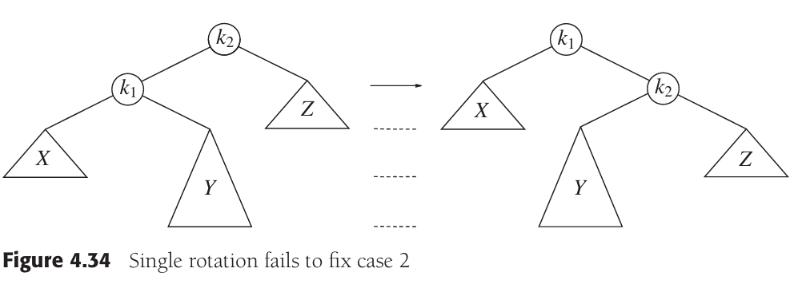
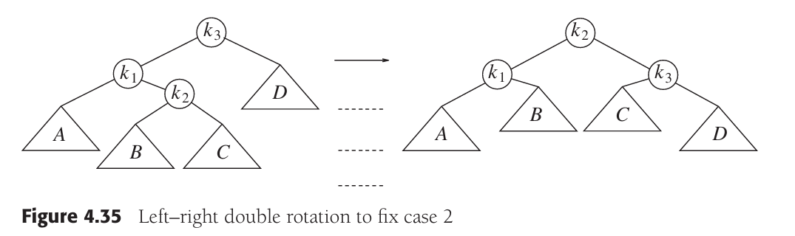
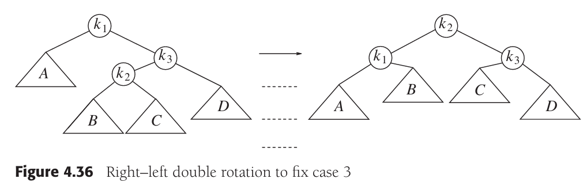

# AVL树实现

<!--more-->

## 普通二叉搜索树的缺陷

对于普通的二叉搜索树，当我们从小到大插入1到10时，因为每次都插在树的最右节点上，因此树的高度和插入的结点个数相同。那么对该树的操作，最大的时间复杂度为`O(n)`，最小为`O(1)`。因此，对于普通的搜索二叉树，一个特性是树的高度和插入的结点的大小顺序紧密相关，因此极易出现树的子树高度不均衡的情况。对树的操作又和结点的位置息息相关，因此可能出现部分操作时间复杂度较大的情况。

我们希望充分利用树的二叉结构，让树的高度为`O(logN)`，这样操作的时间复杂度也为`O(logN)`。我们无法让每颗左右子树高度相同，这样对二叉搜索树的要求太苛刻。但是我们可以让左右子树的高度差别不大于1，这就提出了平衡树的概念。下面引入AVL树。

## AVL树的引进

AVL树是平衡二叉树的一种，其相较于普通的二叉搜索树，其特点在于对于其内的左右子树（包括子树的左右子树）高度差不可大于1。要达成这样的效果，我们需要在对二叉树的结点进行插入和删除时增加一个操作，即"旋转"。

在旋转之前，我们需要找到不平衡树出现的那个根节点。其以上的树的不平衡都是由那个根节点下的左右子树导致的。下面的旋转操作均是围绕着这个出现不平衡情况的根节点实现，而不是围绕着整棵树的根节点。

如果一棵树插入节点后，成为了不平衡树，只可能是以下四种情况：

1. 插入在左子树的左孩子；
2. 插入在左子树的右孩子；
3. 插入在右子树的左孩子；
4. 插入在右子树的右孩子；

其中，情况1和4处理相似，2和3处理相似。对于情况1和4，只需要一次旋转。而对于情况2和3，需要2次旋转。

## 单旋转原理

根据前文，单旋转有2种情况：

- 新结点插入在左子树的左孩子；
- 新节点插入在右子树的右孩子；

这两种情况实际上是相同的，我们以第一种为例来进行分析。我们通过旋转，将左图的情况转变为右图。因为`k1`为不平衡树的根节点，因此我们抓住`k1`，摇一摇，那么`k2`就落了下来，`Z`依然是`k2`的右节点，`X`依然是`k1`的左节点。那么`Y`怎么办呢？`Y`的值大于`k1`而小于`k2`，因此它转变为`k2`的左节点。

## 双旋转

根据前文，双旋转有2种情况：

- 新节点插入在左孩子的右子树；
- 新节点插入在右孩子的左子树；

我们首先分析第一种方式。如果只是单旋转，旋转后如右图。我们可以看到，该树依然是不平衡的。`k1`是不平衡树的根。这样的单旋转只是把左图的样子做了个镜面效果罢了，归根结底是因为`Y`太深了。

对于`Y`，我们可以推测，其有一个根节点，和1-2个子节点。经过分析我们可以知道，`Y`的根节点的值是大于`k1`，小于`k2`的。那么我们可以把`Y`的根节点作为树的根节点，让`k1`和`k2`分别作为它的左右子树。又因为`Y`的左节点大于`k1`且小于`Y`的根节点，因此将其作为`k1`的右结点。同理，`Y`的右结点小于`k2`且大于`Y`的根节点，因此将其作为`k2`的左结点。

综合以上分析，我们对第一种情况进行如图的双旋转，成功解决问题（这里图中的根节点由`k2`替换成了`k3`，而`k2`表示`Y`的根节点，和上图的表示有一些区别，需要注意一下）：

下面我们分析第二种形式，也就是新节点插入在右孩子的左子树。其总体思路和第一种形式相同。如图，我们将`Y`抽象为一个由根节点`k2`和两个子节点`B`和`C`构成的二叉树（实际`C`不一定存在，可能为空）。那么`k2`大于`k1`且小于`k3`，因此让`k2`作为新的平衡二叉树的根节点。而`B`大于`k1`且小于`k2`，因此`B`为`k1`的右节点。`C`大于`k2`且小于`k3`，因此`C`为`k3`的左节点。旋转效果如右图所示。

## `AVLTree`实现

### `BinarySearchTree` 的扩展

### 新的`Node`类

### 重载方法

## `insert`方法重载

## `remove`方法重载

## 完整实现

