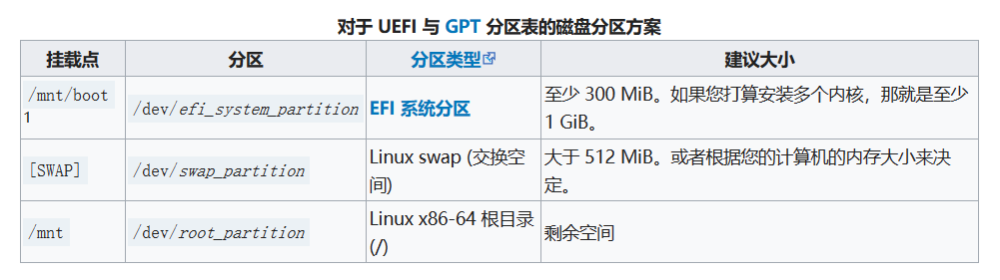
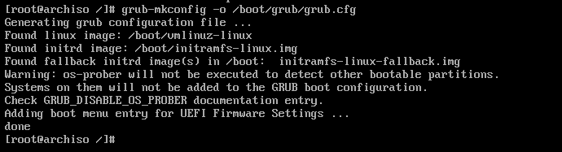

<!--more-->

> [!WARNING]
> 此坑还没填完，暂时只添加了安装部分（装完发现 Arch wiki 实在是已经写得很详细了），还有很多的知识还没有完全弄清楚和补充。
> 等我学习完`计算机组成原理`，`操作系统`和`计算机网络`后会再来填坑。

本文安装过程基本按照 Arch Linux 安装文档，附带了额外的相关知识。其中可能伴有踩坑，但是也是一种经验啦！

如发现本文某些地方有误，请在评论区评论，我看到的话会改过来哒！

## 写作起因

Arch Linux 的安装过程涉及较多的操作系统知识，而不仅仅是像 Ubuntu/Debian 那样提供 GUI 中的几个选项供你选择。此外，Arch Linux 的文档较为详细（Arch wiki 简直是棒极了！）。

因此，本教程不只是演示本人的安装&踩坑过程，还附带许多的相关文档带读、踩坑原因分析等。

## 本文适合哪些人

1. 热爱倒腾的
2. 不怕踩坑的
3. 想要通过 Arch Linux 安装过程递归学习其他知识的

## 对于其他同学

若您仅需要高效的安装 Arch Linux，而不希望看相关知识及其他无关的踩坑过程的，可以：

1. 参考其他博主的奶妈式教程

- [Arch Linux 详细安装教程，萌新再也不怕了！「2023.09」](https://zhuanlan.zhihu.com/p/596227524)
- [archlinux 简明指南 包含安装、配置、维护等，帮助新手快速上手](https://arch.icekylin.online/)
- [Arch Linux 安装使用教程 - ArchTutorial - Arch Linux Studio](https://archlinuxstudio.github.io/ArchLinuxTutorial/#/)
- [Github 教程 1](https://github.com/kmindi/jiffybox-archlinux-tutorial)
- [Github 教程 2](https://github.com/ds19991999/ArchLinux-Install-Tutorial)
- [2022 年 12 月最新安装 Archlinux 一次过的教程](https://zhuanlan.zhihu.com/p/478075538)
- [2022.5 archlinux 详细安装过程](https://zhuanlan.zhihu.com/p/513859236)
- [ArchLinux 安装指南（新手向）](https://www.mivm.cn/archlinux-installation-guide-simple)
- [Archlinux 安装教程超详细（2021.11.15](https://zhuanlan.zhihu.com/p/433920079)
- [Arch Linux 完全安装教程 2023.10](https://www.bilibili.com/read/cv20753052/)

1. archinstall 工具

- [用 archinstall 自动化脚本安装 Arch Linux](https://linux.cn/article-14444-1.html)
- [archinstall github 链接](https://github.com/archlinux/archinstall)

1. 一些图形化界面安装工具

- [Zen installer](https://github.com/spookykidmm/zen_installer)
- [archlinuxgui](https://github.com/arch-linux-gui/alg-releases)

1. Netboot 网络安装
2. [Github 上提供的脚本（按照里面的命令一个个输入）](https://github.com/tengtengsnake/Arch-linux-install-tutorial)
3. [其他安装方式](https://wiki.archlinux.org/title/Category:Installation_process)
4. 要在一个 Ubuntu 虚拟机上安装 Arch 虚拟机（嵌套虚拟机），请看[这里](https://decal.ocf.berkeley.edu/archives/2022-spring/labs/a3/)

## 前言

在使用 Arch 前看了 UCB System Admin Decal 的 Linux Pre-install and Install 一节，其中的实验是在 Ubuntu 虚拟机上安装 Arch。Arch 的安装涉及到自己进行分区，对系统进行加密和解密等，我觉得非常有趣，对于操作系统本身也是一个探索的过程。因此决定挑战自己跟着官方文档进行安装。

以前每次安装 Linux 虚拟机，包括 Ubuntu 和 Debian，都是跟着一些博主自己写的奶妈式手把手安装教程一步步的装。每次都能安装成功，但是总是感觉少了一些`【探索的乐趣】`:laughing:。

今天我就要跟着 Arch Linux 的官方文档一步步装，感受一把极致的安装酸爽体验！

> 如果你也想体验自己安装 Arch，或者是想成为 Arch 开发者，下面内容可能对你有帮助：
>
> 1. [Arch Linux 官方安装文档](https://wiki.archlinux.org/title/Installation_guide#Acquire_an_installation_image)
> 2. [Issue tracker](https://gitlab.archlinux.org/archlinux/archiso/-/issues)
> 3. [Mailing List](https://lists.archlinux.org/mailman3/lists/arch-releng.lists.archlinux.org/)
> 4. [常见问题及解答](https://wiki.archlinuxcn.org/wiki/%E5%B8%B8%E8%A7%81%E9%97%AE%E9%A2%98)
> 5. [帮助](https://wiki.archlinuxcn.org/wiki/Help:%E9%98%85%E8%AF%BB)
> 6. [贡献项目](https://wiki.archlinuxcn.org/wiki/Project:%E5%85%B3%E4%BA%8E)
> 7. [帮助手册](https://wiki.archlinuxcn.org/wiki/Man_page)

## 过程简介

安装过程涉及到的步骤包含：

1. UEFI 模式启动（或 BIOS，但是分区会不一样，需要注意）
2. 设置键盘模式
3. 检查网络连接
4. 更新系统时钟
5. 创建磁盘分区
6. 初始化分区中的文件系统（`/`文件系统可选是否加密）
7. 挂载文件系统
8. 利用`pacstrap`安装必要的包：linux 内核，`initrd`、`init system`、`pacman`\、`base`等等
9. 利用`genfstab`生成`/etc/fstab`（文件系统表）
10. `arch-chroot`进入`/mnt`目录
11. 通过修改`/etc/hostname`修改主机名

 > boot 启动原理如下：
 > 图源自 UCB System Admin Decal(https://docs.google.com/presentation/d/1oLtsjsEIsvChOI31_5YYFhILfzGlyx7Hk9DsL1Nv-mc/edit?pli=1#slide=id.g9b414dda04_0_158)
 > 

## 获取安装镜像（后缀为.iso）

看了一下下载界面，最顶部写了当前发行版的信息，下面是对于几种不同用户的安装方式以及校验和，最后是所有的 Arch 镜像源集合。

### 发行版信息

当前发布版本: 2023.09.01

内核版本: 6.4.12

ISO 镜像文件大小: 804.3 MB

### 几种下载方式

#### 对于已经是 Arch 用户的人

1.  通过命令`pacman -Syu`更新
2.  通过[这里](https://archlinux.org/mirrorlist/)更新镜像源

#### 种子链接下载（官方推荐）

对于这种资源，可以使用`百度网盘`或者`迅雷`下载（和下载电影相同），下载格式为.torrent，该种子链接需要上传到百度网盘/迅雷，然后将其中的 iso 镜像文件下载到本地目录中。

#### Netboot

安装时需要联网，最新版本会自动推送，可用于在系统启动时即时下载最新的 Arch Linux 版本。

> Netboot 使用定制的 `iPXE` 版本。 实时系统的 Linux 内核、`initramfs` 和 `squashfs 文件`是从 Arch Linux 镜像下载的。 所有下载文件的完整性都使用`加密签名`进行验证。

这其中有几个问题：

1. [iPXE](https://ipxe.org/start)是啥？**一种开源的网络启动固件**
   其官方文档中的描述如下：

   > iPXE 是领先的开源网络引导固件。它提供了完整的 PXE 实现，并通过其他功能进行了增强，例如：
   >
   > - 通过 HTTP 从 Web 服务器启动
   > - 从 iSCSI SAN 引导
   > - 通过 FCoE 从光纤通道 SAN 启动
   > - 从 AoE SAN 引导
   > - 从无线网络引导
   > - 从广域网引导
   > - 从 Infiniband 网络引导
   > - 使用脚本控制引导过程

由此可以看出，iPXE 是一种基于网络进行系统启动的固件。它的启动需要依附于计算机网络的各种协议。在 Arch Linux 文档中也指明，使用 Netboot 安装需要满足以下两点要求：

- 具有 DHCP 自配置的网络
- 能够运行系统的足够存储

而它的具体实现是基于`PXE`协议。

基于递归学习的理念，我又查了查[PXE](https://zh.wikipedia.org/wiki/%E9%A2%84%E5%90%AF%E5%8A%A8%E6%89%A7%E8%A1%8C%E7%8E%AF%E5%A2%83#)。。。

其基本概念如下：

> 预启动执行环境（Preboot eXecution Environment，PXE，也被称为预执行环境）提供了一种使用网络接口（Network Interface）启动计算机的机制。这种机制让计算机的启动可以不依赖本地数据存储设备（如硬盘）或本地已安装的操作系统。
> PXE 当初是作为 Intel 的有线管理体系的一部分，Intel 和 Systemsoft 于 1999 年 9 月 20 日公布其规格（版本 2.1）[1]。通过使用像网际协议（IP）、用户数据报协议（UDP）、动态主机设定协定（DHCP）、BOOTP、小型文件传输协议（TFTP）等几种网络协议和全局唯一标识符（GUID）、通用网络驱动接口（UNDI）、通用唯一识别码（UUID）的概念并通过对客户机（通过 PXE 自检的电脑）固件扩展预设的 API 来实现目的。
> PXE 客户机（client）这个术语是指机器在 PXE 启动过程中的角色。

其基本的运行机制是：

> 客户机的固件（如网卡的 PXE 固件）通过 DHCP 协议找到可用的 PXE 启动服务器。在找到可用的 PXE 启动服务器后，固件会向合适的启动服务器询问网络启动程序（NBP，Network Boot Program）的路径，并且通过 TFTP 协议将网络启动程序下载到电脑的内存中，最后执行它[2]。

由`PXE`机制又衍生出了无盘系统，其利用网络服务器下载启动系统的镜像，而不是本地硬盘。`PXE`的协议规范在[intel 的这篇文档中](https://web.archive.org/web/20131102003141/http://download.intel.com/design/archives/wfm/downloads/pxespec.pdf)可以查到。而 PXE 的两个实现，一个为`iPXE`，另一个则是`gPXE`。`gPXE`目前已经停止开发，取而代之的是`iPXE`。

对于`iPXE`和`gPXE`更详细的介绍，可以参考[这篇博文](https://blog.hcl.moe/archives/2177)

1. `initramfs文件`和`squashfs文件`做什么用？
   TODO

2. 为什么`Arch Linux`在下载过程中需要使用加密签名对镜像完整性进行验证？
   TODO

#### VM image

archlinux 虚拟机可从[这里](https://gitlab.archlinux.org/archlinux/arch-boxes/-/packages)下载，使用手册[在此](https://gitlab.archlinux.org/archlinux/arch-boxes)。

#### HTTP 下载（最常用）

> [!TIP]
> `sq`命令需要使用`scoop`进行安装，如果是 windows 用户，会比较麻烦，详细解决办法见后文

从后文中的镜像源中下载镜像。需要注意的是，我们需要保证下载的镜像的校验和，和同一目录`sha256sums.txt`及`b2sums.txt`文件中的校验和匹配。

下载签名：`sq wkd get pierre@archlinux.org -o release-key.pgp`

验证：`sq verify --signer-file release-key.pgp --detached archlinux-2023.09.01-x86_64.iso.sig archlinux-2023.09.01-x86_64.iso`

### 校验和

最新版本的校验和下载详见官网。在镜像源网站上也可以看到`sha256sums.txt`和`b2sums.txt`

。下载镜像后我们需要利用它与我们下载到的镜像的校验和进行比对(主要是用于比对，这两个文件可下载也可不下载，在镜像站上也能打开，只要我们下载到的镜像的校验和文件中版本对应的那行的校验和匹配就行了)。

### 方法一

> [!TIP]
   > 由于这种方式下载过慢，笔者建议使用方法二，即通过开源镜像站进行下载。

1. 在[Download 界面](https://archlinux.org/download/)选择推荐的 BitTorrent Download:
   
2. 下载到本地电脑的 Downloads 文件夹中，其后缀名为`.torrent`
3. 打开百度网盘，在其中上传该文件
4. 上传后双击该文件，点击开始下载到网盘，等待下载完成（有点慢哈！）
5. 下载到网盘后，将`iso镜像文件`下载到在自选的本地目录中

### 方法二

1. 在[Download 界面](https://archlinux.org/download/)下翻，找到中国的镜像站列表:
   
2. 在其中选择`tuna.tsinghua.edu.cn`，即清华大学镜像站（我每次都用他们的镜像，速度不错）
   
3. 选择`archlinux-2023.09.01-x86_64.iso`下载
4. 将`.iso`文件保存到我们想要虚拟机保存的目录中

## 获取[GnuPG](https://wiki.archlinuxcn.org/wiki/GnuPG)签名

> GnuPG 是什么？
> GnuPG 是完整实现了 RFC4880（即 PGP）所定义的 OpenPGP 标准的自由软件。GnuPG 可以加密和签名你的数据和通讯信息，包含一个通用的密钥管理系统以及用于各种公钥目录的访问模块。GnuPG，简称 GPG，是一个易于与其它程序整合的命令行工具，拥有很多前端程序和函数库。GnuPG 还支持 S/MIME 和 Secure Shell (ssh)。

从上述清华大学镜像站，可获取 iso 版本对应的 PGP 签名` archlinux-2023.09.01-x86_64.iso.sig``


在本次安装中，我使用的是 `Git Bash`，其中装有GPG，`cmd`和`powershell`中也装有 gpg，可选择一个终端进行后续操作。

## 验证签名

为避免因 HTTP 连接下载镜像时遭到拦截，获取到恶意镜像，我们需要利用 PGP 签名对镜像进行验证。

通过以下命令验证:

```bash
gpg --keyserver-options auto-key-retrieve --verify archlinux-version-x86_64.iso.sig
```

其中`version`替换成你所下载的版本号，如`2023.09.01`。我的显示结果是：

```bash
legion@DESKTOP-ROOSFVQ MINGW64 /e/VMs/Arch
$ gpg --keyserver-options auto-key-retrieve --verify archlinux-2023.09.01-x86_64.iso.sig
gpg: assuming signed data in 'archlinux-2023.09.01-x86_64.iso'
gpg: Signature made 2023年09月 1日 18:48:49
gpg:                using EDDSA key 3E80CA1A8B89F69CBA57D98A76A5EF9054449A5C
gpg:                issuer "pierre@archlinux.org"
gpg: Good signature from "Pierre Schmitz <pierre@archlinux.org>" [unknown]
gpg: WARNING: This key is not certified with a trusted signature!
gpg:          There is no indication that the signature belongs to the owner.
Primary key fingerprint: 3E80 CA1A 8B89 F69C BA57  D98A 76A5 EF90 5444 9A5C
```

若从镜像站下载，则会显示`fingerprint`，我们需要打开[fingerprint 合集](https://keyserver.ubuntu.com/pks/lookup?op=vindex&fingerprint=on&exact=on&search=0x3E80CA1A8B89F69CBA57D98A76A5EF9054449A5C),确保我们所获得的镜像的`fingerprint`和该网站上的 fingerprint 吻合。（确保公钥的指纹等于其中一位签署了 ISO 文件 Arch Linux 开发者的指纹）

## 准备安装介质

安装镜像包括：U 盘，光盘，和带有 PXE 的网络安装镜像。此处我是用 VMWare 虚拟机进行安装。

## VMWare 新建虚拟机

依次选择：

1. 自定义（高级）
2. 硬件兼容性
3. 稍后安装操作系统
4. 本内核版本为 6.4.12，因 VMware 中没有 Arch，因此我选择`其他 Linux 5.x 内核 64位`
5. 选择安装目录（自定）
6. 处理器配置、~~内存大小分配~~均选择默认（注意：内存大小选择 2G，768MB 完全不够)
7. 使用网络地址转换（NAT）
8. SCSI 控制器:LSI Logic（L）
9. 虚拟磁盘类型：SCSI（S）
10. 创建新虚拟磁盘
11. 最大磁盘大小默认，将虚拟磁盘拆分成多个文件
12. 磁盘文件名默认
13. 自定义硬件->新 CD/DVD->使用 ISO 映像文件->选择我们下载的 iso 文件->关闭
14. 完成
15. 你可以自行决定 BIOS 或 UEFI 模式启动（我选择 UEFI，但是应该影响不大）
16. 点击开启此虚拟机

Ready for the journey? Let's go!

## 进入安装程序

1. 默认第一项，等待一会儿，随后进入命令行模式

## 一号坑：VMware 默认分配内存 768MB 过小，需要 2G

开局遇雷：怎么回事？


参考了[这篇博文](https://blog.csdn.net/m0_46499080/article/details/131711503#:~:text=2%E3%80%81%E6%9B%B4%E6%96%B0%E9%95%9C%E5%83%8F%E6%BA%90pacman,-Syy3%E3%80%81%E6%9B%B4%E6%96%B0ROOT%E5%AF%86%E7%A0%81passwd4%E3%80%81)虚拟机默认的是 768MB，不够。在设置中修改为 2G,成功启动。

## 二号坑：网络出现问题


关了虚拟机，重新开机，成功启动


## 配置控制台键盘布局和字体

系统启动后，控制台键盘布局默认为 us（美式键盘）。如果您需要列出所有可用的键盘布局，可以使用以下命令：

```bash
ls /usr/share/kbd/keymaps/**/*.map.gz
```


此处我使用`us`键盘布局，不修改。

## 检查是否连接到互联网

```bash
ip link
ping archlinux.org
```


## 更新系统时间

```bash
timedatectl #查看系统时间
timedatectl list-timezones #查看所有时区
timedatectl set-timezone "Asia/Shanghai" # 设置为亚洲上海
```


要创建磁盘分区了，为保证出问题后还能倒回来，此处拍摄快照 1

## 创建硬盘分区

### 指南

系统如果识别到计算机的内置硬盘、U 盘或者移动硬盘等类型磁盘，就会将其分配为一个块设备，如 /dev/sda、/dev/nvme0n1 或 /dev/mmcblk0。可以使用 lsblk 或者 fdisk 查看：

```bash
fdisk -l(此处为小写字母l)
```


结果中以 rom、loop 或者 airoot 结尾的设备可以被忽略。

提示：在分区之前，请您检查 NVMe 驱动器和 Advanced Format 硬盘是否使用了最佳逻辑扇区大小。需要注意的是，更改逻辑扇区大小后，可能会导致在 Windows 系统中出现兼容性问题。

对于一个选定的设备，以下分区是必须要有的：

1. 一个根分区（挂载在 根目录）/；
2. 要在 UEFI 模式中启动，还需要一个 EFI 系统分区。
3. 如果您需要创建多级存储例如 LVM、磁盘加密 或 RAID，请您在这时候完成。
   请使用分区工具（fdisk 、parted、cfdisk 等等）修改分区表。例如：

```bash
fdisk /dev/the_disk_to_be_partitioned（要被分区的磁盘）
```

注意：

如果您想要的磁盘没有显示出来， 确保您的磁盘控制器未处于 RAID 模式。

如果要启动的磁盘已经有一个 EFI 系统分区，就不要再新建 EFI 分区了，而是使用现有的 EFI 分区。

如果文件系统支持，交换空间 可以通过 交换文件 实现。

### 分区方案：



### 分区步骤

#### 创建 GPT 分区表

1. 输入`fdisk /dev/sda`，对`/dev/sda`磁盘进行分区
2. 输入`g`，创建一个`GUID`分区表

#### 创建第一个分区：EFI 分区

1. 输入`n`，创建第一个分区，输入其编号（默认为 1，即`/dev/sda1`）
2. 回车，默认其大小
3. 对最后一个扇区，输入`+512M`
4. 输入`t`来将这个新分区改为"EFI System"
5. 输入`L`来查看所有分区名，输入`q`退出，可见`EFI System`分区别名为 1
6. 输入`1`，将分区改为`EFI System`

#### 创建第二个分区：文件系统分区

1. 输入`n`，创建第二个分区
2. 两次回车，使用默认分区号和扇区大小
3. 输入`-512M`，为交换分区留出 512MB 大小来
4. 分区默认名为`Linux filesystem`，因此不需要改

#### 创建第三个分区：交换分区

1. 输入`n`，创建第三个分区
2. 连按 3 次回车，接受所有默认设置
3. 输入`t`，将新分区改为`Linux Swap`,别名为 19

#### 查看分区结果

输入`p`

#### 完成修改

输入`w`

## 格式化分区

对于不同的分区，我们使用不同的文件系统：

### ESP 分区格式化：`mkfs.fat`格式化 FAT32 文件系统

ESP 在`/dev/sda1`中，运行`mkfs.fat -F32 /dev/sda1`来挂载 FAT32 文件系统

## 根分区：通过`mkfs.ext4`格式化 ext4 文件系统

`mkfs.ext4 /dev/sad2`

## 交换分区格式化：`mkswap`

`mkswap /dev/sda3`

## 挂载分区

### 挂载根分区

将根磁盘卷挂载到`/mnt`，使用命令：`mount /dev/sda2 /mnt`

### 挂载 EFI 分区

```bash
mount --mkdir /dev/sda1 /mnt/boot
```

### 挂载 swap 分区

`swapon /dev/sda3`来启用交换分区

稍后 genfstab(8) 将自动检测挂载的文件系统和交换空间。

## 开始安装系统

### 选择镜像站

#### 安装`reflector`包

通常来说系统默认有，如果没有的话使用如下命令安装：

`sudo pacman -S reflector`

#### 更新源

```bash
sudo reflector --country China --save /etc/pacman.d/mirrorlist.pacnew
```

确保源准确无误后，将`mirrorlist.pacnew`复制到`mirrorlist`

### 安装必须的软件包

使用 pacstrap(8) 脚本，安装 base 包 软件包和 Linux 内核以及常规硬件的固件：

```bash
pacstrap -K /mnt base linux vim man-db man-pages texinfo
```

这时候可以同时额外安装计算机的 CPU 微码包。如果计算机是 Intel 的 CPU ，使用`intel-ucode`包，AMD CPU 则使用 `amd-ucode`包。也可以暂时都不安装，等到进入系统后再安装。

1. 因为我是在虚拟机中安装，因此我不安装固件`linux-firmware`和微码包`intel-ucode`。如果你有想补充的软件，请加在`pacstrap`后面。
2. 是`texinfo`，不是`textinfo`，不要看错啦！

<!-- ~~# 三号坑：出现`error: failed to install packages to new root`~~
解决方案：
3. `pacman -S archlinux-keyring`
4. `pacman-key --refresh-keys`
   -->

## 配置系统

### 生成 fstab 文件

通过以下命令生成 fstab 文件 (用 -U 或 -L 选项设置 UUID 或卷标)：

```bash
genfstab -U /mnt >> /mnt/etc/fstab
```

强烈建议在执行完以上命令后，检查一下生成的`/mnt/etc/fstab`文件是否正确。

### chroot 到新安装的系统

```bash
arch-chroot /mnt
```

提示：此处使用的是 arch-chroot 而不是直接使用 chroot，注意不要输错了。在`arch-chroot`进入`/mnt`后，提示符应该变为了`[root@archiso]`样式，如果没有，请检查一下前面的步骤是否都准确完成了。

### 设置时区

```bash
ln -sf /usr/share/zoneinfo/Region（地区名）/City（城市名） /etc/localtime
```

地区名填 Asia,城市名填 Shanghai

然后运行 hwclock(8) 以生成 /etc/adjtime：

```bash
hwclock --systohc
```

这个命令假定已设置硬件时间为 UTC 时间。

### 区域和本地化设置

1. 编辑`/etc/locale.gen`。将`en_US.UTF-8`或其他你想要的配置，对应那行取消注释。修改后，执行`locale-gen`，以生成`locale信息`。
2. 创建`/etc/locale.conf`，在其中写入：

```bash
LANG=en_US.UTF-8
```

### 控制台键盘布局和字体设置

如果需要修改控制台键盘布局和字体，可编辑 /etc/vconsole.conf 使其长期生效，例如：

```bash
KEYMAP=de-latin1
```

### 网络配置

网络配置很重要,否则安装系统后会连不上网（例如`VirtualBox`桥接模式就需要配置 DHCP）

#### 设置主机名

创建`/etc/hostname`文件，在其中直接填写你所设定的主机名，我填写的主机名是`arch`

#### 安装网络管理器

1. `pacman -S networkmanager`
2. `systemctl enable NetworkManager.service`设置网络管理器开机自启动

### 关于 initramfs

通常不需要自己创建新的 initramfs，因为在执行 pacstrap 时已经安装 linux 包，这时已经运行过 mkinitcpio 了。

### 设置 root 密码

输入`passwd`创建一个`root`密码

### 安装引导程序

需要安装 Linux 引导加载程序，才能在安装后启动系统，可以使用的的引导程序已在启动加载器中列出，请选择一个安装并配置它，GRUB 是最常见的选择。

如果有 Intel 或 AMD 的 CPU，请另外启用微码更新。

1. 安装`grub`和`efibootmgr`：输入`pacman -S grub efibootmgr`
2. 输入`grub-install --target=x86_64-efi --efi-directory=[esp] --bootloader-id=GRUB`

   我的`esp`挂载点是`/mnt/boot`，因为我已经`arch-chroot`到`/mnt`中了，因此`esp`字段填写`/boot`即可。如果你安装在了其他挂载点上，请在`esp`字段填写你自己的挂载点。如果出现问题，检查：

	- 是否已经`arch-chroot`到了`/mnt`下？命令提示符为`[root@archiso]`
	- 前面的配置过程有没有出现问题？

   `grub-install`命令成功时应该出现:

  

1. 生成主配置文件:`grub-mkconfig -o /boot/grub/grub.cfg`

   配置成功时界面：

   

## 重新启动计算机

1. `exit`退出`chroot`环境
2. `umount -R /mnt`取消挂载`/mnt`（也等到可`reboot`时 systemd 自动卸载）
3. `reboot`重启系统

## 安装后的工作

参见[建议阅读列表](https://wiki.archlinuxcn.org/wiki/%E5%BB%BA%E8%AE%AE%E9%98%85%E8%AF%BB)及[应用程序列表](https://wiki.archlinuxcn.org/wiki/%E5%BA%94%E7%94%A8%E7%A8%8B%E5%BA%8F%E5%88%97%E8%A1%A8)
