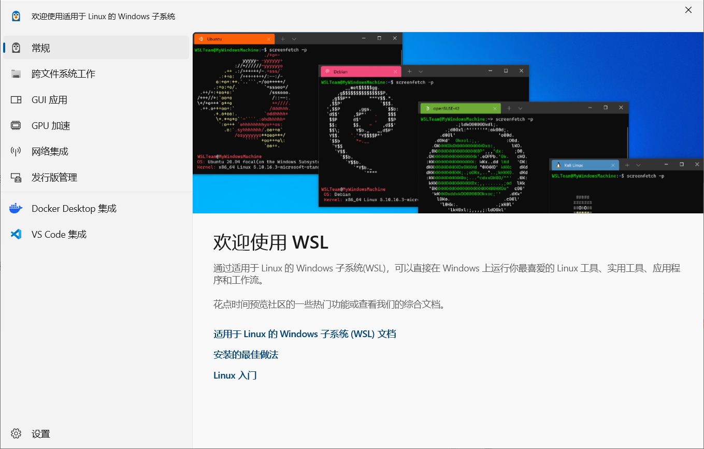

<!--more-->

> [!WARNING]
> 这个帖子并不是什么安装教程，只是纯纯的过程记录。因此其中不乏一些碎碎念和踩坑过程。安装过程参考：[在 WSL 上安装 Arch Linux - Arch Linux 中文维基](https://wiki.archlinuxcn.org/wiki/%E5%9C%A8_WSL_%E4%B8%8A%E5%AE%89%E8%A3%85_Arch_Linux#)

## 前言

很早之前我就听说Arch Linux是个很有趣的Linux发行版了，自定义程度很高，但是之前由于对Linux本身并不那么熟悉，因此并没有使用的想法。在学习Linux期间，我使用的是Ubuntu，挺方便的，通过`apt-get`安装一些工具，稍微配置一下就可以用。我利用Ubuntu学习了很多的基础Linux命令，还在Ubuntu环境下刷过几门课，算是对Linux环境有个基本的熟悉了。因此现在打算尝试一下Arch Linux，也来折腾折腾。

我以前没有使用过WSL2，都是用的VMWare虚拟机，但是感觉VMWare的屏幕很小，用起来不顺手。我每次写代码的时候，都是用的Windows宿主机上的VSCode，通过SSH远程连接到虚拟机。最早我以为SSH是个VSCode中内置的虚拟机开关，可以在VSCode后台直接开Ubuntu虚拟机，还问群友为什么半天连接不上，闹了笑话（话说我很想实现一个VSCode中内置的虚拟机，这样就不用使用VMWare这样笨重的软件了，我要把这条加到我的待办清单中去）。这次我决定使用WSL2，说实话WSL2跟Arch Linux一样，对我来说都是新事物，需要自己去踩坑折腾的，不过我也不害怕，来就来嘛。我的安装过程主要根据官方文档：[在 WSL 上安装 Arch Linux - Arch Linux 中文维基](https://wiki.archlinuxcn.org/wiki/%E5%9C%A8_WSL_%E4%B8%8A%E5%AE%89%E8%A3%85_Arch_Linux)，中间穿插一些踩坑之类的内容。

## 安装

### 启用虚拟化

手册的第一步是在 UEFI 设置中[启用虚拟化](https://support.microsoft.com/en-us/windows/enable-virtualization-on-windows-c5578302-6e43-4b4b-a449-8ced115f58e1)（说实话我不太清楚[UEFI](https://zh.wikipedia.org/wiki/%E7%B5%B1%E4%B8%80%E5%8F%AF%E5%BB%B6%E4%BC%B8%E9%9F%8C%E9%AB%94%E4%BB%8B%E9%9D%A2)是什么，这里要记录一下，后面学习硬件和操作系统的时候得学）

通过在Google中搜索：[how to check if I have enabled the virtualization in UEFI - Google 搜索](https://www.google.com/search?q=how+to+check+if+I+have+enabled+the+virtualization+in+UEFI&oq=how+to+check+if+I+have+enabled+the+virtualization+in+UEFI&gs_lcrp=EgRlZGdlKgYIABBFGDkyBggAEEUYOTIKCAEQABiABBiiBDIHCAIQABjvBTIHCAMQABjvBTIHCAQQABjvBTIHCAUQABjvBdIBCTE2NjgwajBqMagCALACAA&sourceid=chrome&ie=UTF-8)，我得到的答案是：要检查UEFI是否启动了虚拟化，我们需要在Windows控制台中输入`msinfo32`命令查看系统信息，然后在**系统摘要**一栏，看**Hyper-V-固件中启用的虚拟化**一栏是否为**是**。我这里显示已经启用了虚拟化，进入下一步。如果没有的话，参考这篇文档：[Enable Virtualization on Windows - Microsoft Support](https://support.microsoft.com/en-us/windows/enable-virtualization-on-windows-c5578302-6e43-4b4b-a449-8ced115f58e1)。

此外，根据这篇文档[Windows 10 支持将于 2025 年 10 月 14 日结束](https://support.microsoft.com/en-us/windows/windows-10-support-ends-on-october-14-2025-2ca8b313-1946-43d3-b55c-2b95b107f281)，但是看了网上对Win 11多半差评，还是不升级了。

### Arch Linux安装

首先介绍一下WSL，根据这篇文档：[适用于 Linux 的 Windows 子系统文档 | Microsoft Learn](https://learn.microsoft.com/zh-cn/windows/wsl/)（文档非常好，可以深入学习一下WSL）

> 适用于 Linux 的 Windows 子系统 (WSL) 可让开发人员直接在 Windows 上按原样运行 GNU/Linux 环境（包括大多数命令行工具、实用工具和应用程序），且不会产生传统虚拟机或双启动设置开销。

这次我们的目的是安装Arch Linux，所以先不了解那么多。对于安装命令，文档中是这样写的：

> 在管理员模式下打开 **PowerShell** 或 **Windows 命令提示符**，方法是右键单击并选择"**以管理员身份运行**"，输入 `wsl --install` 命令，然后重启计算机。

需要注意的是，`wsl --install`命令安装的是**默认Ubuntu发行版**，要想安装其他发行版，我们需要输入`wsl --install <Distribution Name>`。通过`wsl --list --online`，我们看一下都有哪些发行版：

```powershell
PS C:\Windows\system32> wsl --list --online
以下是可安装的有效分发的列表。
使用 'wsl.exe --install <Distro>' 安装。

NAME                            FRIENDLY NAME
AlmaLinux-8                     AlmaLinux OS 8
AlmaLinux-9                     AlmaLinux OS 9
AlmaLinux-Kitten-10             AlmaLinux OS Kitten 10
Debian                          Debian GNU/Linux
FedoraLinux-42                  Fedora Linux 42
SUSE-Linux-Enterprise-15-SP5    SUSE Linux Enterprise 15 SP5
SUSE-Linux-Enterprise-15-SP6    SUSE Linux Enterprise 15 SP6
Ubuntu                          Ubuntu
Ubuntu-24.04                    Ubuntu 24.04 LTS
archlinux                       Arch Linux
kali-linux                      Kali Linux Rolling
openSUSE-Tumbleweed             openSUSE Tumbleweed
openSUSE-Leap-15.6              openSUSE Leap 15.6
Ubuntu-18.04                    Ubuntu 18.04 LTS
Ubuntu-20.04                    Ubuntu 20.04 LTS
Ubuntu-22.04                    Ubuntu 22.04 LTS
OracleLinux_7_9                 Oracle Linux 7.9
OracleLinux_8_7                 Oracle Linux 8.7
OracleLinux_9_1                 Oracle Linux 9.1
```

这里我们想要安装的是archlinux，安装到D盘去。使用如下命令（管理员权限执行）：

```powershell
wsl --install -d archlinux --name _自定义名称_ --location _自定义路径_
```

譬如：

```powershell
PS C:\Windows\system32> wsl --install -d archlinux --location D:\Program_Files\VM\Arch
正在下载: Arch Linux
正在安装: Arch Linux
已成功安装分发。它可通过 “wsl.exe -d archlinux” 启动
```

安装过程中还会弹出来一个欢迎界面：



安装完成后，输入`wsl -d archlinux`运行`archlinux`，powershell中的运行效果如下：

```powershell
PS C:\Windows\system32> wsl -d archlinux
Welcome to the Arch Linux WSL image!

This image is maintained at <https://gitlab.archlinux.org/archlinux/archlinux-wsl>.

Please, report bugs at <https://gitlab.archlinux.org/archlinux/archlinux-wsl/-/issues>.
Note that WSL 1 is not supported.

For more information about this WSL image and its usage (including "tips and tricks" and troubleshooting steps), see the related Arch Wiki page at <https://wiki.archlinux.org/title/Install_Arch_Linux_on_WSL>.

While images are built regularly, it is strongly recommended running "pacman -Syu" right after the first launch due to the rolling release nature of Arch Linux.

Generating pacman keys...
==> Generating pacman master key. This may take some time.
==> Updating trust database...
Done
[root@DESKTOP-ROOSFVQ system32]#
```

成功！
