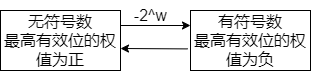

<!--more-->

## 信息的表示和处理

信息 = 二进制位的组合 + 对位组合的解释：无符号，补码，有符号整数，浮点数。

> 介绍了一点 C 语言的演变历史：汇编不方便 —> ANSI C -> ISC C90 -> ISO C99 -> ISO C11(可以在编译时通过`-std=cxx`指定编译所使用的版本)

1 个字节 = 8 位 -> 内存中信息的编码以字节为单位 -> 机器级程序将内存看作一个大的数组（虚拟内存）-> 利用指针来存储地址 -> 指针是机器级代码的概念，其组成包含类型+值，但是类型在内存当中是不可见的，在内存中所有东西都是没有感情的字节数组。-> 指针的大小 = 字长（总线一次传输数据的最大字节数）-> 虚拟地址空间以字编码 -> 字长：虚拟地址空间的最大大小 -> 32 位机器：4GB 64 位机器：16EB -> `32位程序` & `64位程序`指的是：如何编译

字节的表示方法包括：16 进制，10 进制，2 进制等等。

字节序：对跨越多个字节的程序对象，我们必须明确：

1. 地址在哪里：存储的最低字节处
2. 如何排列他们：大端法 or 小端法？

> ASCII 编码与 Unicode 编码。Unicode 和 UTF-8 是什么关系？

布尔代数与位运算，其有分配律，且`(a^b)^a = b`，位向量掩码，经典的`inplace_swap`利用异或进行值交换

逻辑运算，short circuits

移位运算：

1. 逻辑右移
2. 算术右移（有符号数算术右移，无符号数逻辑右移，Java 使用`>>>`来进行逻辑右移）

> 注意：
>
> 1. 移动 k 位（k 很大时），移动 k % w 位
> 2. 加法和减法的优先级 > 移位运算优先级，如 `1<<2+3<<4`，因此移位时记得加括号

## 整数的表示和运算



> 1. 通过引用`#include <stdint.h>`，然后使用`INTX_t`，就可以使用特定位数的某种类型。可以使用宏`%" PRId32 "`来打印串。
>
> 2. 在`<limits.h>`中限定了`INT_MAX`,`INT_MIN`，`UINT_MAX`等等
>
> 3. `INT_MIN = -(-INT_MAX - 1)`

## 浮点数的表示

浮点数针对范围大，精度低的表示。整数针对范围小，精度高的表示。

1. 单精度浮点数(`float`)：1 位符号位 + 8 位阶码 + 23 位位数
2. 双精度浮点数(`double`)：1 位符号位 + 11 位阶码 + 52 位尾数

其表示包含四种情况：

阶码部分是使用了移码计算，其计算方法如下：

$$
bias = 2^{k-1} - 1
$$

$$
exp = E - bias
$$

1. 规格化数：阶码部分不全为 0 也不全为 1
   其尾数计算方法如下：

   $$
    M = 1 + f

$$
2. 非规格化数：阶码部分全为 0
   其尾数部分为$f$，阶码部分计算如下：
   
$$

     exp = 1 - bias

$$
   这种阶码的计算方式实现了非规格化数到规格化数的平滑过渡。
3. 无穷大：阶码部分全为 1，尾数部分全为 0
4. NaN：阶码部分全为 1，尾数部分不为 0

## 重点习题

- 2 进制，16 进制，10 进制之间的转化
- 大端法和小端法对同一个数值的不同存储方式
- 整数和浮点数表示的重合部分
- 布尔代数和位运算
- 位向量掩码
- 布尔运算之间的组合（or,and,xor,not）
- 逻辑运算
- 使用位级运算和逻辑运算实现`^`
- 移位运算的计算
- 同样位表示的无符号和补码值
- 相同位表示下，无符号数和补码值的转换
- 无符号数和有符号数的比较（默认转化为无符号数后比较）
- 有符号数/无符号数的符号扩展
- 不同类型+大小之间的值的转换
- 数值的截断
- 隐式转换可能带来的程序问题，以及如何避免
- 无符号数的加法和溢出判定
- 无符号数求反
- 有符号的加法和溢出判定
- 有符号数求反
- 无符号的乘法
- 补码乘法
- 无符号的乘法
- 乘以 2 的幂
- 乘以常数 & 2 种移位运算
- 无符号数除法
- 有符号数除法（向上舍入）
- 小数的二进制表示和十进制表示
- 浮点数的表示（规格化，非规格化，INF，NaN 的情况）
- 浮点数的计算
- 浮点数的范围
- 整数和浮点数之间的转换，以及其共有部分
- 浮点数的舍入
- 不同类型之间转换带来的精度损失（溢出或舍入）
