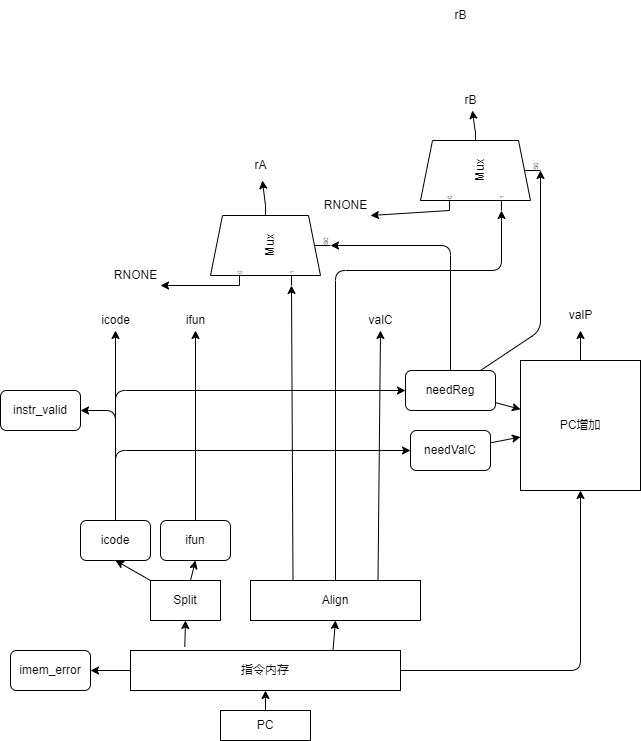
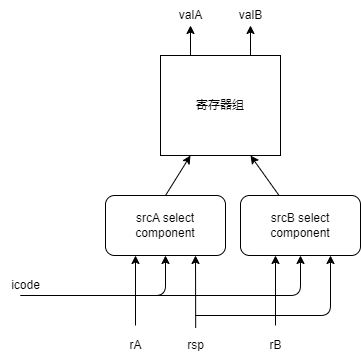
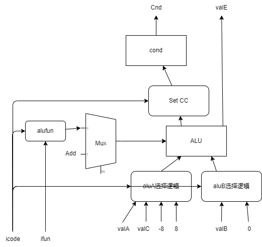
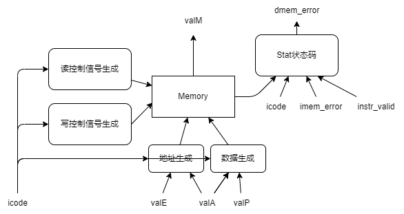
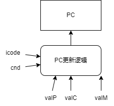
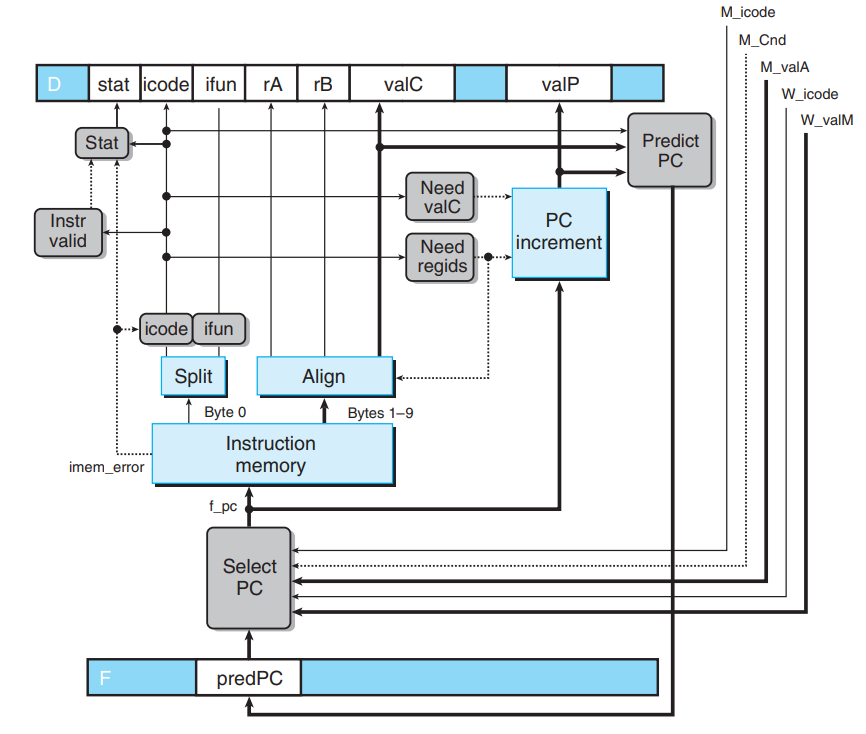
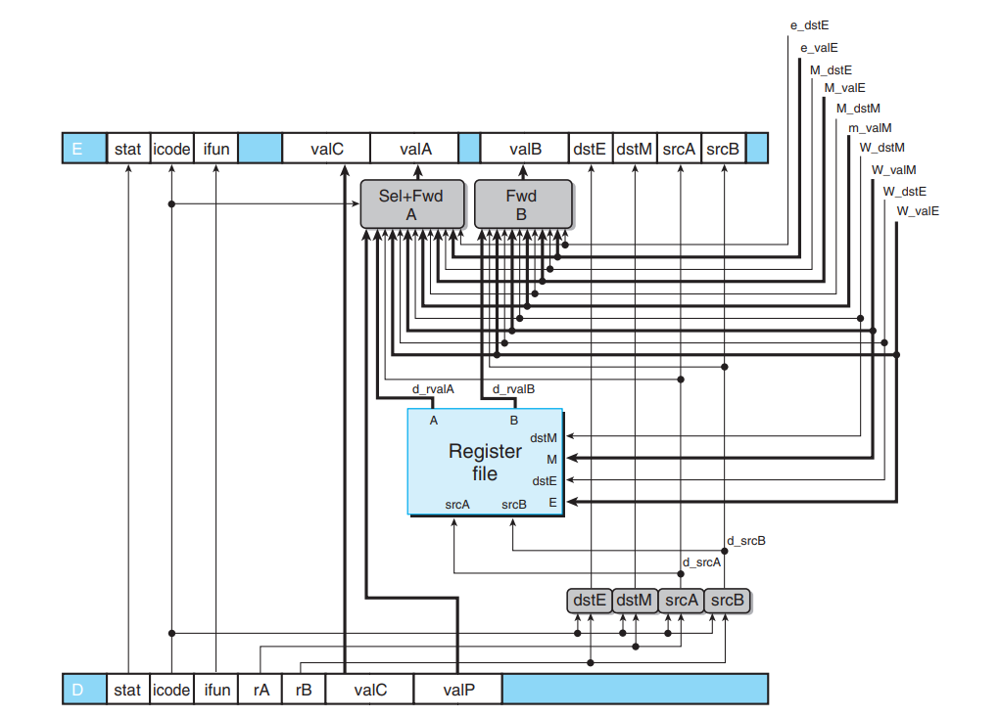
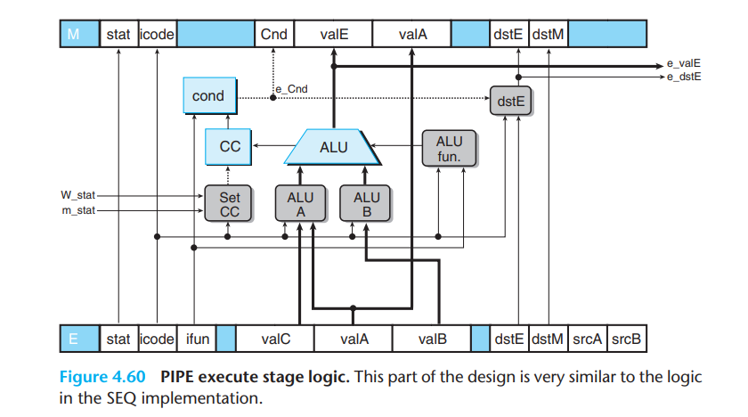
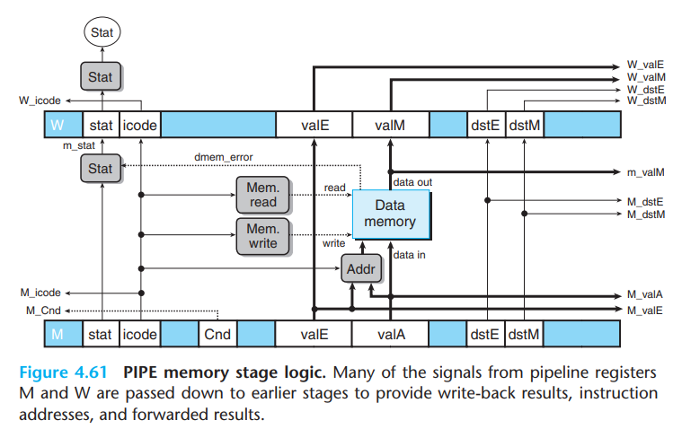
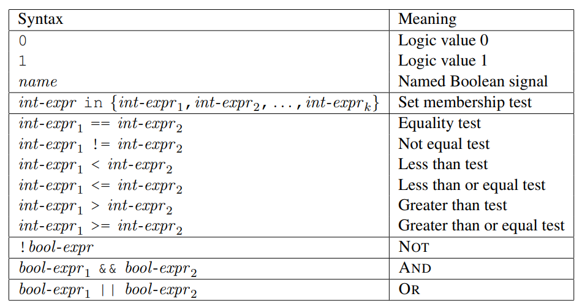

<!--more-->

本章中我们需要实现 3 个目标：

- 设计一个顺序结构的 Y86_64 架构处理器
- 设计一个流水线结构的 Y86_64 架构处理器
- 设计一个包含冒险控制的 Y86_64 架构处理器

## Y86_64 指令集架构

Y86_64 指令集架构的基本格式如下：

- 1 字节的指令指示符，包含 4 位的代码段和 4 位的功能段
- 1 字节的寄存器指示符（部分指令没有）
- 8 个字节的常数（部分指令没有）

此外，Y86_64 指令集架构包含 16 个寄存器，编号为：0-F，其中`F`表示这条指令无需寄存器，此外`%rsp`寄存器的值为 4。并且 Y86_64 处理器的异常处理机制就是让处理器停止执行指令。

根据指令的不同特性，我们将其分为不同的类别来进行分析。指令的指令可以概括的分为 6 个阶段：

- 取指：从 PC 中取出指令，分割其内部字段，如`icode`、`ifun`，寄存器指示符`rA`和`rB`，立即数`valC`等等
- 译码：根据取指阶段各个字段，去寄存器中把值拿出来，得到两个数`valA`和`valB`
- 执行：将寄存器中拿出的值放入`ALU`计算单元，中途还需要判断`icode`和`ifun`等，计算出的值为`valE`
- 访存：访问内存，读出的值为`valM`
- 写回：将结果写回寄存器
- 更新 PC：根据不同指令更新 PC，默认的下一条指令地址为`valP`

### 寄存器操作指令

符合这个类别的指令包括：`rrmovq`，`irmovq`，`OPq`

将这三条指令按上述过程分析如下：

| 阶段    | `rrmovq`                                                                                        | `irmovq`                                                                                                                      | `OPq`                                                                                           |
| ----- | ----------------------------------------------------------------------------------------------- | ----------------------------------------------------------------------------------------------------------------------------- | ----------------------------------------------------------------------------------------------- |
| 取指    | $icode:ifun\leftarrow M_{1}[PC]$<br>$rA:rB\leftarrow M_{1}[PC+1]$ <br><br>$valP\leftarrow PC+2$ | $icode:ifun\leftarrow M_{1}[PC]$<br>$rA:rB\leftarrow M_{1}[PC+1]$<br>$valC\leftarrow M_{8}[PC+2]$<br>$valP\leftarrow PC + 10$ | $icode:ifun\leftarrow M_{1}[PC]$<br>$rA:rB\leftarrow M_{1}[PC+1]$ <br><br>$valP\leftarrow PC+2$ |
| 译码    | $valA\leftarrow R[rA]$<br><br>                                                                  |                                                                                                                               | $valA\leftarrow R[rA]$<br>$valB\leftarrow R[rB]$                                                |
| 执行    | $valE\leftarrow valB\space OP\space valA$                                                       | $valE\leftarrow 0\space OP\space valC$                                                                                        | $valE\leftarrow 0\space OP\space valA$                                                          |
| 访存    |                                                                                                 |                                                                                                                               |                                                                                                 |
| 写回    | <td colspan=2>$R[rB]\leftarrow valE$</td>                                                       |                                                                                                                               |                                                                                                 |
| 更新 PC | <td colspan=2>$PC\leftarrow valP$</td>                                                          |                                                                                                                               |                                                                                                 |

### 访存指令

符合这个类别的指令包括：`rmmovq`，`mrmovq`，`pushq`，`popq`

|阶段|`rmmovq`|`mrmovq`|`pushq`|`popq`|
|-|-|-|-|-|
|取指|<td colspan=3>$icode:ifun\leftarrow M_{1}[PC]$<br>$rA:rB\leftarrow M_{1}[PC+1]$<td>|
||$valC\leftarrow M_{8}[PC+2]$|$valC\leftarrow M_{8}[PC+2]$|
||$valP\leftarrow PC+10$|$valP\leftarrow PC+10$|$valP\leftarrow PC+2$|$valP\leftarrow PC+2$|
|译码|$valA\leftarrow R[rA]$<br>$valB\leftarrow R[rB]$|<br>$valB\leftarrow R[rB]$|$valA\leftarrow R[rA]$<br>$valB\leftarrow R[rsp]$|$valA\leftarrow R[rsp]$<br>$valB\leftarrow R[rsp]$|
|执行|$valE\leftarrow valB+valC$|$valE\leftarrow valB+valC$|$valE\leftarrow valB+(-8)$|$valE\leftarrow valB+8$|
|访存|$M[valE]\leftarrow valA$|$valM\leftarrow M[valE]$|$M[valE]\leftarrow valA$|$valM\leftarrow M[valA]$|
|写回| |$R[rA]\leftarrow valM$|$R[rsp]\leftarrow valE$|$R[rsp]\leftarrow valE$<br>$R[rA]\leftarrow valM$|
|更新 PC|<td colspan=4>$PC\leftarrow valP$</td>|

### 跳转，调用及返回指令

符合这个类别的指令包括：`jXX`，`cmovXX`，`call`，`ret`。这些指令中的部分指令也需要访存，并且涉及到修改 PC。

|阶段|`call`|`cmovXX`|`jXX`|`ret`|
|-|-|-|-|-|
|取指|$icode:ifun\leftarrow M_{1}[PC]$<br>$valC\leftarrow M_{8}[PC+1]$<br>$valP\leftarrow PC+9$|$icode:ifun\leftarrow M_{1}[PC]$<br>$rA：rB\leftarrow M_{1}[PC+1]$<br>$valP\leftarrow PC+2$|$icode:ifun\leftarrow M_{1}[PC]$<br>$valC\leftarrow M_{8}[PC+1]$<br>$valP\leftarrow PC+9$|$icode:ifun\leftarrow M_{1}[PC]$<br><br><br>$valP\leftarrow PC+1$|
|译码|$valB\leftarrow R[rsp]$|$valA\leftarrow R[rA]$| |$valA\leftarrow R[rsp]$<br>$valB\leftarrow R[rsp]$|
|执行|$valE\leftarrow valB+(-8)$| |$Cnd\leftarrow Cond(CC,ifun)$|$valE\leftarrow valB+8$|
|访存|$M[valE]\leftarrow valP$| | |$valM\leftarrow M[valA]$|
|写回|$R[rsp]\leftarrow valE$|$R[rB]\leftarrow Cnd?valA$| |$R[rsp]\leftarrow valE$|
|更新 PC|$PC\leftarrow valC$|$PC\leftarrow valP$|$PC\leftarrow Cnd?valC;valP$|$PC\leftarrow valM$|

### 其他指令

符合这个类别的指令包括：`halt`，`nop`

|阶段|`halt`|`nop`|
|-|-|-|
|取指|$icode:ifun\leftarrow M_{1}[PC]$<br>$valP\leftarrow PC+1$|$icode:ifun\leftarrow M_{1}[PC]$<br>$valP\leftarrow PC+1$|
|译码| | |
|执行|set CC||
|访存| | |
|写回| | |
|更新 PC|$PC\leftarrow valP$|$PC\leftarrow valP$|

## 顺序结构处理器 SEQ 实现

### 取指阶段

取值阶段做的工作主要是从指令中抽出几个字段，然后对其进行判断，并且生成一些信号。

生成的字段包括：

- `icode`：所有指令都生成这个字段
- `ifun`：所有指令都生成这个字段
- `rA`：`rrmovq`,`irmovq`,`OPq`,`rmmovq`,`mrmovq`,`pushq`,`popq`,`cmovXX`
- `rB`：`rrmovq`,`irmovq`,`OPq`,`rmmovq`,`mrmovq`,`pushq`,`popq`,`cmovXX`
- `valC`：`irmovq,mrmovq,rmmovq,jxx,call`
- `valP`：所有指令都生成这个字段，但是其值不一样，根据`icode`和`ifun`来变化

其可以产生的信号包括：

- `icode`和`ifun`
- `needReg`，表示是否需要寄存器，其计算方式如下：

  ```hcl
  word needReg =
    icode in {
        IRRMOVQ,IIRMOVQ,IOPQ,IRMMOVQ,IMRMOVQ,IPUSHQ,IPOPQ
    };
  ```

- `needValC`，表示是否需要立即数，其计算方式如下：

  ```hcl
    word needValC =
    icode in {
        IIRMOVQ,IMRMOVQ,IRMMOVQ,IJXX,ICALL
    };
  ```

- $valP = pc + 1 + needReg + 8 * needValC$

其可以产生的异常信号包括：

- 指令异常`instr_valid`
- 寄存器地址异常`imem_error`（需要将指令转化为`nop`）

我们在取值阶段的设计如图：



### 译码阶段

译码阶段主要产生实现寄存器的值读取，其可以读取到`valA`，`valB`。其值来源有多种，包括`rA`,`rB`,`rsp`。`valA`的值一般来源于`rA`，`valB`的值可能来源于`rB`，也可能来源于`rsp`。

我们的寄存器文件含有 2 个读端口，其读端口地址为`srcA`和`srcB`，读端口数据为`valA`和`valB`。还有一个写端口，写端口的地址为`dstW`，数据为`valW`。

在这个设计中，我们让`valA`进入`srcA`，`valB`进入`srcB`。

其中，`srcA`(`valA`)可能值为`rA`,`rsp`和`RNONE`，不同指令对应的`hcl`代码如下：

```hcl
word srcA = [
    icode in {IRRMOVQ,IOPQ,RMMOVQ,PUSHQ}:rA;
    icode in {IPOPQ,IRET}:RRSP;
    1:RNONE;
];
```

`srcB`(`valB`)的可能值为`rB`和`rsp`和`RNONE`。其`hcl`代码如下：

```hcl
word srcB = [
    icode in {IOPQ,RMMOVQ,MRMOVQ}:rB;
    icode in {IPUSHQ,IPOPQ,IJXX,IRET}:RRSP;
    1:RNONE;
]
```

我们在译码阶段的设计如图(RNONE 未画出)：



### 执行阶段

执行阶段主要是利用运算器 ALU，其中我们由`aluA`和`aluB`进行`ifun`计算，得到`valE`。这一步需要：

- 计算出`aluA`和`aluB`
- 根据`ifun`的值来进行计算
- 设置条件码`CC`
- 产生结果`valE`。能是：

#### `aluB`和`aluA`的计算

根据前述指令分析，`aluB`的来源可能是：

- `valB`:`OPq`,`rmmovq`,`mrmovq`,`pushq`,`popq`,`call`,`ret`
- 0:`rrmovq`,`irmovq`

`aluA`的来源可能是：

- `valA`:`OPq`,`rrmovq`
- `valC`:`irmovq`,`rmmovq`,`mrmovq`
- -8:`pushq`,`call`
- 8:`popq`,`ret`

#### `ifun`计算

只有在`OPq`指令中会用到`ifun`，其`hcl`代码为：

```hcl
word alufun = [
    icode == IOPQ:ifun;
    1:ALUADD;
];
```

#### 条件码设置

只有`OPq`指令设置条件码。因此`hcl`代码如下：

```hcl
bool set_cc = icode in {IOPQ};
```

#### 执行阶段 ALU 设计

执行阶段的 ALU 设计如下：



### 访存阶段

#### 存储器结构

访存阶段需要访问到我们的数据内存，而数据内存的结构是：

- 一个读写信号
- 一个访存地址错误信号(取指阶段获取的`mem_error`)
- 一个地址
- 一个写数据输入
- 一个读数据输出
- 时钟

#### 存储器读

涉及到对存储器的读的指令包括`mrmovq,popq,ret`

其读出的地址为：`valE`,`valA`

读出的数据保存到`valM`

#### 存储器写

涉及到对存储器写的指令包括`rmmovq,pushq,call`

其写入的地址为：`valE`

写入的数据为：`valA`,`valP`

#### 访存阶段设计

1. 读控制信号

```hcl
word mem_read = icode in {IMRMOVQ, IPOPQ, IRET};
```

1. 写控制信号

```hcl
word mem_write = icode in {IRMMOVQ, IPUSHQ, ICALL};
```

1. 写数据信号(`valA`,`valP`)

```hcl
word mem_data = [
    icode in {IRMMMOVQ,IPUSHQ}: valA;
    icode in {ICALL}: valP;
];
```

1. 地址信号(`valE`,`valA`)

```hcl
word mem_addr = [
    icode in {IMRMOVQ,IRMMOVQ,IPUSH,ICALL}: valE;
    icode in {IPOPQ,IRET}: valA;
];
```

1. 生成状态信号
   1. 取值阶段给出`icode`，`imem_error`，`instr_valid`
   2. 生成`dmem_error`内存访问错误信号
   3. `Stat`状态码：`SAOK`,`SADR`,`SINS`,`SHLT`

访存阶段设计如图：



### 写回阶段

写回阶段只能写回两种值，要么是执行阶段产生的`valE`，要么是访存阶段产生的`valM`。因此，寄存器上可以有 2 个写端口，一个`dstE`，一个`dstM`。并且包含两个数据端口。

`dstE`写入的地址有：

1. 写入`rB`:`rrmovq`,`irmovq`,`OPq`
2. 写入`rsp`:`push`,`pop`,`call`,`ret`

其`hcl`代码如下：

```hcl
word dstE = [
    icode in {IRRMOVQ,IIRMOVQ,IOPQ}: rB;
    icode in {IPUSHQ,IPOPQ,ICALL,IRET}: RRSP;
    1: RNONE
];
```

`dstM`写入的地址有`rA`:`mrmovq`,`popq`。

其`hcl`代码如下：

```hcl
word dstM = [
    icode in {IMRMOVQ,IPOPQ}: rA;
    1:RNONE;
];
```

在译码阶段基础上修改如下(RNONE 未画出)：


### 更新 PC

PC 的值有以下几种可能：

- `valP`: 正常的下一条指令。主要来源于`rrmovq,irmovq,OPq,rmmovq,mrmovq,pushq,popq`
- `valC`: 跳转指令规定的特定指令地址。主要来源于`call`
- `valM`: `ret`时的返回地址。主要来源于`ret`

此外，`jxx`指令的结果是`valC`还是`valP`需要视察`Cnd`而定。

因此，PC 的值的更新需要几个信号：

- `icode`
- `Cnd`

其`hcl`代码如下：

```hcl
word new_pc = [
    icode == ICALL: valC;
    icode == IJXX && Cnd: valC;
    icode == IRET: valM;
    1: valP;
]
```

PC 更新部分设计如下：



### 各阶段总结

#### 取指

输入：根据 PC 从指令存储器中取出的指令

输出：

- icode
- ifun
- rA
- rB
- valC
- valP
- instr_valid
- imem_error

#### 译码 & 写回

输入：

- icode
- rA
- rB
- rsp（常量）

输出：

- valA
- valB

#### 执行

输入：

- icode
- ifun
- valA
- valC
- -8（常量）
- 8（常量）
- valB
- 0（常量）

输出：

- valE
- Cnd

#### 访存

输入：

- icode
- valE
- valA
- valP
- imem_error
- instr_valid
- dmem_error

输出：

- Stat 状态码
- valM

#### PC 更新

输入：

- icode
- Cnd
- valP
- valC
- valM

输出：

- 新的 PC

> 我们将以上所有阶段结构组合起来，即可构成我们的 Y86_64 顺序结构处理器。具体图像不再重复绘制。

## 流水线原理简介

流水线将一个处理过程分解为多个阶段，可能有多个指令处于不同的处理阶段之中。流水线化的一个重要特性就是吞吐量，也就是单位时间内服务的顾客总数，不过它也会轻微的增加延迟，也就是服务一个用户所需要的时间。从头到尾执行一条指令所需要的时间称为延迟。

流水线化处理器将多个不同的阶段用寄存器分割，每个阶段用一个时钟周期的时间。每个阶段都是寄存器+组合逻辑，在时钟上升沿将该阶段组合逻辑计算出的值打入下一阶段寄存器。因此，运行时钟速率由最慢的那个阶段所决定。此外，如果流水线过深，效率可能反而会下降。

流水线的运行过程可能存在两种相关：数据相关和控制相关。数据相关多出现于下一条指令需要读入前一条指令写入的值。控制相关多出现于分支跳转，需要进行分支预测。

## 流水线结构处理器 PIPE-实现

将前述 SEQ 顺序结构处理器的信号和值传递绘制成图可得到如下结构（省略所有常量，将所有阶段抽象化，省去写回逻辑和一些其他复杂逻辑，仅仅展示所用到的寄存器值）：


流水线结构处理器 PIPE-相对于顺序结构处理器 SEQ+的变化在于：

- 将 PC 的计算移动到取指阶段
- 创建状态处理器来保存在一条指令执行过程中计算出来的信号
- 在各个阶段之间插入流水线寄存器
  - F 保存程序计数器预测值
  - D 保存最新取出的指令信息，交给译码阶段进行处理
  - E 保存译码指令和从寄存器文件读出的值
  - M 保存指令执行结果，和用于条件转移的分支条件和分支目标信息
  - W 保存要向寄存器写入的值，还要向 PC 提供返回地址

在 PIPE-中，我们在译码阶段将 `valP` 和 `valA` 利用`Select A`模块合并成一个数据`valA`，以减少寄存器中字段的个数。

## 包含冒险控制的流水线结构处理器 PIPE 实现

### 控制冒险

控制冒险主要来源于 PC 的值不确定，需要对 PC 的值进行预测。在 Y86_64 架构中，PC 的值有以下几种可能：

- `valP`: 正常的下一条指令。主要来源于`rrmovq,irmovq,OPq,rmmovq,mrmovq,pushq,popq`
- `valC`: 跳转指令规定的特定指令地址。主要来源于`call`
- `valM`: `ret`时的返回地址。主要来源于`ret`

此外，`jxx`指令的结果是`valC`还是`valP`需要视察`Cnd`而定。

因此：

1. 对于一般的指令，结合`icode`指令代码，PC 的值在取值阶段就可以确定。对于`call`指令是`valC`，对其他则是`valP`
2. 对于`ret`指令，PC 的值需要在访存阶段结束才能确定，其值为`valM`(存储在`W_valM`中)
3. 对于`jxx`，需要在执行阶段产生`Cnd`信号后才能决定是否跳转，若跳转，其值为`valC`；否则为`valP`(存储在`M_valA`中)

因此在设计中，我们采用的办法是，在取值阶段使用`Predict PC`模块来计算需要的是`valC`还是`valP`，将其结果存储到`F`取指寄存器中。在取指阶段开始之前，从`Predict PC`的结果，`valM`和`valE`中选择一个作为下一条指令的地址。

### 数据冒险

Y86_64 指令集架构数据冒险的产生源于主要源于要读的值还没有完成更新。

冒险的来源可能是程序寄存器、程序计数器、内存、条件码寄存器和状态寄存器，我们来逐条分析他们产生冒险的可能性：

1. 程序寄存器：不同阶段的寄存器读写可能导致数据冒险
2. 程序计数器(PC)：可能导致控制冒险
3. 内存(Memory)：程序和数据分开读取，不允许自我修改代码，就不会发生冒险
4. 条件码寄存器(CC)：不会发生冒险
5. 状态寄存器(Stat)：让流水线中的每条指令都有一个相关联的状态码存储在寄存器中，就不会发生冒险

综上，数据冒险仅仅来源于程序寄存器的读写。控制冒险主要来源于 PC 的正确预测问题。

数据冒险的解决方法有：

1. 用暂停避免数据冒险
2. 用转发避免数据冒险
3. 加载/使用数据冒险

#### 用暂停避免数据冒险

暂停技术是指暂停流水线中的一条或多条指令，直到冒险条件不再满足。暂停时需要暂停一条或多条指令，将一条指令暂停在译码阶段也就意味着它的下一条指令必须暂停在取指阶段，暂停方法为让 PC 保持不变，一直重复取指，直到暂停结束，而其他阶段的暂停实现方法就是在执行阶段插入一个气泡。

暂停方法的劣势在于让流水线暂停多个周期，严重降低了整体的吞吐量。

#### 用转发避免数据冒险

执行阶段 ALU 计算出的数据，数据需要经过如下几个步骤才能到达写回寄存器：

1. 执行阶段输出（还未进入访存阶段寄存器）
2. 执行阶段结果，进入访存阶段寄存器但无需访存(`valE`)
3. 在访存阶段的访存结果(`valM`)
4. 执行阶段结果，写回阶段寄存器中但还未写回(`W_valE`)
5. 访存结果，写回阶段寄存器中但还未写回(`W_valM`)

转发的核心在于将要读的值直接转发到**执行阶段寄存器 E(在下一个时钟周期到来时才打入，所以根本来说是转发到译码阶段)** 作为源操作数，其来源可能是：

- 执行阶段的结果 -> 译码阶段(`e_valE`)
- 进入访存阶段但是无需访存的值 -> 译码阶段(`M_valE`)
- 进入写回阶段但是还没写回的值 -> 译码阶段(`W_valE`)
- 访存阶段读出的值 -> 译码阶段(`m_valM`)
- 访存读出的值已进入写回阶段但是还没写回 -> 译码阶段(`W_valM`)

转发目的有两个，分别是`valA`和`valB`。

要实现转发逻辑，我们建立`Sel+Fwd A`和`Fwd B`两个块。`Sel+Fwd A`是`Select A`和转发逻辑的集合，我们前面学过`Select A`是从`valP`和`valA`中选择一个，`Fwd A`实现`valA`端口的转发逻辑，`Fwd B`实现`valB`端口的转发逻辑。

#### 加载/使用数据冒险

该数据冒险的主要原因是读内存发生的太晚，譬如上一条指令需要从内存中读取`%rax`，下一条指令需要使用`%rax`，但是读内存在译码阶段后。对这种问题的解决方案是将暂停和转发结合起来，也就是在下一条指令前加上一个气泡。这种方式称为加载互锁，加载互锁和转发技术结合起来可以处理所有可能类型的数据冒险。代价是可能会降低流水线的吞吐量。

### 避免控制冒险

控制冒险主要发生在`ret`指令和跳转指令。

`ret`指令中，因为指令的地址需要在读内存后写回阶段写入`pc`，但是如果一个`call`指令紧接着一条`ret`指令的话，还不等到地址写入就会取指了，因此需要通过 3 个`nop`指令来让他暂停。

对于跳转指令，我们也是通过 2 个气泡同时取出跳转指令后的指令来取消预测错误的指令，但是会浪费几个时钟周期。

对基本是中的简单扩展就可以让我们暂停流水段，并向作为流水线控制逻辑的一部分呢流水线寄存器中插入气泡。

## 异常处理

我们的指令集架构包含 3 种不同的异常：

1. `halt`指令
2. 有非法指令和功能码组合的指令
3. 取指或数据读写试图访问一个非法地址

处理异常的基本原则是：由流水线中最深的指令引起的异常，优先级最高。

可能会出现两种特殊情况：

1. 导致异常的指令在后续被取消
2. 后续的指令更改了异常状态

我们的处理器面对异常的解决办法是在每个流水线寄存器中包括一个状态码 stat，如果某个阶段产生了一个异常，这个状态字段就被设置成指示异常的种类。异常状态和该指令的其他信息一起沿着流水线传播，直到它到达写回状态。再次，流水线控制逻辑发现出现了异常，并停止执行。

为了防止后续指令修改异常状态，当处于访存或写回阶段中的指令导致异常时，流水线控制逻辑必须禁止更新条件码寄存器或数据内存。

## PIPE 各阶段实现

这里的信号相比 SEQ 阶段，进行了一些改动。例如译码寄存器 D 中读出的值为`D_valA`，而译码阶段产生的寄存器值为`d_valA`。详细设计不再赘述，具体如图。

### 取指阶段

取指阶段的工作是选择程序计数器的当前值，并且选择下一个 PC 值。PC 的下一条指令的地址有如下来源：

- 条件跳转指令`jxx dest`(`dest`在`valC`中)，PC 的值为`valC`，要不要跳转需要等到执行阶段结束，`Cnd`信号产生后才能决定。如果`Cnd`为真，选择`valC`；否则选择`valP`。
- `ret`指令中需要从栈中返回一个地址(`valM`)，要在访存阶段结束才能决定
- `call dest`中调用的地址在`valC`中
- 其他情况下，下一条地址为`valP`

我们使用`Predict PC`来快速计算出 PC 的值，这里的下一条指令地址是可以立即预测出来的，也就是：

1. `call dest`，下一条指令地址为`valC`
2. `jxx dest`默认跳转，也就是下一条指令地址为`valC`
3. 其他情况，下一条指令地址为`valP`

总之，要么是`valC`，要么是`valP`，这需要根据`icode`来决定。这里我们默认跳转，也就是`jxx dest`的下一条指令是`valC`给定的地址，如果执行阶段给出的是不跳转，我们在`Select`单元中会对信号进行选择，对其进行矫正。

该阶段的`hcl`代码如下：

```hcl
word f_predPC = [
  f_icode in {IJXX, ICALL}: f_valC;
  1: f_valP;
]
```

不能立即预测出来的情况包括：

1. `jxx dest`：需要等到执行阶段才确定
2. `ret`：需要等到访存阶段才确定

此外，下一个 PC 的来源要么是访存阶段的`valM`(`ret`指令)，要么是执行阶段的`valA`(也就是`valP`,因为后面译码阶段对`valA`和`valP`进行了合并，`jxx dest`指令)。我们的设计是，在取指阶段使用一个`Select PC`控制单元，该控制单元接受写回阶段发来的`W_valM`和访存阶段发来的`M_valA`，对其进行选择。

那么`Select PC`控制逻辑有 3 个 PC 来源：

1. `f_predPC`：取指阶段的 PC 计算结果
2. `W_valM`：访存阶段的 PC 计算结果（适用于`jxx`指令，由执行阶段的`Cnd`选择并写入访存阶段寄存器），在这一步对`jxx`指令跳转的下一条指令地址进行了校准
3. `M_valA`：写回阶段的 PC 计算结果，适用于`ret`指令，该结果由访存阶段计算得到

因此，`Select PC`控制逻辑的`hcl`代码为：

```hcl
word f_pc = [
  # Mispredicted branch. Fetch at incremented PC
  M_icode == IJXX && !M_Cnd: M_valA;
  # RET instruction returned
  W_icode == IRET: W_valM;
  # Default: Use predicted value of PC
  1: F_predPC;
]
```

此外，我们还是需要计算出三个信号值：

1. `Instr Valid`
2. `Need Regids`
3. `Need ValC`

并且需要判断一下状态码：

1. `imem_error`是否产生
2. `instr_valid`
3. 是否有`halt`指令

其中，数据内存地址的有效性需要推迟到访存阶段才能检验。



### 译码及写回阶段

译码及写回阶段的重点在于`Sel+Fwd A`单元和`Fwd B`单元。

`Sel+Fwd A`单元实现了：

1. `valA`和`valP`合并到`valA`：合并的原因是只有`call dest`和`jxx dest`需要用到`valP`，其他指令都是用`valA`，因此`valA`和`valP`不会同时使用，因此可以通过`Select A`进行合并，使用`icode`来进行控制。当`icode == ICALL或ICODE == JXX`，才选择`valP`。
2. 选择`valA`的值来源
   1. 转发来的
   2. 从`rA`中读取

我们在前文确定了转发的来源：

- 执行阶段的结果 -> 译码阶段(`e_valE`)
- 进入访存阶段但是无需访存的值 -> 译码阶段(`M_valE`)
- 进入写回阶段但是还没写回的值 -> 译码阶段(`W_valE`)
- 访存阶段读出的值 -> 译码阶段(`m_valM`)
- 访存读出的值已进入写回阶段但是还没写回 -> 译码阶段(`W_valM`)

我们需要对转发逻辑输入这些值以及其目的寄存器。因此一共 10 根线。我们需要比对转发源和输入寄存器的值（毕竟转发是因为该值还没有写入寄存器，但是时间上来不及了，因此不能让他读寄存器中的错误值，如果发现转发源和读寄存器的寄存器 ID 相同，就赶紧选择转发源，不要选`src`寄存器）。

信号合并+转发逻辑单元的`hcl`代码如下：

```hcl
word d_valA = [
  # 数据合并
  D_icode in {ICALL, IJXX}: D_valP;
  # 转发实现
  d_srcA == e_dstE: e_valE; # valE from execute
  d_srcA == M_dstM: m_valM; # valM from memory
  d_srcA == M_dstE: M_valE; # valE from memory
  d_srcA == M_dstM: W_valM; # valM from write back
  d_srcA == W_dstE: W_valE; # valE from write back
  # 其他情况下选择src寄存器
  1: d_rvalA;
]
```

5 个转发源的优先级非常重要，因为转发源优先选择最近计算出的值（也就是执行阶段），流水线越浅处转发的值优先级越高。

`Fwd B`单元实现了`valB`的值来源的选择。

写回阶段的状态`Stat`中需要考虑写回阶段有气泡的，这是正常操作的一部分，其他情况保持`Stat`的值不变，`hcl`描述如下：

```hcl
word Stat = [
  W_stat == SBUB: SAOK;
  1: W_stat;
];
```



### 执行阶段



### 访存阶段



## 流水线控制逻辑

### 几种特殊情况及其处理

几种需要处理的特殊情况包括：

- 加载/使用冒险：
  - 该冒险出现的情况是在下一条指令的译码阶段，上一条指令还没有完成访存
  - 该冒险的处理方式是在访存指令后插入一个 bubble（暂停一个周期），然后再运行下一条指令
- 处理 ret
  - 该冒险出现的情况是`ret`指令 PC 的下一条地址是在访存阶段完成，但是后面那条指令还不等到访存写入正确的 PC 就取指了，所以需要在`ret`后加 3 个 bubble（暂停 3 个周期）
- 预测错误的分支
  - 该情况出现的原因是获取了错误的指令，那么我们需要在获取正确的指令前插入 bubble，并且将错误的指令改成`nop`（取消指令）
- 异常
  - 异常的情况包括遇到了`halt`停机，取出了错误的指令，后续指令改变了之前的异常状态，我们需要做的是让指令的状态携带在寄存器中，随着指令的运行流过流水线，并且在遇到异常后停机（禁止后面的指令更新程序员可见的状态，并且在异常指令到达写回阶段的时候停止执行）

那么问题来了:

1. 如何发现异常？
2. 如何插入 bubble？
3. 如何暂停流水线？暂停有什么用？和插入 bubble 有什么区别？
4. 如何将指令改为`nop`？将指令改为`nop`有什么用？
5. 如何停机？
6. 如何处理其他异常？

#### 加载/使用冒险处理

加载/使用冒险发生的时候，情况如下：

1. 该条指令在执行阶段
2. 下一条指令在译码阶段，并且需要读这条指令访存的值

我们的目标是：

1. 该条指令进入访存阶段
2. 下一条指令依然在译码阶段
3. 将值从访存阶段转发到下一条指令的译码阶段

问题是：

1. 如何让该条指令进入访存阶段？
2. 中间的执行阶段咋办？
3. 如何让下一条指令保持在译码阶段？
4. 如何让下一条指令也保持在取指阶段？

我们的解决办法是：

1. 该条指令照常进行工作，在下一个周期进入访存阶段
2. 在下个周期，在下一条指令和这条指令之间插入一个气泡，填充过执行阶段
3. 让下一条指令暂停在译码阶段（流水线寄存器 D 保持固定）
4. 下下一条指令暂停在取指阶段（流水线寄存器 F 保持固定）

#### `ret`指令处理

`ret`指令出现的时候，情况如下：

1. `ret`指令正在译码阶段
2. 下一条指令正在取指阶段

我们的目标是：等到`ret`指令进入写回阶段后，下一条指令在进入取指阶段

问题在于：`ret`指令从译码阶段到写回阶段需要 3 个时钟周期，在这期间如何保持下一条指令一直在取指阶段，且我们无法在取指阶段插入气泡

我们的解决办法是：

1. `ret`指令正常执行
2. 取指阶段暂停，一直重复取出下一条指令
3. 在`ret`执行到译码、执行、访存阶段时，将那些指令替换为气泡（`nop`）
4. 3 个周期结束后继续取下一条指令

#### 预测错误的分支处理

分支预测错误时，情况如下：

1. `jxx dest`指令位于译码阶段
2. 下一条指令位于取指阶段

我们的目标是：

1. 等到`jxx dest`进入访存阶段后，取下一条指令
2. 其他时候取出的指令作废（包括译码阶段取指、执行阶段取指）

实现的方法是：

1. `jxx dest`指令正常运作
2. `jxx dest`在译码阶段、执行阶段中，处理器取出的指令替换为`nop`（执行阶段后才替换，因为`jxx dest`在执行阶段后才检测出错误来）
3. 进入访存阶段后正常取出下一条指令

#### 异常处理

对于异常，我们首先采取一个措施：在寄存器中加入`stat`状态字段，该字段随着指令流过寄存器。我们的目标是：异常前的指令正确执行，异常后的指令对程序可见的状态没有影响。

有 2 处位置会产生异常：

1. 取指，如果指令不合法或者指令地址不合法，会产生异常
2. 访存，如果数据地址不合法，会产生异常

程序状态在 3 个阶段被更新：

1. 执行
2. 访存
3. 写回

我们应对这 3 个阶段的异常采取的措施是：

1. 禁止执行阶段中的指令设置条件码
2. 像访存阶段中插入气泡
3. 暂停写回阶段

### 发现特殊控制条件

这里有几个问题：

1. 什么时候发现？
2. 发现以后怎么做？

几种情况：

1. 加载/使用冒险
   - 该条指令在执行阶段；下一条指令在译码阶段，并且需要读这条指令访存的值；
   - `E_icode in {IMRMOVL,IPOPL} && E_dstM in {d_srcA,d_srcB}`
2. 处理`ret`指令
   - 等待`ret`指令经过译码，执行，访存阶段，进入写回阶段
   - `IRET in {D_icode, E_icode, M_icode}`
3. 预测错误的分支
   - 该指令为`jxx dest`并且执行阶段`Cnd`为`false`(不跳转)
   - `E_icode == IJXX && !e_Cnd`
4. 异常情况
   - 检查访存和写回阶段的指令状态值，就能发现异常指令
   - `m_stat in {SADR,SINS,SHLT} || W_stat in {SADR,SINS,SHLT}`

### 流水线控制机制

流水线的控制机制包括:

1. 暂停流水线
2. 插入气泡（将下一条指令替换为`nop`）

实现方式：对基本时钟寄存器进行一点小扩展，信号的设置决定在时钟上升沿如何更新流水线寄存器

1. 正常操作，两个输入都为 0，寄存器加载输入作为新状态
2. 暂停信号为 1，禁止更新状态
3. 气泡信号为 1，寄存器设置成某个固定的复位配置，得到一个等效于`nop`指令的状态
4. 气泡和暂停都为 1，表明发生错误

### 流水线三种特殊情况下应该采取的行动

| 条件           | F    | D    | E    | M    | W    |
| -------------- | ---- | ---- | ---- | ---- | ---- |
| 处理`ret`      | 暂停 | 气泡 | 正常 | 正常 | 正常 |
| 加载/使用冒险  | 暂停 | 暂停 | 气泡 | 正常 | 正常 |
| 预测错误的分支 | 正常 | 气泡 | 气泡 | 正常 | 正常 |

### 控制条件的组合

#### 组合 A：JXX Dest（执行阶段) + ret 指令(译码阶段)

冲突发生条件：

1. `jxx dest`在执行阶段计算出`Cnd`，发现跳转分支错误，于是选择在下一个时钟周期取消后面的 2 条指令
2. `ret`指令进入到译码阶段，下一个周期进入执行阶段

结果：`ret`指令被取消掉

但是`ret`指令进入执行阶段后，会让它后面的三条指令变成气泡（为了让`ret`顺利的度过访存阶段，取出下一条 PC），虽然`ret`被取消了，但是后面的 3 条指令还是暂停了。

最终方案：

1. `jxx dest`进入到访存阶段
2. 进入到执行阶段的`ret`变成气泡
3. 进入执行阶段的`ret`的后面一条指令（译码阶段）变成气泡
4. 进入取指阶段的那条指令暂停，一直重复取指

#### 组合 B：加载/使用冒险 + ret 指令

冲突发生条件：

1. 执行阶段存在一条访存指令（`mrmovq`或`popq`，推测多半是`popq`）
2. 译码阶段是`ret`指令，刚好用到前面所用到的寄存器

由于`ret`指令在译码阶段所用到的寄存器是`%rsp`，所以推测前面的那条指令是`popq %rsp`。那么也就是说：

1. `popq %rsp`位于执行阶段
2. `ret`位于译码阶段

对于`popq %rsp`造成的加载/使用冒险，当`popq %rsp`进入访存阶段时，`ret`进入执行阶段。为了应对加载/使用冒险，我们会在执行阶段插入一个气泡，将访存的结果转发到下一条指令的译码阶段，译码阶段和取指阶段暂停。

然而，当`ret`在译码阶段时会被检测到，当其进入执行阶段时，译码阶段的指令被转化为气泡，而取指阶段的指令暂停。

那么综合起来时间线如下：

1. `popq %rsp`位于执行阶段，加载/使用冒险被探测到；同时`ret`位于译码阶段，`ret`的处理被探测到
2. `popq %rsp`进入访存阶段 -> 在执行阶段插入一个气泡，访存的结果被转发到下一条指令的译码阶段，译码阶段和取指阶段暂停；`ret`进入执行阶段 -> `ret`变成气泡，译码阶段变成气泡，取指阶段暂停；

总结如下：

1. 执行阶段指令变成了气泡
2. 取指阶段暂停

那么冲突来了：译码阶段的指令到底是变成气泡呢？还是暂停呢？

> 在 PIPE 的实现中，这里是存在问题的，它会在时钟里把气泡和暂停信号都设置为 1，我们希望它只采取针对加载/使用冒险的动作，处理`ret`指令的动作应该推迟一个周期。

### 控制逻辑实现

> 复习一下几种控制冒险的发生条件：
>
> 1.  加载/使用冒险
>
>     - 该条指令在执行阶段；下一条指令在译码阶段，并且需要读这条指令访存的值；
>     - `E_icode in {IMRMOVL,IPOPL} && E_dstM in {d_srcA,d_srcB}`
>
> 2.  处理`ret`指令
>
>     - 等待`ret`指令经过译码，执行，访存阶段，进入写回阶段
>     - `IRET in {D_icode, E_icode, M_icode}`
>
> 3.  预测错误的分支
>
>     - 该指令为`jxx dest`并且执行阶段`Cnd`为`false`(不跳转)
>     - `E_icode == IJXX && !e_Cnd`
>
> 4.  异常情况
>
>     - 检查访存和写回阶段的指令状态值，就能发现异常指令
>     - `m_stat in {SADR,SINS,SHLT} || W_stat in {SADR,SINS,SHLT}`

要实现的控制逻辑如下：

- `F_stall`
  - 取指寄存器暂停主要存在于以下几种情况：
    - 加载/使用冒险
    - 处理`ret`
- `D_stall`
  - 译码寄存器暂停主要存在于加载/使用冒险
- `D_bubble`
  - 译码寄存器插入气泡主要存在于以下几种情况：
    - 处理`ret`
    - 预测错误的分支
  - 此外，如前面组合 B 分析的，**遇到加载/使用冒险`ret`指令组合的，不应该插入气泡**
- `E_bubble`
  - 执行阶段插入气泡主要存在于以下几种情况：
    - 加载/使用冒险
    - 预测错误的分支
- `set_cc`
  - 条件码的设置
- `M_bubble`
  - 访存阶段寄存器插入气泡主要存在于**异常发生时**
- `W_stall`
  - 写回阶段寄存器暂停主要存在于**异常发生时**
- 其他的流水线控制信号都设置为 0

各情况下的信号描述，和前文各控制冒险的探测条件相同。比如取指寄存器的暂停主要存在于加载/使用冒险和`ret`指令，那么其发生条件就是加载/使用冒险和`ret`指令的发生条件相或。

例如，`F_stall`的发生条件`hcl`描述如下：

```hcl
bool F_stall = [
	# 加载/使用冒险的条件
	E_icode in {IMRMOVQ,IPOPQ} && E_dstM in {d_srcA, d_srcB}
	||
	# ret指令通过流水线时暂停
	IRET in {D_icode, E_icode, M_icode};
];
```

`D_bubble`的发生条件`hcl`描述如下：

```hcl
bool D_bubble = [
	# 预测错误的分支
	(E_icode == IJXX && !e_Cnd) ||
	# ret指令通过流水线时暂停
	IRET in {D_icode, E_icode, M_icode} &&
	# 但是ret指令和加载/使用冒险不能同时出现
	!(E_icode in {IMRMOVQ, IPOPQ} && E_dstM in {d_srcA,d_srcB})
];
```

### 两种测试方法

1. 编写测试程序
   1. **基础指令**测试，具有不同的源和目的寄存器
   2. **跳转和函数调用**指令测试，具有不同的是否选择分支的组合
   3. **条件传送指令**测试，具有不同控制组合
   4. **数据冒险可能性**测试，具有不同的源和目的组合，其中插入多种`nop`指令
   5. 不同**数据冒险的控制组合**
   6. 导致**异常的指令**和其后可能改变程序员可见状态的指令组合
2. 使用形式化验证
   - 使用归纳法，表明两个处理器之间在一个周期到一个周期的基础上都是一致的
   - 使用符号方法来推导硬件
   - 能够证明 SEQ 和 PIPE 行为完全相同，但是不能保证都实现了完备的 Y86-64 体系结构

> 可以使用 Verilog 语言来描述硬件，然后使用各种模拟和形式化工具进行测试验证，对设计有信心后，可以使用逻辑合成工具将设计翻译成实际的逻辑电路，最后下载到可编程门阵列（FPGA）上，运行实际的 Y86-64 程序。

## 性能分析

流水线中的暂停和气泡。都会导致流水线无法实现一个周期一条指令的目标，这里主要通过插入气泡的频率和个数来衡量效率的损失，因为插入气泡会导致未使用的流水线周期。不同指令插入气泡的情况如下：

- 加载/使用冒险：插入 1 个气泡
- 跳转指令：插入 2 个气泡
- `ret`指令：插入 3 个气泡

我们的衡量指标是 PIPE **执行一条指令所需要的时钟周期数，也称为 CPI (Cycles Per Instructions), 该值是吞吐量的倒数**。

我们的测试方法是在处理器上运行某个基准程序，其中计算 CPI 的公式如下：

$$
CPI = \frac{C_{i}+C_{b}}{C_{i}} = 1 + \frac{C_{b}}{C_{i}}
$$

其中$C_{i}$是执行的指令的个数，$C_{b}$是执行这些指令期间插入气泡的个数。如果没有气泡的话，应该是 1 个周期 1 条指令。但是有了气泡以后，就需要添加气泡所耗费的时钟周期（1 个气泡 1 个时钟周期）。因此

$$
CPI = 1 + (lp + mp + rp)
$$

我们可以将这个处罚项分解成 3 个部分：

1. 加载/使用冒险带来的气泡平均数 `lp`
2. 跳转指令所带来的气泡平均数 `mp`
3. `ret`指令所带来的气泡平均数 `rp`

要估算每个冒险产生的气泡平均数，需要：

- 计算每条指令发生的频率
- 执行该指令时该冒险出现的频率
- 每次冒险产生的气泡个数

> 降低 CPI 的方法主要集中在预测错误的分支

## 未完成的工作

### 多周期指令

复杂的指令需要多个周期才能完成。为了实现这些指令，我们需要：

- 额外的硬件
- 协调这些指令的处理和正常流水线的机制

实现有几种方法：

1. 简单的扩展执行阶段逻辑的功能：添加整数和浮点运算单元，在执行阶段多逗留，暂停后面的阶段（效率低下）
2. 采用独立于主流水线的特殊硬件功能单元：译码阶段可以发射指令到特殊单元，主流水线继续执行后面的指令（并发执行）
3. 不同单元的操作必须同步以避免出错：使用各种形式的转发

### 与存储系统的接口

在对 PIPE 进行分析的时候，我们忽略了自我修改代码造成的可能冒险。也就是一个指令写，后面又要读。

但是，我们对存储器的引用是以虚拟地址的形式进行的，这要求在执行实际的读或写之前，要将虚拟地址翻译成物理地址，但是这需要很多个周期。而且，要读的数据可能在磁盘上，需要上百万个时钟周期才能完成。

而后我们会了解到，处理器的存储系统是由多种硬件存储器和管理虚拟内存的操作系统软件共同组成的。存储系统被组织成一个层次结构。最靠近处理器的一层是高速缓冲存储器(`cache`)。

一个典型的处理器有两个第一层高速缓存：一个用于读指令，一个用于读/写数据。此外，还有一种 cache，叫做翻译后备缓冲器(Translation Look-aside Buffer, 也叫 TLB)，它提供了从虚拟地址到物理地址的快速翻译。存储系统的快速访问是 TLB 和 cache 的共同作用，可能实现一个时钟周期内读或者写数据。

但是高速缓存也有不命中的可能。

1. 在较高层的存储系统中找到不命中的数据需要 3-20 个时钟周期。同时，流水线会简单暂停，将指令保持在取指或访问阶段，直到高速缓冲存储器能够执行读或写操作。
2. 不命中的数据在磁盘上，此时硬件产生缺页异常信号，同其他异常一样，这个异常会导致处理器调用操作系统的异常处理程序代码。完成后操作系统返回到原来的程序，导致缺页的指令会被重新执行。因为访问磁盘需要上百万个时钟周期，因此缺页处理成顺序执行的上百个时钟周期数可以忽略不计。

总结：

1. 用暂停处理短时间的高速缓存不命中
2. 利用异常处理来处理长时间的缺页

> 微处理器结构发展：五级流水线 -> 超标量操作 —> 乱序发射/多核处理器等等

## HCL 代码学习

PIPE 处理器的 HCL 代码[见此](http://csapp.cs.cmu.edu/3e/waside/waside-hcl.pdf)

HCL 是一种硬件描述语言，其含有对 Boolean 表达式的描述和一部分选择逻辑的描述，相比真正的 HDL 语言，还差了很多东西。HDL 语言主要通过一个叫`HCL2C`的程序转化成 C 语言程序，然后通过和其他一部分 C 程序相链接，形成最后的模拟器。

HCL 有两种信号：

- bool，翻译成 C 语言后是`int`类型，只有 0 和 1 两种值
- int，翻译成 C 语言后是`long long int`类型

### HCL 信号说明

信号的声明方式如下：

```hcl
boolsig name ’C-expr’
intsig name ’C-expr’
```

其中，信号名的命名方式为：字母/下划线+字母/数字/下划线，其中`C-expr`种可以是任意表达式，但是其中不能包含`’`和`\n`。`C-expr`会在编译时替换掉所有的`name`

### HCL`quote`

`quote`可以直接通过`hcl2c`传入 C 语言表达式，`’`内的字符串保持不变。（但是其中不能包含`’`和`\n`）

### HCL 表达式和块

有两种表达式，`bool-expr`和`int-expr`。

`bool-expr`的描述如图：



同一方框内的表达式的优先级相同。

`int-expr`有 3 种：

- 数字
- 命名的`intsig`
- case 表达式，其写法如下：

  ```hcl
  [
  bool-expr 1 : int-expr 1
  bool-expr 2 : int-expr 2
  .
  .
  .
  bool-expr k : int-expr k
  ]
  ```

`expr`可以进行赋值，语句如下：

```hcl
bool name = bool-expr;
int name = int-expr;
```

### HCL 示例

下面我们实现一个`MUX4`，其可以通过`hcl2c`和其他 C 程序结合运行，通过控制台输入参数，然后输出结果。


```hcl
  quote ’#include <stdio.h>’
  quote ’#include <stdlib.h>’
  quote ’long long code_val, s0_val, s1_val;’
  quote ’char **data_names;’

  ## Declarations of signals used in the HCL description and
  ## the corresponding C expressions.
  boolsig s0 ’s0_val’
  boolsig s1 ’s1_val’
  wordsig code ’code_val’
  wordsig A ’atoll(data_names[0])’
  wordsig B ’atoll(data_names[1])’
  wordsig C ’atoll(data_names[2])’
  wordsig D ’atoll(data_names[3])’

  ## HCL descriptions of the logic blocks
  bool s1 = code in { 2, 3 };
  bool s0 = code in { 1, 3 };

  word Out4 = [
    !s1 && !s0 : A; # 00
    !s1 : B; # 01
    !s0 : C; # 10
    1 : D; # 11
  ];

  ## More information inserted verbatim into the C code to
  ## compute the values and print the output
  quote ’int main(int argc, char *argv[]) {’
  quote ’ data_names = argv+2;’
  quote ’ code_val = atoll(argv[1]);’
  quote ’ s1_val = gen_s1();’
  quote ’ s0_val = gen_s0();’
  quote ’ printf("Out = %lld\n", gen_Out4());’
  quote ’ return 0;’
  quote ’}’
```

这个代码可以分为如下几个部分：

- 头文件的引入和信号的定义
  - `long long`类型的`code_val, s0_val, s1_val`
  - `char**`的字符串数组`data_names`
  - 声明各个信号：`s0 s1 code A B C D`
- 信号的求值
  - `s0`和`s1`由`code`的值得出
- 控制逻辑的实现
  - `Out4`的结果值由`s0 s1 A B C D`共同得出
- C 语言程序的嵌入
  - 上述`hcl`代码会被转化成`gen_S1()`，`gen_S0()`，`gen_Out4()`等

### HCL SEQ 代码分析

#### 头文件引入

```hcl
quote ’#include <stdio.h>’
quote ’#include "isa.h"’
quote ’#include "sim.h"’
quote ’int sim_main(int argc, char *argv[]);’
quote ’word_t gen_pc(){return 0;}’
quote ’int main(int argc, char *argv[])’
quote ’ {plusmode=0;return sim_main(argc,argv);}’
```

这段代码主要使用`quote`来嵌入 C 语言程序，可以看到其中包含了如下函数：

- `main`函数：设置`plusmode = 0`，返回`sim_main(argc,argv)`的结果（目测`plusmode`可能是流水线的设置模式，主要的模拟在`sim_main`种进行）
- `sim_main`：模拟函数
- `gen_pc`：返回 PC 的值

#### 信号声明

信号有如下几种：

- 指令代码

  ```hcl
  ##### Symbolic representation of Y86-64 Instruction Codes #############
  wordsig INOP ’I_NOP’
  wordsig IHALT ’I_HALT’
  wordsig IRRMOVQ ’I_RRMOVQ’
  wordsig IIRMOVQ ’I_IRMOVQ’
  wordsig IRMMOVQ ’I_RMMOVQ’
  wordsig IMRMOVQ ’I_MRMOVQ’
  wordsig IOPQ ’I_ALU’
  wordsig IJXX ’I_JMP’
  wordsig ICALL ’I_CALL’
  wordsig IRET ’I_RET’
  wordsig IPUSHQ ’I_PUSHQ’
  wordsig IPOPQ ’I_POPQ’

  ##### Symbolic represenations of Y86-64 function codes #####
  wordsig FNONE ’F_NONE’ # Default function code
  ```

- 要用到的特殊寄存器

  ```hcl
  ##### Symbolic representation of Y86-64 Registers referenced explicitly #####
  wordsig RRSP ’REG_RSP’ # Stack Pointer
  wordsig RNONE ’REG_NONE’ # Special value indicating "no register"
  ```

- 要用到的加法

  ```hcl
  ##### ALU Functions referenced explicitly #####
  wordsig ALUADD ’A_ADD’ # ALU should add its arguments
  ```

- 状态代码

  ```hcl
  ##### Possible instruction status values #####
  wordsig SAOK ’STAT_AOK’ # Normal execution
  wordsig SADR ’STAT_ADR’ # Invalid memory address
  wordsig SINS ’STAT_INS’ # Invalid instruction
  wordsig SHLT ’STAT_HLT’ # Halt instruction encountered
  ```

- 各阶段信号
  - 取指阶段信号

  ```hcl
  ##### Fetch stage inputs #####
  wordsig pc ’pc’ # Program counter
  ##### Fetch stage computations #####
  wordsig imem_icode ’imem_icode’ # icode field from instruction memory
  wordsig imem_ifun ’imem_ifun’ # ifun field from instruction memory
  wordsig icode ’icode’ # Instruction control code
  wordsig ifun ’ifun’ # Instruction function
  wordsig rA ’ra’ # rA field from instruction
  wordsig rB ’rb’ # rB field from instruction
  wordsig valC ’valc’ # Constant from instruction
  wordsig valP ’valp’ # Address of following instruction
  boolsig imem_error ’imem_error’ # Error signal from instruction memory
  boolsig instr_valid ’instr_valid’ # Is fetched instruction valid?
  ```

  - 译码 & 写回阶段信号

  ```hcl
  ##### Decode stage computations #####
  wordsig valA ’vala’ # Value from register A port
  wordsig valB ’valb’ # Value from register B port
  ```

  - 执行阶段信号

  ```hcl
  ##### Execute stage computations #####
  wordsig valE ’vale’ # Value computed by ALU
  boolsig Cnd ’cond’ # Branch test
  ```

  - 访存阶段信号

  ```hcl
  ##### Memory stage computations #####
  wordsig valM ’valm’ # Value read from memory
  boolsig dmem_error ’dmem_error’ # Error signal from data memory
  ```

剩下几个阶段的`hcl`代码在前文已经写过了，这里不再解释。

### HCL PIPE 代码分析

剩下几个阶段的`hcl`代码在前文已经写过了，这里不再解释。

## Verlog 代码学习

PIPE 处理器的 Verilog 代码[见此](http://csapp.cs.cmu.edu/3e/waside/waside-verilog.pdf)

## 总结

在本章中，我们：

1. 简单介绍了 CISC 和 RISC 指令集的区别，并设计了一个汇集二者特性的 Y86-64 指令集
2. 分析 Y86-64 指令集，构造了 SEQ 顺序结构处理器
3. 将顺序结构处理器 PC 更新阶段调整到开头，生成了 SEQ+处理器
4. 添加流水线寄存器，生成 PIPE-流水线处理器
5. 添加转发逻辑，生成 PIPE 流水线处理器
6. 添加异常处理机制，并描述了各控制信号

实现心得：

1. 管理复杂性
2. 不需要直接实现 ISA，而是将其抽象为五个阶段
3. 设计时必须小心分析，仔细分析各个指令的组合，并进行详尽的测试
