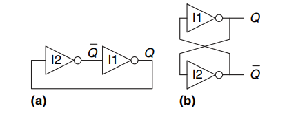
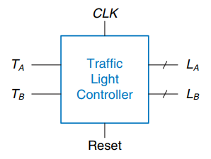
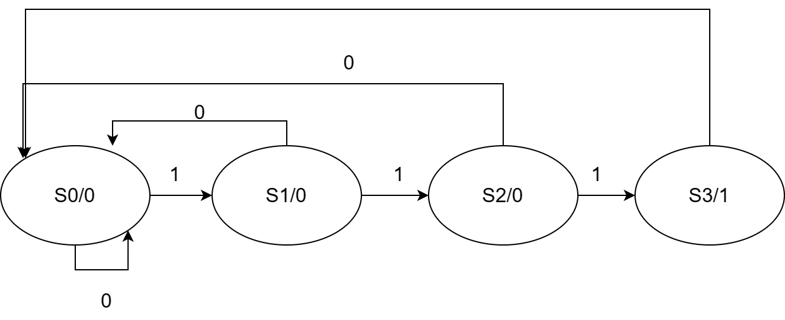
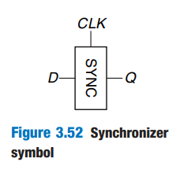

> 以下是 《Digital Design and Computer Architecture》 第 1-8 章的阅读笔记，目录采用原书结构，笔记内容为自己整理（3.5节 时序逻辑电路的时序特性分析跳过）。数字电路部分还可以参考这本教材：[Fundamentals of Digital Logic with Verilog Design, THIRD EDITION (auhd.edu.ye)](https://www.auhd.edu.ye/upfiles/elibrary/Azal2020-01-22-12-23-12-14318.pdf)

## Chapter 1：从 0 到 1

### 1.1 大纲

> 这一章主要为导引内容，比较简单，因此阅读笔记中仅介绍大纲和课后作业。

- Abstraction
- Dicipline
- 3Y's Deisng Dicipline
	- Hierarchy
	- Modularity
	- Regularity
- Digital Abstraction：From Analog to Digital System
- Number System
	- Decimal Numbers
	- Binary Numbers
	- Hexdecimal Numbers
	- Bytes, Nibbles and All that Jazz
	- 8 bits -> bytes
	- 4 bits -> nibble
	- Data in chunks -> words -> depend on the architecture of the microprocessor
	- Memory size -> bytes
	- Communication speed -> bits/sec
	- Arithmetic
	- Unsigned numbers
		- Binary Addition
			- 溢出判断：使用全加器时，最高位是否为 1
	- Signed Numbers
		- Sign-magnitude representation
		- 2's complement representation
			- 溢出判断：如果两数的符号位相同，最高位是否和他们不同
	- Comparison of Number System
	- Unsigned
	- Sign-Magnitude
	- 2's Complement
- Logic Gates
	- Or
	- And
	- Not
	- Buffer
	- Nand
	- Xor
- Beneath the Digital Abstraction
- CMOS Transistors*
- Power Consumption*

## Chapter 2：组合逻辑设计

> 这一章前面的布尔运算、公理和对偶式、卡诺图的使用、以及布尔代数到电路图的转换较为简单，因此不作详细说明，摆出重点公式和算法。

### 2.1 Introduction

组合逻辑电路主要有 4 个组成部分：

- 一个或多个输入
- 一个或多个输出
- 组合逻辑函数
- 表示组合逻辑延迟的时序

### 2.2 Boolean Equations

#### 最小项

每个布尔变量，以原变量或者其反变量的形式，在各个`&`式中出现一次。真值表中输出为 1 的行，可以表示为所有这种`&`式的或。譬如有布尔变量`A`和`B`，其输出公式为$F(A,B)=\bar{A}B+AB$将每个`&`式表达为一个十进制的值（如 AB 对应`0b11`，其十进制的值为 3，该项就可以表示为`m3`），对他们进行`|`运算，这种表示就是最小项。其最小项公式可以表述为：

$F(A,B)=\Sigma(m1,m3)$

#### 最大项

找到真值表中所有输出为 0 的行，将其中为 1 的布尔变量取反，和值为 0 的布尔变量相或。将每个这样的行的值相与，得到的就是最大项。

#### 最大项和最小项的关系

- 最小项中的每一项结果都为 1，只要这些项有 1 个为 1，结果就为 1
- 最大项中每一项的结果都为 0，只要有一个项为 0，结果就为 0
- 最大项可以由最小项进行取反得到

### 2.3 Boolean Algebra

- 公理及其对偶式
- 单变量定理
- 多变量定理
- 真值表
- 简化真值表

### 2.4 From Logic to Gates

- 单输出的 Gates：单个逻辑表达式
- 多输出的 Gates：多个逻辑表达式

### 2.5 Multilevel Combinational Logic

- 硬件简化
- Bubble Pushing

### 2.6 X's and Z's, Oh My

X：

- 不合法的值，如输出同时出现 1 和 0，导致冲突
- 电路尚未初始化的值
- 卡诺图中的无关项（注意区分和电路中的区别）
	Z：
- 高阻态，非 0 也非 1
- 多见于三态门

### 2.7 Karnaugh Maps

- 一次在卡诺图中圈出一个大小为 1，2，4，8（或其他 2 的倍数）的块
- 每个圈都代表一个逻辑表达式
- 卡诺图的上下，左右的边缘相连
- 所有逻辑表达式的和就是，电路最后的简化逻辑表达式

### 2.8 Combinational Building Blocks

- 选择器
- 译码器

### 2.9 Timing

#### Propagation

- 传播延迟：从输入改变 -> 输出值完全稳定下来，中间所需要的时间，一个模块从输入到输出的传播延迟取决于最长的那条路径（关键路径）
- 最小延迟：从输入改变 -> 输出开始改变，中间所需要的时间

#### Glitches

- 竞争冒险：多见于关键路径和最短路径输出的值不一样，而其值到达输出的时刻不一样，导致输出电路的值出现波动。
- 竞争冒险的消除可以通过向电路中增加卡诺图中的冗余项实现。冗余项来源于卡诺图中两个圈相切的部分，将相切的部分的两个圈化为一个圈，将其添加到电路中，即可消除竞争冒险。

## Chapter 3：时序逻辑设计

> 这一章的时序逻辑分析和设计较为重要，学习过程中可以参考这个油管系列视频：
> [Sequential Circuits - YouTube](https://www.youtube.com/playlist?list=PLwjK_iyK4LLCCpnnybEztvRqxpMyfgarS)
>
> 学习完成之后可以：
>
> 1. 完成华科的数字逻辑设计头歌平台所有作业
> 2. HDLBits Verilog语言学习
> 3. Vivado/Quartus Verilog编程环境配置
> 4. 其他学校的数字电路实验课完成

### 3.1 Introduction

- 组合逻辑电路的输出只和输入有关
- 时序逻辑电路的输出不只和输入有关，还和之前的状态相关
- 本章我们会
	- 介绍时序逻辑电路的组成
	- 状态变量的设计
	- 介绍状态机
	- 时序逻辑电路的效率
	- 提高时序逻辑电路效率的方法：并行化

### 3.2 Latches and Flip-Flops

上图中表示的是一个维持稳定状态的电路，为什么说它们维持稳定状态呢？

- 对（a）中电路，如果 I2 的输入为 0，$\bar{Q}$为 1，I1 的输入为 0，又传回 I2，电路状态永远不变。当 I2 的输入为 1 时，同上。
- 对（b）中电路，如果 I2 的输入为 0，那么 I1 的输入为 1，Q 为 0，$\bar{Q}$为 1，电路状态保持不变；反之亦然。
	在 Q 和$\bar{Q}$的值变化的过程中，可能存在其他的状态，这个情况我们在后面会进行讨论。

以上的电路有 2 个状态，可以承载 1 个 bit 的信息。那么 N 个状态的电路，就可以承载$\log_{2}N$个 bit 的信息。Q 是该电路的一个有效状态，$\bar{Q}$也可以说是一个有效状态，但是我们知道它是 Q 的取反，因此知道 Q 就够了。

但是这个电路的不足在于，我们不知道他是什么状态，我们无法输入，这个问题需要修复。

#### SR Latch

SR 锁存器特点：

- 2 个输入：S 和 R
- 2 个输出：Q 和$\bar{Q}$

SR 锁存器真值表：

- S=0，R=0
	- N2 输出对 Q 取反，N1 输出对$\bar{Q}$取反。因为 N2 的输出原本就是$\bar{Q}$，N1 的输出原本就是 Q，因此状态不变
- S=0，R=1
	- N1 输出 0（Q=0），N2 这里 Q 和 S 都是 0，因此输出 1（$\bar{Q}$=1）
- S=1，R=0
	- N2 输出 0（$\bar{Q}$=0），N1 这里$\bar{Q}$和 R 都是 0，因此输出 1（$Q$=1）
- S=1，R=1
	- Q 和$\bar{Q}$都输出 0，冲突，这种情况不应当存在

因为 R=1 时 Q=0，S=1 时 Q=1，因此 S 和 R 称为 Set 和 Reset。

SR 锁存器有一些问题：

- S 和 R 都为 1 时发生冲突，因此不应该让 SR 同时为 1
- 当某个输入被设置为 1 时，状态立刻改变，我们应当对这个改变的时刻加以控制。输入的改变和状态的改变，应当分开进行控制。

#### D Latch

D 锁存器的出现是为了解决 SR 锁存器的上述两个问题，我们进行了两方面的调整：

- 引入输入 D
- 引入时钟信号 CLK，用 CLK 的高低控制锁存器的开闭

D 锁存器的工作机制和 SR 锁存器类似，当 CLK=1 时，S=$\bar{D}$，否则 SR 寄存器保持原有状态，这种机制称为`level-sensitive latch`，也就是锁存器状态取决于 CLK 为 1 时电平信号的高低。

D 锁存器也有一点小小的缺陷，也就是 CLK 为 1 时，锁存器的状态完全取决于 D 电平信号的高低。如果 D 的电平信号震荡，锁存器的状态也会随之上下改变。我们希望能够实现锁存器状态的稳定，让状态更新在一个时刻完成，而不是一段时间，要解决这个问题，下面我们引入 D 触发器。

#### D flip-flop

D 触发器由两个接入相反时钟状态的 D 锁存器构成，前一个称为`master`，后一个称为`slave`。其特性在于：

- 当 CLK=0 时，`master`打入值，`slave`的值不随`master`改变
- 当 CLK=1 时，`slave`打入值，`master`的值不随输入改变

因此，触发器的状态主要取决于 CLK 从 0 到 1 时，实现锁存器的状态转换，而其他时刻状态不变。这样就解决了 D 锁存器状态因转换的时间过长而带来的可能的状态震荡。该触发方式也叫`边沿触发`。

#### Register

寄存器由多个触发器组成，可以存储多位的值，每个触发器存储 1 位的值，通过给他们连接同步的时实现。

#### Enabled Flip-Flop

使能触发器在普通的 D 触发器的基础上，增加了一个 2 选 1 数据选择器。数据选择器的选择端是使能信号，两个数据信号分别是输入 D 和触发器的之前状态。

其状态如下：

- Enable = 1 时，使能触发器输入为 D
- Enable = 0 时，使能触发器保持之前状态

使能触发器相对于 D 触发器做出的改进在于：我们只有在希望的时候才打入输入，而不是在每次时钟上升沿都打入。其控制能力相比 D 触发器更上一层。

#### Resettable Flip-Flop

可复位触发器相比使能触发器的区别在于，当 reset 信号为 1 时，与门输出为 0，打入的信号为 0，状态更新为 0，实现状态复位。该设置常用于对触发器进行同步/异步复位。

#### Transistor-Level Latch and Flip-Flop Designs*

> 此段省略。

#### Putting It All Together

- D 锁存器：高电平触发
- D 触发器：时钟上升沿触发

#### Summary

下面我们对本章介绍的多个锁存器和触发器、以及寄存器进行介绍，最重要的是**D 触发器**。

1. **SR 锁存器**：实现了**过去状态的存储**，但是 SR 均为 1 时电路无效，并且无法控制状态转换的时刻
2. **D 锁存器**：解决了 SR=1 时的无效状态，引入 CLK 时钟对电路进行控制，但是状态变化的间隔过长，容易导致在高电平期间，电路状态随着输入变化而持续变化，我们希望在某个时刻完成状态转换，然后保持其不变
3. **D 触发器**：采用`master-slave`结构，`master`接$\bar{CLK}$，而`slave`接 CLK。`master`在低电平期间状态改变，其他时候不变。`slave`在高电平期间状态改变，其他时候不变。因此最终的结果是触发器的状态取决于时钟上升沿。但是在每次时钟上升沿，电路的状态都会随着输入的状态改变。因此我们希望设置一下电路是接受输入，还是保持状态不变
4. **D 使能触发器**：在 D 触发器的基础上增加一个数据选择器，利用使能信号来选择下一个时钟上升沿，打入`slave`的值是新的输入，还是电路之前的状态
5. **D 复位触发器**：将 D 触发器的输入和$\bar{RESET}$进行与操作，如果`RESET = 1`，那么$\bar{RESET} = 0$，输入为 0，实现了触发器的复位
6. **寄存器**：由多个触发器构成，每个触发器接的是相同的时钟

### 3.3 Synchronous Logic Design

#### 3.3.1 Some Problematic Circuits

1. 以一段时间为周期的周期性震荡的电路
		
2. 存在因电路延迟带来的竞争冒险的电路
		

#### 3.3.2 Synchronous Sequential Circuits

上述电路出现问题的原因：电路中出现了环路

如何消除环路？通过向环路中间加入寄存器，将环路转化成多个段，每个寄存器都由触发器组成，在时钟上升沿触发，因此我们说该电路是时钟同步电路，以此为基础，我们设计了时序逻辑电路。

时序逻辑电路有 5 个组成要素：

- 多个中间状态
- 输入
- 输出
- 组合逻辑函数
- 时序，即一个同步的 CLK
	- 时钟上升沿 -> 输出开始变化：$T_{setup}$
	- 时钟上升沿 -> 输出值稳定：$T_{hold}$

时序逻辑电路的特点在于：

- 由寄存器（触发器，不是锁存器）和组合逻辑电路组成
- 至少有一个寄存器（触发器，不是锁存器）
- 所有寄存器接受相同的时钟信号（不可以有延迟）
- 每个环路至少有一个寄存器

#### 3.3.3 Synchronous and Asynchronous Circuits

异步时序逻辑电路比同步时序逻辑电路更常见，但是更复杂。这里不详述。

### 3.4 Finite State Machines

时序逻辑电路可以被表示成有限状态机的形式，它通常有如下几个组成部分：

- M 个输入
- N 个输出
- k 位的状态（因此电路一共可以有$2^{k}$个状态）
- 一个时钟

时序逻辑电路又分两种：

- Moore 型电路：电路的状态由电路之前的状态和组合逻辑函数决定
- Mealy 型电路：电路的状态由之前的状态，电路的输入，和组合逻辑函数决定

#### 3.4.1 FSM Design Example

> 下面通过一个设计十字路口交通灯的案例，来演示时序逻辑电路的设计。

##### 步骤一：明确问题背景

1. 十字路口有两个传感器：$T_{A}$和$T_{B}$，当传感器输出为`True`代表有学生，输出为`False`代表道路空
2. 两个交通灯：$L_{A}$和$L_{B}$，每个交通灯都要接受传感器的数据，然后决定是输出`红`，`绿`，还是`黄`
3. 每个交通灯有 5 秒的间隔，交通灯在时钟上升沿通过传感器的输入，更新自己的状态
4. 控制器还有一个 reset 按钮来实现复位

交通灯概念图设计如下：

交通灯接口设计如下：

##### 步骤二：绘制状态转换图

电路状态转换过程分析如下：

1. 状态的初始值（复位状态）如下：**A 路绿，B 路红**
2. 如果$T_{A}$为`True`，那么 A 路持续绿，B 路持续红；否则，A 路进入黄色，B 路红
3. **A 路黄，B 路红**时，我们无需管$T_{A}$的状态。过 5 秒自动切入下一个状态：A 路红，B 路绿
4. **A 路红，B 路绿**时，如果$T_{B}$为`True`，那么 A 路持续红，B 路持续绿；否则，A 路红，B 路进入黄色
5. **A 路红，B 路进入黄色**时，我们无需管$T_{B}$的状态，过 5 秒后回到初始状态，A 路绿，B 路红

根据以上分析，电路可以划分为以下几个状态：

1. A 路绿，B 路红：$T_{A}$为`True`时保持，否则进入状态 2
2. A 路黄，B 路红：5 秒后进入状态 3
3. A 路红，B 路绿：$T_{B}$为`True`时保持，否则进入状态 4
4. A 路红，B 路黄：5 秒后进入状态 1
		
		电路转换的时机是时钟上升沿

##### 步骤三：绘制状态转换表

我们将状态转换图，转化为状态转换表。在绘制过程中，我们需要明确如下几样：

- 状态表示：这里我们用 S0，S1，S2，S3 来表示
- 状态转换输入：用$T_{A}$，$T_{B}$来表示，使用 X 来表示无关项（类似卡诺图）

状态转换表的每行有 3 项：

- 该状态
- 输入
- 下一状态

绘制状态转换表如下：

| 当前状态 | 输入$T_{A}$ | 输入$T_{B}$ | 下一状态 |
| ---- | --------- | --------- | ---- |
| S0   | 0         | X         | S1   |
| S0   | 1         | X         | S0   |
| S1   | X         | X         | S2   |
| S2   | X         | 0         | S3   |
| S2   | X         | 1         | S2   |
| S3   | X         | X         | S0   |

##### 步骤四：对状态进行二进制编码

状态分为：S0，S1，S2，S3

| 状态 | $S_{1}$ | $S_{0}$ |
| -- | ------- | ------- |
| S0 | 0       | 0       |
| S1 | 0       | 1       |
| S2 | 1       | 0       |
| S3 | 1       | 1       |

##### 步骤五：对输出进行二进制编码

输出分为：红、黄、绿

| 输出 | $L_{1}$ | $L_{0}$ |
| -- | ------- | ------- |
| 绿  | 0       | 0       |
| 黄  | 0       | 1       |
| 红  | 1       | 0       |

##### 步骤六：确定状态与输入关系表（将状态编码嵌入到状态转换表）

| 当前状态 | $S_{1}$ | $S_{0}$ | 输入$T_{A}$ | 输入$T_{B}$ | 下一状态 | $S_{1}$ | $S_{0}$ |
| ---- | ------- | ------- | --------- | --------- | ---- | ------- | ------- |
| S0   | 0       | 0       | 0         | X         | S1   | 0       | 1       |
| S0   | 0       | 0       | 1         | X         | S0   | 0       | 0       |
| S1   | 0       | 1       | X         | X         | S2   | 1       | 0       |
| S2   | 1       | 0       | X         | 0         | S3   | 1       | 1       |
| S2   | 1       | 0       | X         | 1         | S2   | 1       | 0       |
| S3   | 1       | 1       | X         | X         | S0   | 0       | 0       |

##### 步骤七：确定状态与输出的关系表（根据电路分析、状态编码和输出编码）

| 状态 | $S_{1}$ | $S_{0}$ | $L_{A1}$ | $L_{A0}$ | $L_{B1}$ | $L_{B0}$ |
| -- | ------- | ------- | -------- | -------- | -------- | -------- |
| S0 | 0       | 0       | 0        | 0        | 1        | 0        |
| S1 | 0       | 1       | 0        | 1        | 1        | 0        |
| S2 | 1       | 0       | 1        | 0        | 0        | 0        |
| S3 | 1       | 1       | 1        | 0        | 0        | 1        |

##### 步骤八：写出状态表达式

我们使用$S’$来表示下一时刻的状态，可以如下表示：

$$
S_{1}' = S_{1}S_{0} +S_{1}S_{0}T_{B} +S_{1}S_{0}T_{B}
$$

$$
S_{0}' = S_{1}S_{0}T_{A}+S_{1}S_{0}T_{B}
$$

##### 步骤九：写出输出表达式

$$
L_{A1} = S_{1}L_{A0} = S_{1}S_{0}
$$

$$
L_{B1} = S_{1}L_{B0} = S_{1}S_{0}
$$

##### 步骤十：画出电路图

1. 设计寄存器
		
		状态寄存器设计如图，左边是下一时刻状态，右边是之前的状态。在时钟上升沿，下一时刻状态打入寄存器，因此将其花在左边，而不是右边。

2. 添加状态与输入关系电路
		

3. 添加状态与输出关系电路
		

#### 3.4.2 State Encodings

> 状态编码有分为二进制编码（binary encoding）和独热编码（One-hot encoding）

##### Binary Encoding

N 个编码只需要$log_{2}N$位就可以表示。

##### One-hot Encoding

N 个编码需要 N 位二进制表示，该二进制数中，对于一个状态有且仅有 1 位的值为 1。选择这种编码需要更多的触发器，但是对应的输出电路和状态转换电路会更简单。

##### 设计示例1：3进制计数器

设计一个 divide by 3 counter，当状态转换的次数为3的倍数时（对3求模 = 0），输出为1，否则输出为0

###### 背景分析

根据分析，电路存在3个状态：

- S0：初始状态，也是最终状态，输出为1。下一时刻跳转到S1
- S1：输出为0，下一时刻跳转到S2
- S2：输出为0，下一时刻跳转到S0

电路状态转换图如下：

###### 状态转换图绘制

状态有3个，S0、S1和S2，我们分别采用二进制编码和独热编码对其进行编码。

###### 采用二进制编码设计

1. 状态编码：电路有3个状态，我们采用2位二进制进行编码，分别用$S_{1}$和$S_{0}$表示。

| 状态 | $S_{1}$ | $S_{0}$ |
| -- | ------- | ------- |
| S0 | 0       | 0       |
| S1 | 0       | 1       |
| S2 | 1       | 0       |

1. 输出编码：电路只有1个输出，也就是Y，那么我们只需要1位二进制数表示
2. 状态转换表

| 状态 | $S_{1}$ | $S_{0}$ | 下一状态 | $S_{1}'$ | $S_{0}'$ |
| -- | ------- | ------- | ---- | -------- | -------- |
| S0 | 0       | 0       | S1   | 0        | 1        |
| S1 | 0       | 1       | S2   | 1        | 0        |
| S2 | 1       | 0       | S0   | 0        | 0        |

由图我们可以得到状态表达式，下一时刻的状态用$S'$表示。

$$
S_{1}' = \bar{S_{1}}S_{0}
$$

$$
S_{0}' = \bar{S_{1}}\bar{S_{0}}
$$

1. 状态与输出关系表

| 状态 | $S_{1}$ | $S_{0}$ | 输出Y |
| -- | ------- | ------- | --- |
| S0 | 0       | 0       | 1   |
| S1 | 0       | 1       | 0   |
| S2 | 1       | 0       | 0   |

由图我们可以得到输出与状态的关系式：

$$
Y=\bar{S_{1}}\bar{S_{0}}
$$

1. 电路图设计

###### 采用独热编码设计

1. 状态编码：独热编码对每个状态使用1位单独的二进制1，因此3个状态需要3位二进制数。

| 状态 | $S_{2}$ | $S_{1}$ | $S_{0}$ |
| -- | ------- | ------- | ------- |
| S0 | 0       | 0       | 1       |
| S1 | 0       | 1       | 0       |
| S2 | 1       | 0       | 0       |

1. 输出编码：电路只有1个输出，也就是Y，使用1位二进制数表示
2. 状态转换表

| 状态 | $S_{2}$ | $S_{1}$ | $S_{0}$ | 下一时刻状态 | $S_{2}'$ | $S_{1}'$ | $S_{0}'$ |
| -- | ------- | ------- | ------- | ------ | -------- | -------- | -------- |
| S0 | 0       | 0       | 1       | S1     | 0        | 1        | 0        |
| S1 | 0       | 1       | 0       | S2     | 1        | 0        | 0        |
| S2 | 1       | 0       | 0       | S0     | 0        | 0        | 1        |

由图我们可以得到状态表达式：

$$
S_{1}' = S{0}
$$

$$
S_{2}' = S{1}
$$

$$
S_{0}' = S{2}
$$

1. 状态与输出关系表

| 状态 | $S_{2}$ | $S_{1}$ | $S_{0}$ | 输出Y |
| -- | ------- | ------- | ------- | --- |
| S0 | 0       | 0       | 1       | 1   |
| S1 | 0       | 1       | 0       | 0   |
| S2 | 1       | 0       | 0       | 0   |

由此我们可以得到状态与输出表达式：$Y=S_{0}$

1. 电路设计

通过上面的分析，我们可以看到，独热编码的逻辑表达式比二进制编码要简单很多，但是会更加消耗二进制位数。电路设计如下：

##### 设计示例2：3进制累加器

设计一个累加器，当连续输入3个1时，输出为1，其他时候输出为0。

###### 背景分析

根据分析，电路存在3个状态：

- S0：起始（复位）状态，输入0个3时，输出为0。若此时输入1，进入S1；否则继续S0
- S1：输入1个3时，输出为0。若此时输入1，进入S2；否则进入S0
- S2：输入2个3时，输出为0。若此时输入1，进入S3；否则进入S0
- S3：输入3个3时，输出为1。下一状态为S0

###### 状态转换图绘制

###### 状态转换表绘制

| 状态 | $S_{1}$ | $S_{0}$ | 输入T | 下一时刻状态 | $S_{1}'$ | $S_{0}'$ | 输出 |
| -- | ------- | ------- | --- | ------ | -------- | -------- | -- |
| S0 | 0       | 0       | 0   | S0     | 0        | 0        | 0  |
| S0 | 0       | 0       | 1   | S1     | 0        | 1        | 0  |
| S1 | 0       | 1       | 0   | S0     | 0        | 0        | 0  |
| S1 | 0       | 1       | 1   | S2     | 1        | 0        | 0  |
| S2 | 1       | 0       | 0   | S0     | 0        | 0        | 0  |
| S2 | 1       | 0       | 1   | S3     | 1        | 1        | 0  |
| S3 | 1       | 1       | X   | S0     | 0        | 0        | 1  |

###### 二进制编码实现

1. 状态编码：状态有4个，因此使用2位二进制数进行编码

| 状态 | $S_{1}$ | $S_{0}$ |
| -- | ------- | ------- |
| S0 | 0       | 0       |
| S1 | 0       | 1       |
| S2 | 1       | 0       |
| S3 | 1       | 1       |

1. 输入编码：输入只有1个，因此使用1位二进制数表示
2. 输出编码：输出只有1个，因此使用1位二进制数表示
3. 状态转换表达式
		$S_{1}'=\bar{S_{1}}S_{0}T + S_{1}\bar{S_{0}}T$
		$S_{0}'=\bar{S_{0}}$

4. 输出表达式：$Y=S_{1}S_{0}$

> 此处不画电路图。

#### 3.4.3 Moore and Mealy Machines

> 详细的案例可见教材P132面蜗牛爬行问题。

Mealy型电路相比Moore型电路的主要区别在于，它的输出不仅取决于之前的状态，还取决于输入。通常在设计Mealy型电路的状态转换图时，我们会使用较少的状态，将状态之间的输入和输出用`输入/输出`的方式写在状态转换弧线上。此外，因为输出跟输入有关，因此有时我们会直接用与门来确定输出。这样做带来的好处是，相比Moore型电路中，一定要等到状态确定才能确定输出，Mealy型电路的输出少了一个触发器（寄存器）的延迟。

#### 3.4.4 Factoring State Machines

当遇到比较复杂的问题时，我们需要将问题分解为多个状态机，将一个状态机的输出作为另一个状态机的输入，而不是使用一个状态机解决。这种做法会带来相当程度的简化。

#### 3.4.5 Deriving an FSM from a Schematic

> 本节介绍如何由时序逻辑电路电路还原状态机，并且分析电路功能，这节的内容主要在于对电路的逆向工程。详细的案例可参考课本P137

- 分析电路的输入、输出、状态位
- 写出状态转换逻辑表达式，和输出逻辑表达式
- 根据表达式构建状态转换真值表，输出逻辑真值表
- 消除真值表中不存在的状态项（因为如果使用二进制表示法编码的话，二进制位可以产生的状态个数可能会大于实际需要的状态个数）
- 给每个有效状态分配一个状态名
- 将原来的状态转换表和输出表中的二进制编码替换为状态名
- 画出状态转换图
- 语言描述状态机的用途

#### 3.4.6 FSM Review

> 本节介绍如何实现一个时序逻辑电路。

- 确定输入和输出
- 画出状态转换图
- 对于Moore型电路
	- 写出状态转换表
	- 写出输出逻辑表
- 对于Mealy型电路
	- 写出一个状态转换表，其中合并了状态转换和输出
- 选择状态编码
- 写出状态转换逻辑函数和输出逻辑函数
- 画出电路图

### 3.5 Timing of Sequential Logic

> 这一段写得非常绕，但是我在找了几个油管的视频之后理解了，视频链接如下：
> 
> 

首先，我们需要了解一个原则，就是CLK时钟从0到1的变化，并不是突然之间产生的，而是经过一个短暂的阶梯型变化过程。从第一章的内容我们可以知道，模拟电路到数字电路的转换之前，需要对高电平和低电平进行定义。在某个电压之上，我们将其状态定义为高电平；在某个电压之下，我们将其定义为低电平；而在这之间，电平处于无效状态。

触发器的状态更新，就是发生在时钟上升沿。但是触发器并不是一个单一的部件，其由内部多个逻辑门所构成。如D触发器的结构如下：

在CLK位于低电平时，输入从D到N1，需要经过一个D锁存器。从N1到Q，需要经过一个D锁存器。我们需要保证触发器中的值（也就是`slave`锁存器中的值）是稳定的，那么就要求从D输入到N1，以及N1输入到Q的过程中，这个值保持稳定。从D输入到N1的时间，我们称为`setup time`；从N1到Q的时间，我们称为`hold time`。也就是说，输入必须在`setup time + hold time`期间内，保持稳定。不稳定所带来的情况，我们将在`3.5.4 Metastability`一节中讨论。

> `setup time`和`hold time`之和也叫`aperture time`

#### 3.5.1 The Dynamic Discipline

结合上述电路图，我们阐述几个重要的时间：

- contamination delay（$t_{ccq}$）：从上升沿获取输入，到得到Q1输出的最短时间
- propagation delay（$t_{pcq}$）：从上升沿获取输入，到得到Q1输出的最长时间
- setup time：在CLK上升沿之前，输入至少保持`setup time`
- hold time：在CLK上升沿之后，输入至少保持`hold time`
- 组合逻辑电路的延迟（$t_{pd}$）：值从Q1到Q2的最大时间

#### 3.5.2 System Timing

在对电路的时序进行分析之前，我们需要明确两个值：$T_{c}$和$f_{c}$。前者是指两个时钟上升沿之间的时间间隔，也叫时钟周期。后者是前者的倒数，是时钟频率。时钟频率的增加，可以带来吞吐量的增加。时钟频率的单位包括：`Hz`，`MHz`和`GHz`。其单位换算如下：

- 1 megahertz (MHz) = 106 Hz
- 1 gigahertz (GHz) = 109 Hz.

结合上述电路块的结构分析，一个电路的值传递有如下几个阶段：

- 从输入，经过触发器R1，到Q1
- 从Q1，经过组合逻辑电路，到D2
- 从D2输入到触发器R2

##### Setup Time Constraint

> 在对约束条件进行分析时，我们采用`worst case analysis`，也就是分析极限情况下的边界条件。需要注意的是`setup time constraint`指的不是`setup time`，而是对组合逻辑电路最大值的限制，因为组合逻辑部分是这个电路唯一可以优化的部分。

对电路`setup time`的约束主要在于触发器R2。分析如下：

- 在时钟上升沿后，触发器R1的值最多需要经过$t_{pcq}$才能到达Q1
- Q1的值最多需要经过$t_{pd}$才能到达D2
- 总的时钟周期为$T_{c}$

而D2输入必须满足`setup time`的要求，也就是说：

- D2的输入必须至少在时钟上升沿前$t_{setup}$刻开始保持稳定，即组合逻辑电路的值必须在$T_{c} - t_{setup}$时刻或之前抵达D2

综上分析，我们可以得出以下公式：

$t_{pcq}+t_{pd}<=T_{c}-t_{setup}$

通过移项运算，我们可以得到如下公式：

$$
T_{c} >= t_{pcq}+t_{pd}+t_{setup}
$$

那么，$T_{c}$的值至少为$t_{pcq}+t_{pd}+t_{setup}$，那么$f_{c}$的值最大为

$$
f_{c} = \frac{1}{t_{pcq}+t_{pd}+t_{setup}}
$$

通过这个公式，我们可以了解到，该电路的主要可优化部分为组合逻辑部分，$t_{pd} ≤T_{c}−t_{pcq} +t_{setup}$ 称为`setup time constraint`。

##### Hold Time Constraint

对于`hold time`的约束条件探索，我们同样采用取极端情况的情况，就是不考虑组合逻辑（其延迟为0）。

对于R2的输入D2，其之前的值需要保存$t_{hold}$个单位的时间。但是从R1过来的值，最短只需要$t_{ccq}+t_{cd}$个时刻就能到达，因此可以得出以下表达式：

$$
t_{ccq}+t_{cd}>=t_{hold}
$$

因此，可以得出如下表达式：

$$
t_{cd} ≥ t_{hold}-t_{ccq}
$$

组合逻辑电路延迟的最小值是 $t_{hold}-t{ccq}$。当两个触发器直接相接的时候，$t_{ccq}=0$，那么要求$t_{hold}<=t_{ccq}$。通常情况下我们默认$t_{hold}=0$，那么上述不等于恒成立。但是如果该条件不成立，我们就需要增加$t_{ccq}$，这需要对电路进行大量的修改，并且耗费巨大的资金，因此我们在设计电路时需要谨慎地考虑$t_{hold}$约束。

##### Putting It All Together

> 时序分析案例见课本P145面

两条约束原则：

- $t_{pd} ≤T_{c}−t_{pcq} +t_{setup}$
- $t_{cd} ≥ t_{hold}-t_{ccq}$

修复`hold time violation`，可以用加buffer的方式。但是要注意的是，有的时候加了Buffer后会改变关键路径，从而改变`setup time`的约束情况。

#### 3.5.3 Clock Skew

> 这一段也不太好理解，尤其是hold time的部分，我参考了以下油管视频：
> 
> 

`Clock skew`的含义是：对各个触发器时钟上升沿到达的时间不一致。

产生clock skew的原因包括：

- 通往多个clock的线的长度不一致
- 噪声（`Noise`）
- `clock gating`

在讲解`Clock Skew`之前，我们需要再看一下电路图：

对于一个触发器，`master`的CLK是通过`slave`的CLK取反得到的，因此这个非门可能会导致两个CLK的上升沿不一致，如图：

因CLK1比CLK2多经过1个非门，因此时钟到达CLK2的时间更早，CLK1更晚

##### setup time constraint分析

我们从`worst case scenario`分析（这里的`worst case scenario`指的是触发器输出和组合逻辑传递都取最长时间。因为我们要探索的是，在CLK1和CLK2的时钟上升沿间隔缩短，触发器输出和组合逻辑传输时间最长的情况下，依然保证留有$t_{setup}$个单位的时间，供R2维持输入的稳定）：

- 从CLK1的上升沿开始，R1的值经过最多$t_{pcq}$进入到Q1；
- 经过组合逻辑的电路的延迟$t_{pd}$，Q1传输到D2，
- D2输入至少要在CLK2的上升沿前$t_{setup}$时刻达到，甚至更早

也就是说，从CLK1的上升沿，至少经过$t_{pcq}+t_{pd}+t_{setup}$抵达CLK2的上升沿。而从CLK1的上升沿到CLK2的上升沿，经过的时间是$T_{c}-t_{skew}$

经过如上分析，我们可以建立不等式：

$$
T_{c} - t_{skew} >= t_{pcq} + t_{pd} + t_{setup}
$$

对其进行移位变换，我们可以得到：

$$
T_{c} >= t_{pcq} + t_{pd} + t_{setup} + t_{skew}
$$

同上，`setup time constraint`指的是组合逻辑电路的延迟限制（因为组合逻辑电路是电路中唯一一个可以优化的部分，其他的时钟频率、触发器时延、时钟时延、setup time 都是不可改变的），我们可以得到如下不等式：

$$
t_{pd} <= T_{c} - (t_{pcq}+t_{setup}+t_{skew})
$$

##### hold time constraint分析

对于`hold time constraint`，我们同样分析的是R2，R2的值必须**在CLK2时钟上升沿后**，R1传过来的值到达前，保持至少`hold time`个时间单位。我们依然从`worst case scenario`分析（这里与`setup time constraint`的`worst case`不同，我们需要探测从R1传输过来的时间最短的情况，必须要让`hold time`比最短的传输时间还短，否则会导致`hold time violation`）：

- R1的输出最少需要$t_{ccq}$个时间单位进入Q1
- Q1最少需要$t_{cd}$个时间单位进入D2

但是，因为有了`clock skew`。因此，哪怕信号已经到达了，而且CLK1已经经过了一个时钟周期，它也还需要再等待$t_{skew}$个单位的时间，才能进入R2。这为R2的$t_{hold}$争取到了一些额外的时间。

那么，我们就可以得到如下不等式：

$$
t_{hold} + t_{skew} <= t_{ccq} + t_{cd}
$$

同上，组合逻辑电路是这个电路中唯一可以优化的部分，组合逻辑电路的时延要求如下：

$$
t_{cd} >= t_{hold} + t_{skew} - t_{ccq}
$$

##### Put it all together

在存在`clock skew`的情况下，我们得到了两个不等式，描述了对于组合逻辑延迟的约束：

$$
t_{pd} <= T_{c} - (t_{pcq}+t_{setup}+t_{skew})
$$

$$
t_{cd} >= t_{hold} + t_{skew} - t_{ccq}
$$

通过如上不等式，我们可以看到，`clock skew`使得组合逻辑电路的最大值减少、最小值增加。者带来的问题是，当两个触发器直接相接（无组合逻辑电路时），$t_{cd}=0$，$t_{skew}-t{ccq}$如果大于0，哪怕$t_{hold}$等于0，都会导致`hold time violation`。因此，很多厂家会把$t_{ccq}$设计的比较大，哪怕$t_{skew}$的值有时并不大，但是一旦导致`hold time violation`，修改电路导致的各方面的损失是巨大的。

> 带有`clock skew`的时序电路分析案例见课本P150面。

对于存在`hold time violation`的电路，修复的方法包括：

- 加buffer（关键路径也要加）
- 改进触发器，将`hold time`缩短
- 增加$t_{ccq}$

#### 3.5.4 Metastability

> 这个油管视频讲的非常好：
> 

##### Metastable State

`Metastability`指的是亚稳态，亚稳态指的是，输入在`setup time`和`hold time`内没有保持稳定，这导致输出不确定。输出可能会在0和$V_{DD}$之间（即`forbidden zone`），但是最终总会达到0或者1。

##### Resolution Time

我们把电路从亚稳态到稳态的时间记为$t_{res}$，有如下两种情况：

- 输入的变化是在`aperture time`之外发生的，那么$t_{res} = t_{ccq}$
- 否则，时间无法估计，只能用一个概率函数表示：

	$$
	P(t_{res}>t) = \frac{T_{0}}{T_{c}}e^{-\frac{t}{τ}}

$$
这个概率函数的推导在这里意义不大，因此不与呈现。但是可以看到的是，这个概率是一个以$e$为底的指数函数，并且指数是负数，那么随着$t$增大，这个概率会以指数级别的速度减小，但是它不可能为0。

从第一章的介绍中我们可以知道，模拟电路到数字电路的映射方式是，将某个电压以上均视为高电平，某个电压以下均视为低电平，中间的称为`forbidden zone`。因此，电压无需完全的达到0，只需要最终下降到一个合理的区间内即可。随着时间的推移，电路极大可能处于稳态。

#### 3.5.5 Synchronizers

在设计电路时，有时我们需要设计多个模块，这些个模块在时钟上可能不是完全同步的。或者，我们设计了一个同步电路，但是电路的输入是随机发生的，不一定会在`aperture time`内保持稳定，但是我们需要保证输出处于稳态，这时候就需要用到同步器。一个同步器有一个输入，一个CLK时钟，和一个输出，如图所示：

一个可能的同步器的实现就是将两个触发器直接相接，得到的电路如下：

在上述电路中，如果输入在`aperture time`中保持稳定，那么输出自然保持稳定。如果输入不稳定，如果给的时间够长，它极大概率会在$t_{res}$内转换到稳态。

> 对于无法转换到稳态的概率计算，详见课本P153面

#### 3.5.6 Derivation of Resolution Time*

> 此节为前文$t_{res}$公式的推导，本节涉及到模拟电路的内容，此处略过。

### 3.6 Parallelism

> 参考了课程官方讲解视频：
>
> 

此节有几个重要概念：

- 延迟（`latency`）：完成一项工作所花费的时间
- 吞吐量（`throughoutput`）：单位时间内完成工作的量

为了提高吞吐率，我们可以采用并行（`parallelism`）的方式，`parallelism`有两种：

- `spatial parallelism`：复制硬件
- `temporal parallelism`：将工作拆分为多个阶段，不同的工作可能处于不同的阶段中，即流水线

量化分析，假设如下场景：

- 一个任务的延迟是L（完成一项任务所花费的时间是L）
- 它的吞吐量是1/L（在单位时间内完成的工作量是1/L）

对于`spatial parallelism`的系统，假设硬件复制了N份，那么：

- 任务的延迟依然是L
- 它的吞吐量是N/L（同一时刻有N份硬件完成该任务）

对于`temporal parallelism`的系统，假设把他划分为N个阶段，那么：

- 任务的延迟依然是L
- 对于流水线，第一个任务完成所需要的时间是L，自那以后每过L/N个单位的时间，就有一项任务完成。对于$n$个任务来说，完成所需要的总时间是$L+(N-1)*\frac{L}{N}$，那么它的吞吐量就是$\frac{n}{L+(N-1)*(\frac{L}{N})}$，对该式进行化简，过程如下：
$$

\frac{n}{L+(N-1)*(\frac{L}{N})} = \frac{n}{2L-\frac{L}{N}}

$$

对于流水线来说，其一个阶段的`时钟周期`，取决于这个阶段中**关键路径所花的时间**（也就是从上个寄存器到下个寄存器，通过最长时间的路径）；其`延迟`是指从流水线开头到流水线结尾所花费的时间；其`吞吐量`可以约等于$\frac{1}{时钟周期}$

`temporal parallelism`和`spatial parallelism`相比，其优势在于其可以通过不增加硬件达到加倍的吞吐量。

### 3.7 Summary

本章介绍了：

- 时序逻辑电路和组合逻辑电路的区别
- 多种锁存器 -> 多种触发器 -> 使能触发器和复位触发器
- 从状态转换图到时序逻辑电路的设计
- 时序逻辑电路的时序分析
- 多种`parallelism`：`spatial parallelism`和`temporal parallelism`的延迟和吞吐量

### Exercises

> 触发器的转换方法参考链接[各类触发器的转换-数字电子技术-电子发烧友网站 (elecfans.com)](https://www.elecfans.com/book/625/)

#### 基础的锁存器 & 触发器特性

- SR锁存器
	- S为set，S=1时，输出信号为1
	- R为reset，R=1时，输出信号为0
	- SR=1时，电路状态无效
	- SR=0时，电路状态保持不变
- D锁存器
	- CLK=1时，输出Q=D
	- CLK=0时，输出保持不变
- D触发器
	- CLK上升沿把D的值输入到Q
	- 其他时候输出保持不变

#### 各类触发器之间的互相转换

没有在课本中提到的是一些其他的触发器，以及触发器的特性方程，而触发器之间的互相转换需要利用到特性方程。特性方程指的是锁存器/触发器的下一时刻输出$Q*$与输入信号之间的关系。

- RS触发器：输入信号R和S，输出为Q*。特性方程为$Q^{*}=S+\bar{R}Q$
- D触发器：输入信号D和CLK，输出为Q*。特性方程为$Q^{*} = D$
- JK触发器：功能最强大
	- JK都为0，保持输入
	- J=1，输出为1
	- K=1，输出为0
	- JK都为1，输出取前一个时刻输出的取反
	- 输入信号为J和K，输出为$Q^{*}$，特性方程为$Q^{*}=J\bar{Q}+\bar{K}Q$
- T触发器：
	- 功能是每个时钟上升沿，输出为前一个时刻输出的取反。输入信号为T和CLK，输出为Q*；
	- 特性方程为$Q^{*}=\bar{T}Q+T\bar{Q}$

各个触发器的状态转换的方法在于，用已知的触发器去表达未知的触发器，如下：

- D触发器 -> T触发器（用T表示D）：$D=\bar{T}Q+T\bar{Q}$
- D触发器 -> JK触发器（用JK表示D）：$D=J\bar{Q}+\bar{K}Q$
- JK触发器 -> D触发器（用D表示JK）：
	- 可以将D转化为$Q^{*}=D(Q+\bar{Q})=DQ+D\bar{Q}$
	- 因为JK触发器特性方程为$Q^{*}=J\bar{Q}+\bar{K}Q$
	- 那么$J=D,K=\bar{D}$
- JK触发器 -> T触发器（用T表示JK）：
	- JK触发器：$Q^{*}=J\bar{Q}+\bar{K}Q$
	- T触发器：$D=\bar{T}Q+T\bar{Q}$
	- 那么$J=T,K=T$

#### 同步电路 vs 异步电路

> 异步 `preset & clear`电路的工作时序可以参考这个油管视频：
> `preset & clear latch/flip-flop`的设计可以参考这个油管视频：
> 
> 以及这个油管视频：
>
> 查找异步视频资料的时候还费了点功夫，一开始搜索的是`asynchronous d latch/flip flop/sequential circuit design`，结果搜到的资料非常有限，直到搜到一本`sequential circuit design`还是什么教材，里面管这个特性叫`preset & clear`，才恍然大悟查错了资料。后来换了个方式查找资料，果然搜到了。

- 异步复位的D锁存器设计
- 异步设置D锁存器设计
- 异步复位的D触发器设计
- 异步设置D触发器设计

#### 时序逻辑电路的设计：从状态机到电路（尤其是Mealy型电路的设计）

> Moore型电路和Mealy型电路的主要差别在于：**Moore型电路的输出与状态有关，而Mealy型电路的输出与状态和输入有关。**
>
> Mealy型电路的设计还不太会（如课本P166 习题3.25）(说白了其实是DFA的设计不太会，过会儿补一补）
> DFA的介绍看这里：

##### 状态机的化简流程

> 状态机的化简看这里：

化简流程：

1. 根据状态转换图，画出状态转换表
2. 消去等效状态
3. 把表中消去的等效状态用已有的状态替代
4. 画出新的状态转换图

##### 二进制序列检测器

> 基础二进制序列检测器的实现方法看这里：

##### Grey Code状态机生成器

#### 时序逻辑电路的分析：从电路到状态机

#### 时序逻辑电路中的限制与延迟

### Interview Questions

## Chapter 4：硬件描述语言

> 这一章的学习可以配套 HDLBits 的 Verilog 练习，以及其他学校的 Verilog 数字电路设计课程进行练习，光看是没有用的。

## Chapter 5：数字电路设计

> 这一章的学习过程中，可以使用 Logisim 将所有基础电路搭起来，并且使用 Verilog 构建所有的电路

## Chapter 6：MIPS 汇编语言

> 这一章学习过后可以学习汇编和链接过程，文件格式，实现一个 MIPS 汇编器，和一个 MIPS 反汇编器

## Chapter 7：微架构处理器设计

> 这一章学习后，可以使用 Logisim 实现 MIPS 单周期/多周期/流水线处理器（完成华科头歌实验），并用 Verilog 进行实现并仿真

## Chapter 8：主存和 I/O 系统设计

> 这一章学习后，可以使用 Logisim 实现简单的 Memory 和 Cache（完成华科头歌实验），而后可以使用 Verilog 实现并仿真

## 后续任务

- [ ] 华科数字逻辑+组成原理课程学完
- [ ] 其他学校数字逻辑+组成原理课程学完
- [ ] Verilog 基础数字电路构建块设计
- [ ] 设计一些小型的数字电路
- [ ] 实现一个带存储+I/O+五级流水的 MIPS CPU
- [ ] 文件格式学习
- [ ] 链接过程学习
- [ ] MIPS 汇编器实现
- [ ] MIPS 反汇编器实现
- [ ] 学习基础的编译原理知识
- [ ] 小型 C 语言编译器实现
