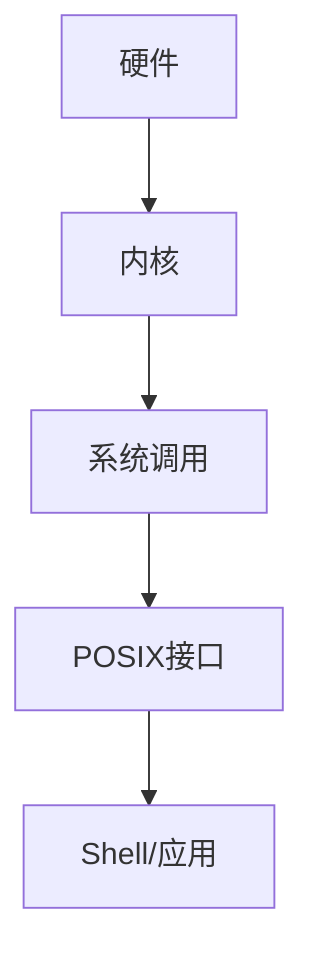

<!--more-->

### 软件包管理器及软件包

前文我们用`pacman`安装了vim，但是我们还不是特别了解pacman的包管理模式，以及那些选项的含义。下面我们来详细的了解一下pacman。

根据[pacman - Arch Linux 中文维基](https://wiki.archlinuxcn.org/wiki/Pacman)文档，pacman是一种软件包管理器。那么什么是软件包管理器呢？通过查阅[软件包管理系统 - 维基百科，自由的百科全书](https://zh.wikipedia.org/wiki/%E8%BD%AF%E4%BB%B6%E5%8C%85%E7%AE%A1%E7%90%86%E7%B3%BB%E7%BB%9F)，我们了解到

> **软件包管理系统**是在电脑中自动安装、配制、卸载和升级[软件包](https://zh.wikipedia.org/wiki/%E8%BD%AF%E4%BB%B6%E5%8C%85 "软件包")的工具组合，在各种[系统软件](https://zh.wikipedia.org/wiki/%E7%B3%BB%E7%BB%9F%E8%BD%AF%E4%BB%B6 "系统软件")和[应用软件](https://zh.wikipedia.org/wiki/%E5%BA%94%E7%94%A8%E8%BD%AF%E4%BB%B6 "应用软件")的安装管理中均有广泛应用。

那么软件包是什么呢？

> **软件包**（**packaged software**）是对于一种[软件](https://zh.wikipedia.org/wiki/%E8%BD%AF%E4%BB%B6 "软件")所进行打包的方式。在不同的操作系统中，软件包的类型有很大的区别。在[Linux](https://zh.wikipedia.org/wiki/Linux "Linux")、[BSD](https://zh.wikipedia.org/wiki/BSD "BSD")系统中，软件包主要以两种形式出现：二进制包以及源代码包。

那么二进制包和源代码包又有什么差别呢？通过搜索[what's the difference between binary package and source package - Google 搜索](https://www.google.com/search?q=what%27s+the+difference+between+binary+package+and+source+package&sca_esv=829c1e259cd14284&ei=8kM1aP6BA8q8seMP3dXouAU&ved=0ahUKEwj-wpCg7MKNAxVKXmwGHd0qGlcQ4dUDCBA&uact=5&oq=what%27s+the+difference+between+binary+package+and+source+package&gs_lp=Egxnd3Mtd2l6LXNlcnAiP3doYXQncyB0aGUgZGlmZmVyZW5jZSBiZXR3ZWVuIGJpbmFyeSBwYWNrYWdlIGFuZCBzb3VyY2UgcGFja2FnZUigPlAAWJg9cAR4AJABBJgB3wKgAehiqgEJMy41Ni4xMC4xuAEDyAEA-AEBmAJEoALDW8ICERAuGIAEGLEDGNEDGIMBGMcBwgILEAAYgAQYsQMYgwHCAgUQABiABMICIBAuGIAEGLEDGNEDGIMBGMcBGJcFGNwEGN4EGOAE2AEBwgIQEAAYgAQYsQMYgwEYigUYCsICBxAAGIAEGArCAg0QLhiABBjRAxjHARgKwgIHEC4YgAQYCsICHBAuGIAEGNEDGMcBGAoYlwUY3AQY3gQY4ATYAQHCAgcQABiABBgNwgIGEAAYChgewgIEEAAYHsICBhAAGA0YHsICCRAAGIAEGBMYDcICCBAAGBMYChgewgIIEAAYExgNGB7CAggQABgIGA0YHsICCBAAGIAEGKIEwgIFEAAY7wXCAgcQIRigARgKmAMAugYGCAEQARgUkgcJNy40Ny4xMy4xoAeMmQOyBwkzLjQ3LjEzLjG4B7lb&sclient=gws-wiz-serp)，我们得到如下结论：

> There are two types of packages that include binary packages and source packages. **The source packages need to be compiled and built for a system, whereas the binary packages have already been compiled for a specific installation**.

也就是说源代码包是没有经过编译的，需要用户进行手动编译。而二进制包是已经编译好了的。

其中，对于二进制包，对于不同的linux发行版，有不同的包管理器：

- red hat linux使用rpm进行包管理
- debian下的.deb文件是用apt包管理器进行包管理，其调用dpkg（apt和dpkg又是什么关系呢？APT最早被设计成[dpkg](https://zh.wikipedia.org/wiki/Dpkg "Dpkg")的前端，用来处理[deb](https://zh.wikipedia.org/wiki/Deb "Deb")格式的软件包。现在经过APT-RPM组织修改，APT已经可以安装在支持[RPM](https://zh.wikipedia.org/wiki/RPM%E5%A5%97%E4%BB%B6%E7%AE%A1%E7%90%86%E5%93%A1 "RPM包管理员")的系统管理[RPM](https://zh.wikipedia.org/wiki/RPM%E5%A5%97%E4%BB%B6%E7%AE%A1%E7%90%86%E5%93%A1 "RPM包管理员")包）
- Autopackage：其目标为可以简易的创造在所有的[Linux发行版](https://zh.wikipedia.org/wiki/Linux%E7%99%BC%E8%A1%8C%E7%89%88 "Linux发行版")上安装的软件包，是一种通用的包管理工具

而对于源代码包，也有一种包管理工具，其在Gentoo Linux下运行，可以在编译时指定编译器之类的选项，进行手动编译。当然用户也可以手动编译。

这里插播一个知识点，Linux有多种[Linux发行版列表 - 维基百科，自由的百科全书](https://zh.wikipedia.org/wiki/Linux%E5%8F%91%E8%A1%8C%E7%89%88%E5%88%97%E8%A1%A8)，按照打包方式划分，可以分为如下几类：

- Debian系：Debian，Deepin，Kali Linux，Ubuntu等；其中deb为软件包格式，用dpkg及其前端apt进行包管理；
- Red Hat系：CentOS，Fedora等；使用RPM进行包管理；
- Slackware系：这里不详述；
- Arch系：Arch Linux，Manjaro等；使用Pacman进行包管理；
- 其他打包方式的包，这里不详述；
- 给老机器订制的小型包，这里不详述；

### Arch 包格式及创建软件包

> 参考：
> - [创建软件包 - Arch Linux 中文维基](https://wiki.archlinuxcn.org/wiki/%E5%88%9B%E5%BB%BA%E8%BD%AF%E4%BB%B6%E5%8C%85)
> - [Ports - 维基百科，自由的百科全书](https://zh.wikipedia.org/wiki/Ports)
> - [BSD - 维基百科，自由的百科全书](https://zh.wikipedia.org/wiki/BSD)

Pacman文档中写道，Pacman将一个简单的二进制包格式和一个易用的构建系统结合起来。Pacman的目标是简化对软件包的管理，无论软件包是来自[官方软件仓库](https://wiki.archlinuxcn.org/wiki/Official_repositories "Official repositories")还是用户自己创建的软件包。这里就涉及到一个创建pacman包的问题。

文档一上来第一句话就说：

> 本文旨在帮助用户利用类似于 ports 软件的 [Arch 构建系统](https://wiki.archlinuxcn.org/wiki/Arch_%E6%9E%84%E5%BB%BA%E7%B3%BB%E7%BB%9F "Arch 构建系统")来创建自己的软件包，这些软件包可以提交到 [Arch 用户软件仓库 (AUR)](https://wiki.archlinuxcn.org/wiki/Arch_%E7%94%A8%E6%88%B7%E8%BD%AF%E4%BB%B6%E4%BB%93%E5%BA%93_\(AUR\) "Arch 用户软件仓库 (AUR)")。

这个`ports`软件是什么东西？经过查阅[Ports - 维基百科，自由的百科全书](https://zh.wikipedia.org/wiki/Ports)，我们查到如下内容：

> **Ports collections** （又称 **ports trees** 或直接简称 **ports**）是一系列由[BSD](https://zh.wikipedia.org/wiki/BSD "BSD")系列操作系统（比如 [FreeBSD](https://zh.wikipedia.org/wiki/FreeBSD "FreeBSD")，[NetBSD](https://zh.wikipedia.org/wiki/NetBSD "NetBSD")，和 [OpenBSD](https://zh.wikipedia.org/wiki/OpenBSD "OpenBSD")）提供的一些 [makefile](https://zh.wikipedia.org/wiki/Makefile "Makefile") 和 [patch (Unix)](https://zh.wikipedia.org/wiki/Patch "Patch")，以作为一种简单的[安装](https://zh.wikipedia.org/w/index.php?title=%E5%AE%89%E8%A3%85&action=edit&redlink=1 "安装（页面不存在）")以及创建[二进制包](https://zh.wikipedia.org/w/index.php?title=%E4%BA%8C%E8%BF%9B%E5%88%B6%E5%8C%85&action=edit&redlink=1 "二进制包（页面不存在）")的方法。它们通常基于[软件包管理系统](https://zh.wikipedia.org/wiki/%E8%BD%AF%E4%BB%B6%E5%8C%85%E7%AE%A1%E7%90%86%E7%B3%BB%E7%BB%9F "软件包管理系统")，并带有 ports [handling package](https://zh.wikipedia.org/w/index.php?title=Handling_package&action=edit&redlink=1 "Handling package（页面不存在）") 创建以及附加工具以对软件包删除、增添或进行其他操作。除了BSD，一些[Linux发行版](https://zh.wikipedia.org/wiki/Linux%E5%8F%91%E8%A1%8C%E7%89%88 "Linux发行版")有类似的软件。包括 [Gentoo](https://zh.wikipedia.org/wiki/Gentoo "Gentoo")的 [Portage](https://zh.wikipedia.org/wiki/Portage "Portage")，[Archlinux](https://zh.wikipedia.org/wiki/Archlinux "Archlinux") 的 [Arch编译系统](https://zh.wikipedia.org/wiki/Arch%E7%BC%96%E8%AF%91%E7%B3%BB%E7%BB%9F "Arch编译系统")(ABS) ，[CRUX](https://zh.wikipedia.org/w/index.php?title=CRUX&action=edit&redlink=1 "CRUX（页面不存在）") 的以及 [Void Linux](https://zh.wikipedia.org/wiki/Void_Linux "Void Linux") 的 Ports。

#### BSD，Linux及类Unix系统

那么BSD系列操作系统又是什么？我又查了一下：

> **伯克利软件包**（英语：**B**erkeley **S**oftware **D**istribution，缩写：**BSD**；也被称为**伯克利Unix**或Berkeley Unix）是一个派生自[Unix](https://zh.wikipedia.org/wiki/Unix "Unix")（[类Unix](https://zh.wikipedia.org/wiki/%E7%B1%BBUnix "类Unix")）的[操作系统](https://zh.wikipedia.org/wiki/%E6%93%8D%E4%BD%9C%E7%B3%BB%E7%BB%9F "操作系统")，1970年代由[伯克利加州大学](https://zh.wikipedia.org/wiki/%E4%BC%AF%E5%85%8B%E5%88%A9%E5%8A%A0%E5%B7%9E%E5%A4%A7%E5%AD%A6 "伯克利加州大学")的学生[比尔·乔伊](https://zh.wikipedia.org/wiki/%E6%AF%94%E5%B0%94%C2%B7%E4%B9%94%E4%BC%8A "比尔·乔伊")开创，也被用来代表其派生出的各种包。
> [BSD许可证](https://zh.wikipedia.org/wiki/BSD%E8%AE%B8%E5%8F%AF%E8%AF%81 "BSD许可证")非常地宽松，因此BSD常被当作[工作站](https://zh.wikipedia.org/wiki/%E5%B7%A5%E4%BD%9C%E7%AB%99 "工作站")级别的Unix系统，许多1980年代成立的计算机公司都从BSD中获益，比较著名的例子如[DEC](https://zh.wikipedia.org/wiki/DEC "DEC")的[Ultrix](https://zh.wikipedia.org/w/index.php?title=Ultrix&action=edit&redlink=1 "Ultrix（页面不存在）")，以及[Sun公司](https://zh.wikipedia.org/wiki/%E6%98%87%E9%99%BD "昇阳")的[SunOS](https://zh.wikipedia.org/wiki/SunOS "SunOS")。 1990年代，BSD大幅度被[System V](https://zh.wikipedia.org/wiki/System_V "System V") 4.x版以及[OSF/1](https://zh.wikipedia.org/w/index.php?title=OSF/1&action=edit&redlink=1 "OSF/1（页面不存在）")系统所取代，但其[开源](https://zh.wikipedia.org/wiki/%E5%BC%80%E6%BA%90 "开源")版本被用在[互联网](https://zh.wikipedia.org/wiki/%E7%B6%B2%E9%9A%9B%E7%B6%B2%E8%B7%AF "互联网")的开发。

因此我们可以了解到，BSD是一种派生自Unix的操作系统，以及其派生出的各种包。

Linux和BSD的区别又在哪里呢？通过搜索[Linux和BSD的区别是什么 - Google 搜索](https://www.google.com/search?q=Linux%E5%92%8CBSD%E7%9A%84%E5%8C%BA%E5%88%AB%E6%98%AF%E4%BB%80%E4%B9%88&oq=Linux%E5%92%8CBSD%E7%9A%84%E5%8C%BA%E5%88%AB%E6%98%AF%E4%BB%80%E4%B9%88&gs_lcrp=EgRlZGdlKgYIABBFGDkyBggAEEUYOTIHCAEQABjvBTIHCAIQABjvBTIHCAMQABjvBTIHCAQQABjvBdIBCDQ5MzNqMGoxqAIAsAIA&sourceid=chrome&ie=UTF-8)，我们了解到Linux指的是内核，而Linux发行版是完整的Linux操作系统。那么BSD也是一个完整的操作系统，它并不是内核，用的也不是Linux内核。BSD和Linux都是类Unix操作系统，它们并不是同一个操作系统。BSD操作系统家族见[此](https://zh.wikipedia.org/wiki/BSD#BSD%E5%AE%B6%E6%97%8F)。BSD派生的操作系统包括FreeBSD操作系统。

那么再查一下，Unix又是什么呢？从[UNIX - 维基百科，自由的百科全书](https://zh.wikipedia.org/zh-cn/UNIX)我们可以了解到：

> UNIX操作系统，是一个强大的多用户、多任务操作系统，支持多种[处理器架构](https://zh.wikipedia.org/wiki/%E6%8C%87%E4%BB%A4%E9%9B%86%E6%9E%B6%E6%A7%8B "指令集架构")，按照操作系统的分类，属于[分时操作系统](https://zh.wikipedia.org/wiki/%E5%88%86%E6%97%B6%E6%93%8D%E4%BD%9C%E7%B3%BB%E7%BB%9F "分时操作系统")，最早由肯·汤普逊、丹尼斯·里奇和道格拉斯·麦克罗伊于1969年在AT&T的贝尔实验室开发。目前它的商标权由[国际开放标准组织](https://zh.wikipedia.org/wiki/%E5%9C%8B%E9%9A%9B%E9%96%8B%E6%94%BE%E6%A8%99%E6%BA%96%E7%B5%84%E7%B9%94 "国际开放标准组织")所拥有，只有符合单一UNIX规范的UNIX系统才能使用UNIX这个名称，否则只能称为类UNIX（UNIX-like）。

类Unix操作系统和Unix又有什么区别？通过[类Unix系统 - 维基百科，自由的百科全书](https://zh.wikipedia.org/wiki/%E7%B1%BBUnix%E7%B3%BB%E7%BB%9F)可得，其主要区别在于是否**符合单一UNIX规范**：

> **类 Unix 系统**（英语：**Unix-like**；经常被称为 **UN*X** 或 ***nix**）指各种 [Unix](https://zh.wikipedia.org/wiki/Unix "Unix") 的派生系统，比如 [FreeBSD](https://zh.wikipedia.org/wiki/FreeBSD "FreeBSD")、[OpenBSD](https://zh.wikipedia.org/wiki/OpenBSD "OpenBSD")、[SUN](https://zh.wikipedia.org/wiki/%E6%98%87%E9%99%BD%E9%9B%BB%E8%85%A6 "Sun微系统") 的 [Solaris](https://zh.wikipedia.org/wiki/Solaris "Solaris")，以及各种与传统 Unix 类似的系统，例如 [Minix](https://zh.wikipedia.org/wiki/Minix "Minix")、[Linux](https://zh.wikipedia.org/wiki/Linux "Linux")、[QNX](https://zh.wikipedia.org/wiki/QNX "QNX") 等。它们虽然有的是[自由软件](https://zh.wikipedia.org/wiki/%E8%87%AA%E7%94%B1%E8%BD%AF%E4%BB%B6 "自由软件")，有的是[私有软件](https://zh.wikipedia.org/wiki/%E7%A7%81%E6%9C%89%E8%BD%AF%E4%BB%B6 "私有软件")，但都相当程度地继承了原始 UNIX 的特性，有许多相似处，并且都在一定程度上遵守 [POSIX](https://zh.wikipedia.org/wiki/POSIX "POSIX") 规范。[[1]](https://zh.wikipedia.org/wiki/%E7%B1%BBUnix%E7%B3%BB%E7%BB%9F#cite_note-1)[[2]](https://zh.wikipedia.org/wiki/%E7%B1%BBUnix%E7%B3%BB%E7%BB%9F#cite_note-2)
>
> UNIX 的商标权由[国际开放标准组织](https://zh.wikipedia.org/wiki/%E5%9C%8B%E9%9A%9B%E9%96%8B%E6%94%BE%E6%A8%99%E6%BA%96%E7%B5%84%E7%B9%94 "国际开放标准组织")所拥有，只有符合[单一 UNIX 规范](https://zh.wikipedia.org/wiki/%E5%96%AE%E4%B8%80UNIX%E8%A6%8F%E7%AF%84 "单一UNIX规范")的 UNIX 系统才能使用 UNIX 这个名称，否则只能称为类 Unix（Unix-like）。在日常用法里，当人们表示类 Unix 的系统而非 UNIX 官方版本时，常常使用首字母大写的拼写方式，而非全大写。

什么是单一的UNIX规范呢？根据[什么是单一UNIX规范 - Google 搜索](https://www.google.com/search?q=%E4%BB%80%E4%B9%88%E6%98%AF%E5%8D%95%E4%B8%80UNIX%E8%A7%84%E8%8C%83&sca_esv=3498eaba75d41009&ei=fK41aN6SG_up1e8PrvGc2QM&ved=0ahUKEwjewMnt0cONAxX7VPUHHa44JzsQ4dUDCBA&uact=5&oq=%E4%BB%80%E4%B9%88%E6%98%AF%E5%8D%95%E4%B8%80UNIX%E8%A7%84%E8%8C%83&gs_lp=Egxnd3Mtd2l6LXNlcnAiGeS7gOS5iOaYr-WNleS4gFVOSVjop4TojIMyBRAAGO8FMggQABiABBiiBDIIEAAYgAQYogQyCBAAGIAEGKIEMggQABiABBiiBEilI1CGDViJInABeAGQAQCYAasDoAHxHaoBCjMuMTYuMy4xLjG4AQPIAQD4AQGYAhKgAocRwgIKEAAYsAMY1gQYR8ICCxAAGIAEGLEDGIMBwgIIEAAYgAQYsQPCAhEQLhiABBixAxjRAxiDARjHAcICCxAuGIAEGLEDGIMBwgITEC4YgAQY0QMYQxjUAhjHARiKBcICChAAGIAEGEMYigXCAg4QLhiABBixAxiDARiKBcICIhAuGIAEGNEDGEMY1AIYxwEYigUYlwUY3AQY3gQY4ATYAQHCAhYQLhiABBixAxjRAxhDGIMBGMcBGIoFwgIWEC4YgAQY0QMYQxjUAhjHARjJAxiKBcICChAuGIAEGEMYigXCAgsQABiABBiSAxiKBcICJRAuGIAEGLEDGNEDGEMYgwEYxwEYigUYlwUY3AQY3gQY4ATYAQHCAg4QABiABBixAxiDARiKBcICDhAuGIAEGLEDGNEDGMcBwgIFEAAYgATCAggQLhiABBjUAsICBxAAGIAEGAyYAwCIBgGQBgK6BgYIARABGBSSBwYyLjE1LjGgB8xssgcGMS4xNS4xuAeCEQ&sclient=gws-wiz-serp)得到：

> 单一UNIX规范（Single UNIX Specification, SUS）是**一套用于规范UNIX操作系统接口的标准，旨在确保在遵循该规范的UNIX系统上开发的程序能够在其他不同的UNIX系统上运行**。它包括了基础操作系统环境、网络服务、窗口系统服务、国际化相关事项及编程语言等内容。SUS 是由IEEE与The Open Group提出，目前由Austin Group负责维持。
>
> 更详细的解释如下：
>
> - **标准UNIX接口：**:单一UNIX规范定义了UNIX操作系统的核心接口，包括C语言程序和用户命令接口。
> - **可移植性：**:该规范的目的是提高UNIX程序的跨平台可移植性，即一个在符合规范的UNIX系统上开发的程序可以在其他符合规范的UNIX系统上运行。
> - **IEEE和The Open Group：**:单一UNIX规范是由IEEE（电气电子工程师协会）和The Open Group（开放组织）共同制定的，The Open Group负责 UN*X认证。
> - **POSIX：**:单一UNIX规范与POSIX（可移植操作系统接口）标准有关。POSIX标准是IEEE定义的UNIX系统接口规范。单一UNIX规范在POSIX的基础上增加了额外的接口和功能。
> - **UNIX认证：**:遵循单一UNIX规范的UNIX操作系统被允许使用UNIX商标。
> - **范围：**:单一UNIX规范涵盖了广泛的UNIX系统组件，包括基础操作系统环境、网络服务、窗口系统服务、国际化相关事项及编程语言。
> - **Austin Group：**:Austin Group是 负责维护单一UNIX规范。

这里说的其实不是特别清楚，因为我们并不知道为什么Linux等操作系统不符合单一的Unix规范，因此我进一步查了一下[Linux等类UNIX操作系统为什么不符合单一UNIX规范 - Google 搜索](https://www.google.com/search?q=Linux%E7%AD%89%E7%B1%BBUNIX%E6%93%8D%E4%BD%9C%E7%B3%BB%E7%BB%9F%E4%B8%BA%E4%BB%80%E4%B9%88%E4%B8%8D%E7%AC%A6%E5%90%88%E5%8D%95%E4%B8%80UNIX%E8%A7%84%E8%8C%83&sca_esv=3498eaba75d41009&ei=Ba81aLjuGKrCvr0Ptvyv4QQ&ved=0ahUKEwj4hPGu0sONAxUqoa8BHTb-K0wQ4dUDCBA&uact=5&oq=Linux%E7%AD%89%E7%B1%BBUNIX%E6%93%8D%E4%BD%9C%E7%B3%BB%E7%BB%9F%E4%B8%BA%E4%BB%80%E4%B9%88%E4%B8%8D%E7%AC%A6%E5%90%88%E5%8D%95%E4%B8%80UNIX%E8%A7%84%E8%8C%83&gs_lp=Egxnd3Mtd2l6LXNlcnAiPUxpbnV4562J57G7VU5JWOaTjeS9nOezu-e7n-S4uuS7gOS5iOS4jeespuWQiOWNleS4gFVOSVjop4TojIMyChAAGLADGNYEGEcyChAAGLADGNYEGEcyChAAGLADGNYEGEcyChAAGLADGNYEGEcyChAAGLADGNYEGEcyChAAGLADGNYEGEcyChAAGLADGNYEGEcyChAAGLADGNYEGEcyChAAGLADGNYEGEcyChAAGLADGNYEGEdI_Q5QugVYgw5wAXgBkAEAmAH6AaABjhCqAQUwLjguM7gBA8gBAPgBAZgCAaACB5gDAIgGAZAGCpIHATGgB98asgcAuAcA&sclient=gws-wiz-serp)：

> Linux 等类UNIX操作系统之所以不符合单一UNIX规范，**主要原因在于它们并没有经过严格的认证，以证明符合规范的特定要求**。单一UNIX规范由国际开放标准组织（The Open Group）制定，只有符合该规范的系统才能使用"UNIX"这个名称。类UNIX操作系统，如Linux和BSD，尽管与UNIX有着紧密的联系，并且共享许多相同的特性，但它们并没有经过该认证，因此只能被称为类UNIX操作系统，而不是UNIX。
>
> 具体来说，以下是一些原因：
> - **认证要求**：单一UNIX规范定义了操作系统的具体特性和接口，**并要求操作系统通过严格的测试来证明符合这些要求**。Linux等开源操作系统并没有经过这样的认证，因此不能被称为符合单一UNIX规范的UNIX。
> - **开源性**：Linux是开源的，**这使得它在设计和实现上更灵活，但也意味着它在特定标准上的严格遵从性可能不如封闭的UNIX系统**。
> - **BSD变体**：BSD系统也并非都符合单一UNIX规范。它们作为类UNIX操作系统，**也受到相同的限制，即没有获得单一UNIX的官方认证**。
> - **macOS的特殊情况**：macOS虽然也基于UNIX，但它也并非完全符合单一UNIX规范。**由于它采用了混合内核架构，并且对UNIX的标准进行了扩展**，因此也无法直接获得单一UNIX的认证。
>
> 简而言之，虽然Linux等类UNIX操作系统与UNIX有很强的相似性，**但它们并没有经过官方认证以证明符合单一UNIX规范，因此它们只能被称为类UNIX操作系统**，而不是UNIX。

总结一下，根据前文，类Unix包括Linux发行版，BSD操作系统，macOS（均支持POSIX标准）。

#### POSIX标准详解

维基百科中还有一句，说类Unix系统虽然不全是完全符合Unix规范，但是遵循[POSIX](https://zh.wikipedia.org/wiki/POSIX "POSIX") 规范，那么什么是[POSIX](https://zh.wikipedia.org/wiki/POSIX "POSIX") 规范呢？还是看维基百科：

> **可移植操作系统接口**（英语：Portable Operating System Interface，缩写为**POSIX**）是[IEEE](https://zh.wikipedia.org/wiki/IEEE "IEEE")为要在各种[类UNIX](https://zh.wikipedia.org/wiki/%E7%B1%BBUnix%E7%B3%BB%E7%BB%9F "类Unix系统")[操作系统](https://zh.wikipedia.org/wiki/%E6%93%8D%E4%BD%9C%E7%B3%BB%E7%BB%9F "操作系统")上运行软件，而定义[API](https://zh.wikipedia.org/wiki/API "API")的一系列互相关联的标准的总称，其正式称呼为IEEE Std 1003，而国际标准名称为[ISO](https://zh.wikipedia.org/wiki/ISO "ISO")/[IEC](https://zh.wikipedia.org/wiki/IEC "IEC") 9945。此标准源于一个大约开始于1985年的项目。POSIX这个名称是由[理查德·斯托曼](https://zh.wikipedia.org/wiki/%E7%90%86%E6%9F%A5%E5%BE%B7%C2%B7%E6%96%AF%E6%89%98%E6%9B%BC "理查德·斯托曼")（RMS）应IEEE的要求而提议的一个易于记忆的名称。它基本上是Portable Operating System Interface（可移植操作系统接口）的缩写，而**X**则表明其对Unix API的传承。
>
> [Linux](https://zh.wikipedia.org/wiki/Linux "Linux")基本上逐步实现了POSIX兼容，但并没有参加正式的POSIX认证。
>
> [微软](https://zh.wikipedia.org/wiki/%E5%BE%AE%E8%BD%AF "微软")的[Windows NT](https://zh.wikipedia.org/wiki/Windows_NT "Windows NT")声称部分实现了POSIX标准。
>
> 当前的POSIX主要分为四个部分：Base Definitions、System Interfaces、Shell and Utilities和Rationale。

但是我感觉还是很抽象，于是我问了一下deepseek：

> 网上对POSIX的描述总是很抽象，就说是一组API接口标准，我也不知道什么是API接口，什么是API接口标准。如何通俗易懂的理解API、API接口标准和POSIX，比如我想实现一个操作系统，实现Linux里的那些shell命令算遵循POSIX吗？实现socket套接字接口算遵循POSIX吗？你能给我生动的举一些例子，在我自己的操作系统里需要实现哪些东西，才是遵循POSIX呢？

它是这样回答的：

理解POSIX就像学习做一道标准化的「宫保鸡丁」——无论你在哪个餐馆点这道菜，都能预期相同的味道和配料。下面用厨房的比喻带你彻底搞懂这些概念：

一、用「开餐馆」理解API和标准

1. **API = 餐厅的菜单**
   - 你（程序员）是顾客，操作系统是厨房
   - 不用知道厨房怎么做菜（系统调用实现），只要会点菜（调用API）
   - 例：`write(fd, buf, size)` 就像点"辣子鸡丁"的指令

2. **API标准 = 菜谱规范**
   - 不同餐馆（操作系统）的同一道菜必须：
     ✅ 用鸡肉（不能换成鱼肉）
     ✅ 放干辣椒（不能放青椒）
   - POSIX就是这样的"操作系统菜谱国家标准"

二、POSIX具体规定什么？（以你的OS为例）

1. **必须实现的"招牌菜"**（核心接口）

| 类别      | 例子                | 你的OS需要实现          |
| ------- | ----------------- | ----------------- |
| 文件操作    | `open/read/write` | 能操作U盘里的txt文件      |
| 进程控制    | `fork/exec`       | 支持在终端运行`ls &`后台命令 |
| Shell命令 | `ls/cd/mkdir`     | 实现这些命令的核心功能       |
| 信号处理    | `kill/signal`     | Ctrl+C能终止程序       |

1. **需要遵守的"烹饪流程"**（行为规范）

- 文件路径必须用`/`分隔（即使你在Windows开发）
- `ls`命令输出的时间格式必须是：
  `-rw-r--r-- 1 user group 1024 Jun 5 10:00 file.txt`
- 管道符`|`要能连接两个进程（如`ps aux | grep ssh`）

三、你的两个具体问题解析

1. **实现shell命令**
   - ✅ 算部分遵循POSIX
   - 必须实现：`ls/cd/pwd/mkdir/rm`等基础命令
   - 可选实现：`awk/sed`等高级工具

2. **实现socket**
   - ✅ 属于POSIX-2001标准
   - 必须支持：

     ```c
     int sockfd = socket(AF_INET, SOCK_STREAM, 0); 
     bind(sockfd, (struct sockaddr*)&addr, sizeof(addr));
     ```

四、自己实现OS的POSIX Checklist

```markdown
1. [ ] 文件系统：支持`/tmp` `/home`等标准目录结构
2. [ ] 系统调用：实现`fork/waitpid/exit`进程管理
3. [ ] 终端控制：处理`Ctrl+Z`挂起信号
4. [ ] 用户权限：`chmod 755`能实际生效
5. [ ] 时间管理：`time_t`用Unix时间戳格式
```

五、生动案例：不符合POSIX的后果

假设你的OS这样实现：

```python
# 非POSIX行为
open("file.txt", "r")  # 用反斜杠路径
ls -l                 # 输出"2024年6月5日"而不是"Jun 5"
```

结果：

- ❌ Python解释器跑崩
- ❌ Bash脚本无法运行
- ✅ 但你的OS仍然能开机（只是软件生态受限）

六、快速验证方法

在你开发的OS上运行：

```bash
./configure --prefix=/usr
make
```

如果大量开源软件能正常编译安装，说明POSIX兼容性良好。

POSIX就像编程界的"普通话"——你当然可以用方言（自定义API），但会说普通话（POSIX）才能和更多人交流（运行更多软件）。现在你可以自信地开发自己的"方言+普通话"混合系统了！

> 所以POSIX规定的是最终的一些行为一致，而不是具体的调用函数的函数名一致，是吗？比如我可以在在自己的操作系统中将`ls`起名为`lls`，只要我的lls和ls打印出来的效果相同？如果函数调用的名字可以不同，那选项之类的需要保持命名一致吗？比如他用`ls -a`，我可以用`ls --all`吗？

你的理解**部分正确**，但POSIX的规定比这个更精细。让我们用「翻译外国小说」来比喻：

一、POSIX的「三层规定」

| 层级          | 类比     | 你的`lls`例子        | 是否允许  |
| ----------- | ------ | ---------------- | ----- |
| **函数名/命令名** | 原著角色名字 | `ls`改名`lls`      | ❌ 不允许 |
| **选项格式**    | 关键剧情对白 | `-a`改成`--all`    | ❌ 不允许 |
| **输出行为**    | 故事核心情节 | `lls`输出和`ls`格式相同 | ✅ 允许  |

二、具体到你的问题

1. **命令名称**
   - ❌ 不能把`ls`改名为`lls`
   - POSIX明确规定了[标准工具名称](https://pubs.opengroup.org/onlinepubs/9699919799/utilities/)
   - 就像你不能把《哈利波特》改名《哈啰波特》还声称是官方翻译

2. **选项格式**
   - ❌ `-a`不能改成`--all`
   - 但可以**额外支持**`--all`（像双语对照版）

   ```bash
   # 你的OS必须这样：
   ls -a    # POSIX强制要求
   lls -a   # 非法
   ls --all # 可额外支持（非POSIX要求）
   ```

3. **输出格式**
   - ✅ 时间显示`Jun 5 10:00`还是`2024-06-05`可以微调
   - ✅ 但必须有：权限/用户/大小等核心字段

   ```bash
   # 合法调整示例（字段顺序不变）：
   -rw-r--r-- 1 user group 1024 [Jun 5] file.txt  # POSIX
   -rw-r--r-- 1 user group 1024 [06-05] file.txt # 你的OS
   ```

三、开发建议（平衡兼容性）

```c
// 你的OS应该这样实现：
void lls() {
    if (argv == "--all") {  // 扩展支持
        show_hidden_files(); 
    } else if (argv == "-a") { // POSIX强制要求
        show_hidden_files();
    } else {
        perror("Invalid option");
    }
}
```

四、为什么这么严格？

1. **脚本灾难**
   如果允许改名：

   ```bash
   # 所有现存脚本崩溃
   #!/bin/sh
   ls -a  # 你的OS找不到命令
   ```

2. **行业共识**
   Linux/macOS/BSD都遵守这些规则，就像：
   - 所有汽车厂商的「油门」都在右边
   - 所有电源插座都左零右火

五、实操 checklist

在你的OS中：

- ✅ **必须保持**：`ls/cd/mkdir`等命令名
- ✅ **必须支持**：`-a -l -R`等POSIX选项
- ✅ **可以扩展**：`--all --color`等GNU风格选项
- ✅ **输出字段**：权限/用户/大小必须存在（顺序可微调）

就像翻译《圣经》——你可以加注释（扩展功能），但不能把「耶稣」译成「如来」（破坏兼容性）。现在你对POSIX的严格性应该有了更立体的认知！

#### 操作系统，操作系统内核，系统调用接口及Ports软件

我觉得还是对很多细节和以上几个术语之间的关系不太理解，所以我又发问了：

> 如果我想写一个操作系统，不使用已有的网络上的任何库，那我实现的时候需要一条一条的对着POSIX写吗？我看POSIX标准很庞大啊，我要怎么保证我的操作系统符合POSIX标准？还是应该对操作系统的某些部分使用网络上的什么已有的库？如果需要的话，应该怎么实现？能不能再额外生动形象的讲解一下，操作系统、操作系统内核、操作系统接口、系统调用、POSIX之间是什么关系？而BSD，Linux，Ports软件，包管理工具（dpkg，apt，pacman）之间又是什么关系？请尽量讲解的详尽、形象且通俗易懂。

好的！让我们用「建造城市」的比喻来彻底理解这些概念，并给出具体实现方案。

---

一、操作系统组件关系（城市比喻）

| 概念                | 城市类比                  | 具体表现例子                                                                 |
|---------------------|--------------------------|----------------------------------------------------------------------------|
| **硬件**            | 土地和自然资源           | CPU=发电厂，内存=临时仓库，硬盘=永久仓库                                    |
| **内核**            | 市政府+基建部门          | 管理内存分配（土地规划）、进程调度（交通信号灯）、驱动硬件（水厂/电厂）     |
| **系统调用**        | 市民热线12345            | `write()`=申请修路，`fork()`=开分公司                                      |
| **POSIX接口**       | 国家标准《城市建设规范》  | 规定"所有道路宽度≥3米"（即`ls`命令必须支持`-l`选项）                        |
| **Shell/应用**      | 市民和企业               | Chrome=购物中心，vim=文具店                                                |

---

二、自研OS如何对待POSIX（建城指南）

是否要逐条实现POSIX？

- ❌ 不需要全实现（就像县城不必建机场）
- ✅ **关键部分**必须实现（否则软件跑不起来）：

  ```c
  /* 最小POSIX子集示例 */
  // 文件系统
  open(), read(), write(), mkdir()
  
  // 进程管理
  fork(), exec(), wait()
  
  // 基础工具
  /bin/sh (Shell), /bin/ls, /bin/cp
  ```

如何保证兼容性？

- **测试工具**：用[POSIX测试套件](https://pubs.opengroup.org/onlinepubs/9699919799/)（相当于验收检查表）
- **偷懒技巧**：

  ```bash
  # 只实现Linux的系统调用号（x86_64）：
  # 比如 write=1, read=0, open=2...
  # 这样现有程序二进制文件可以直接运行
  ```

何时用现有库？

| 场景      | 推荐方案             | 相当于城市建设中... |
| ------- | ---------------- | ----------- |
| 文件系统格式化 | 用MIT授权的FAT32库    | 直接采购标准建材    |
| 网络协议栈   | 移植BSD的TCP/IP栈    | 引进成熟的下水道系统  |
| 图形界面    | 自己写framebuffer驱动 | 自建地方特色建筑    |

---

三、核心概念关系详解

操作系统层级模型：



Linux/BSD/Ports的关系：

| 概念            | 类比                  | 实例说明                                                                 |
|-----------------|----------------------|------------------------------------------------------------------------|
| **Linux内核**   | 上海市政府的章程      | 提供核心功能（调度/内存管理），但不管应用商店                            |
| **BSD系统**     | 北京市政府+国营商店   | 内核和基础工具（如`ls`）是一个整体                                       |
| **Ports**       | 特许加盟店           | FreeBSD的`/usr/ports`里存着软件配方（Makefile），现编译安装              |
| **dpkg/apt**    | 快递配送体系         | Debian直接分发二进制包（像预制菜）                                      |
| **pacman**      | 智能仓储中心         | Arch Linux的仓库同时存源码和二进制包                                    |

---

四、自研OS实操路线图

阶段1：裸机启动（打好地基）

```asm
; 示例：x86汇编启动代码
org 0x7C00
start:
    mov ax, cs
    mov ds, ax
    jmp $  ; 死循环
times 510-($-$$) db 0
dw 0xAA55  ; 魔数
```

阶段2：最小内核（盖市政大厅）

```c
// 实现内存分页（土地规划）
void init_paging() {
    for(int i=0; i<1024; i++) {
        page_directory[i] = alloc_page() | 0x3; // 标记为可读写
    }
}
```

阶段3：POSIX兼容层（铺设标准道路）

```c
// 伪代码：实现open系统调用
int sys_open(char *path) {
    if (!check_permission(path)) return -EPERM; // 权限检查
    return vfs_lookup(path); // 虚拟文件系统查询
}
```

阶段4：生态建设（招商引资）

```bash
# 移植BusyBox（迷你工具集）
./configure --prefix=/ --host=your_os-arch
make install
```

---

五、关键决策建议

1. **网络协议栈**：
   - ✅ 移植[LwIP](https://savannah.nongnu.org/projects/lwip/)（轻量级TCP/IP栈）
   - ❌ 不要从零写（相当于自建自来水厂，容易出安全问题）

2. **包管理系统**：
   - 简单方案：直接兼容`.deb`或`.rpm`格式
   - 高级方案：设计类似[OSTree](https://ostreedev.github.io/ostree/)的原子更新机制

3. **开发捷径**：

   ```bash
   # 用现成组件快速搭建
   git clone https://github.com/linux-on-litex-vexriscv/linux-on-litex-vexriscv
   # 修改为你的架构支持
   ```

---

六、生动总结

开发操作系统就像：

- **内核**是市政府：管理核心资源但低调
- **POSIX**是国标GB：保证全国电器能插你城市的插座
- **包管理**是外卖平台：决定软件是预制菜（二进制）还是现炒（源码编译）

建议路线：

1. 先实现能启动+打印`Hello World`
2. 加入进程管理和文件系统
3. **最后**才考虑POSIX兼容性测试
4. 关键子系统用成熟开源代码（就像城市直接采购电网设备）

记住：Linux花了30年才完善，你的OS可以先用「方言」跑起来，再慢慢学「普通话」（POSIX）！

#### 操作系统，构建系统和包管理工具的关系

BSD/Arch操作系统，Ports软件/Arch构建系统，包管理工具（如dpkg，pacman）之间又是什么关系？又如何利用构建系统来进行包管理的呢？

我们根据前文Ports软件的定义，可以了解到Ports是一个用于安装和编译软件的系统。它类似于Linux 中的包管理器（如apt 或yum），但它允许用户从源代码构建软件，并提供更大的灵活性。Arch Linux中的ABS编译系统就是对一种Ports软件在Arch操作系统下的变种。

我们再来看[Arch 构建系统 - Arch Linux 中文维基](https://wiki.archlinuxcn.org/wiki/Arch_%E6%9E%84%E5%BB%BA%E7%B3%BB%E7%BB%9F)文档，其中有如下一段话：

> ABS（Arch Build System）是一套**从源码构建并打包**软件包的系统。在 Arch 中，[pacman](https://wiki.archlinuxcn.org/wiki/Pacman "Pacman") 专门**管理二进制软件包**（包括那些由 ABS 创建的）；而 ABS 则是**一系列工具**，负责把**源代码编译成可安装的 _.pkg.tar.zst_ 软件包**。

这句话说的非常清楚了，pacman只是管理二进制软件包的，而ABS是那个把源码转换为二进制软件包的工具。

下面两段把ABS和Ports的关系说的非常清楚了：

> _Ports_ 是 *BSD 使用的一种系统，可以自动**下载源代码、解压缩、打补丁、编译和安装软件**。**一个"port"仅仅是指用户电脑上的一个目录，该目录根据即将安装的软件来命名，它包含一些能指导源码的下载和编译安装的文件**。Ports 系统让你只需在 port 目录下运行 `make` 或 `make install clean` 就能安装你想要的软件。
>
> ABS 的概念与 Ports 相似。它由为每个 Arch Linux 可用软件包提供的 **git 仓库组成**。每个目录中**并不包含二进制包或源代码，而是包含一个 [PKGBUILD](https://wiki.archlinuxcn.org/wiki/PKGBUILD "PKGBUILD") 文件**（有时也会有其它文件）。在有 `PKGBUILD` 文件的目录里运行 [makepkg](https://wiki.archlinuxcn.org/wiki/Makepkg "Makepkg") 命令，系统就会在目录中下载软件的源代码、编译并打包在构建文件夹里。然后就可以通过 [pacman](https://wiki.archlinuxcn.org/wiki/Pacman "Pacman") 进行安装或升级了。

所以在BSD操作系统下，一个软件安装目录准确来说是叫port，里面包含一些Makefile和patch。而操作系统中的Ports系统，可以通过这个port中的makefile和patch，来进行软件的各种管理。

而ABS构建系统由一系列Git仓库组成，每个仓库对应一个Arch Linux软件包（也就是每个软件包都对应一个对立的Git仓库）。这些仓库中包含的是用来构建软件包的`PKGBUILD`文件，而不是直接的二进制包或源代码。每个目录有一个`PKGBUILD`文件，它描述了如何获取软件的源代码、编译它、以及最终打包成Arch Linux的软件包。在其中运行`makepkg`命令，进行软件包的构建，然后`pacman`就会来管理这个二进制软件包。当你使用`pacman`命令安装软件包时，`pacman`会从Git仓库中获取`PKGBUILD`文件，然后使用`makepkg`命令根据这个文件来构建软件包。这种方式的好处在于，用户可以修改`PKGBUILD`文件来适应自己的需求，比如更改版本，添加依赖，或者修改编译选项。此外，`PKGBUILD`文件也便于对软件包进行贡献和维护。

#### Arch官方软件仓库 & AUR用户软件仓库

而问题又来了，BSD中是直接通过Ports软件系统在port中进行软件包的构建。但是ABS由一些列Git仓库构成，每个仓库对应一个Arch Linux软件包。ABS是怎么知道软件包的仓库在哪？这个Git仓库是github中的开放仓库吗？如果我们想要让ABS中也有我们的软件包的Git仓库，我们应该如何把这个Git仓库添加到ABS中去呢？

##### 简明区别

抱着疑惑，我再次查找了资料，发现了两个仓库，一个是Arch官方软件仓库，一个是AUR用户软件仓库。那么其区别是什么呢？通过搜索[Arch官方软件仓库和AUR - Google 搜索](https://www.google.com/search?q=Arch%E5%AE%98%E6%96%B9%E8%BD%AF%E4%BB%B6%E4%BB%93%E5%BA%93%E5%92%8CAUR&oq=Arch%E5%AE%98%E6%96%B9%E8%BD%AF%E4%BB%B6%E4%BB%93%E5%BA%93%E5%92%8CAUR&gs_lcrp=EgRlZGdlKgYIABBFGDkyBggAEEUYOTIKCAEQABiABBiiBDIHCAIQABjvBTIHCAMQABjvBdIBCDU0NTRqMGoxqAIAsAIA&sourceid=chrome&ie=UTF-8)，AI给出以下简要答案：

 Arch 官方软件仓库和Arch 用户仓库(AUR) 是**Arch Linux 两个关键的软件来源**。官方仓库是**Arch Linux 官方维护**的，包含**经过测试和审核**的软件包，而AUR 是**用户社区贡献的**，允许**用户分享自定义的打包脚本(PKGBUILD) 并从源代码构建软件包**。

Arch 官方软件仓库：

- **由Arch Linux 官方维护**:官方仓库包含经过测试和审核的软件包，确保稳定性和安全性。
- **官方支持**:官方提供对官方仓库软件包的支持。
- **最基本的软件包**:官方仓库包含Arch Linux 系统所需的最小软件包。
- **使用 `pacman` 安装**:官方软件包可以通过 `pacman` 软件包管理器直接安装。

Arch 用户仓库(AUR)：

- **由用户社区维护:**
    AUR 允许用户分享PKGBUILD 脚本，这些脚本描述如何从源代码构建软件包。
- **用户贡献:**
    AUR 中的软件包由用户提供和维护，而不是Arch Linux 官方。
- **更广泛的软件选择:**
    AUR 提供比官方仓库更广泛的软件包选择，包括用户自定义的软件包和较新的软件包。
- 需要 `makepkg` 构建:
    用户需要使用 `makepkg` 工具从AUR 中构建软件包，然后使用 `pacman` 安装。
- **不保证安全性:**
    由于AUR 软件包由用户维护，因此不保证安全性。
- **通过投票机制:**
    AUR 允许用户对软件包进行投票，以帮助区分高质量的软件包。
- **可能进入官方仓库:**
    热门的AUR 软件包可以通过投票和审核过程进入Arch Linux 官方仓库。

总结：

- **官方仓库是Arch Linux 官方提供的软件包来源，确保稳定和安全。**
- **AUR 是用户社区提供的软件包来源，提供更广泛的软件选择。**
- **用户可以根据需求选择从哪个仓库安装软件包。**

例如：

- 在Arch Linux 中安装Firefox：你可以从官方仓库使用 `pacman` 直接安装Firefox。
- 在Arch Linux 中安装一个特定的Firefox 主题：你可能需要在AUR 中找到该主题的PKGBUILD 脚本，然后使用 `makepkg` 构建并安装。

##### 官方仓库

要了解官方仓库，我们同样查阅[官方仓库 - Arch Linux 中文维基](https://wiki.archlinuxcn.org/wiki/%E5%AE%98%E6%96%B9%E4%BB%93%E5%BA%93#%E7%A8%B3%E5%AE%9A%E4%BB%93%E5%BA%93)文档，发现如下内容：

> [软件仓库](https://en.wikipedia.org/wiki/software_repository "wikipedia:software repository")是获取软件包的地方。
>
> Arch Linux **官方软件仓库**包含着基础的和较为流行的软件。他们可通过[Pacman](https://wiki.archlinuxcn.org/wiki/Pacman "Pacman")便捷的获取。软件包由[软件包维护者](https://wiki.archlinuxcn.org/wiki/Arch_terminology#%E8%BD%AF%E4%BB%B6%E5%8C%85%E7%BB%B4%E6%8A%A4%E8%80%85 "Arch terminology")维护。
>
> 官方软件仓库中的软件包会持续更新，即老版本将被新版本所替代。Arch 没有主版本的概念：每个软件在上游有新版本时单独更新。每一个软件仓库都是互相联系的，即，软件仓库中的所有软件都是相互兼容的。

我们在用`pacman -S vim`进行`vim`的安装时，曾经遇到过如下警告：

```bash
warning: database file for 'core' does not exist (use '-Sy' to download)
warning: database file for 'extra' does not exist (use '-Sy' to download)
```

根据文档，`core`和`extra`是Arch官方仓库中的稳定仓库。它们位于仓库镜像中。除此以外还有`multilib`仓库。

Arch官方仓库中还有`testing`仓库，_testing_ 仓库的目的是提供一个即将被放入主软件仓库的软件包的集散地。软件包维护者（和普通用户）可以访问并测试这些软件包以确保软件包没有问题。当位于 _testing_ 仓库的软件包被测试无问题后，即可被移入主仓库。官方仓库中还有`kde-unstable`，`gnome-unstable`和`staging repositories`。这些都是需要经过测试的包或者损坏的包所在的仓库。

要启用测试仓库，可以在`/etc/pacman.conf`中进行相应配置。要禁用测试仓库，需要注释掉那些启用的配置，然后输入`pacman -Syuu`将从这些仓库安装的软件还原到主仓库版本。

##### AUR用户软件仓库

通过官方文档[Arch 用户软件仓库 - Arch Linux 中文维基](https://wiki.archlinuxcn.org/wiki/Arch_%E7%94%A8%E6%88%B7%E8%BD%AF%E4%BB%B6%E4%BB%93%E5%BA%93)，我们可以了解到：

> [_Arch 用户软件仓库_](https://aur.archlinux.org/)（Arch User Repository，AUR）是为用户而建、由用户主导的 [Arch Linux](https://wiki.archlinuxcn.org/wiki/Arch_Linux "Arch Linux") 软件仓库。AUR 中的软件包**以软件包生成脚本（[PKGBUILD](https://wiki.archlinuxcn.org/wiki/PKGBUILD "PKGBUILD")）的形式提供，用户自己通过 [makepkg](https://wiki.archlinuxcn.org/wiki/Makepkg "Makepkg") 生成包，再由 [pacman](https://wiki.archlinuxcn.org/wiki/Pacman "Pacman") 安装**。创建 AUR 的初衷是方便用户维护和分享新软件包，并由官方定期从中挑选软件包进入 [extra](https://wiki.archlinuxcn.org/wiki/%E5%AE%98%E6%96%B9%E4%BB%93%E5%BA%93#extra "官方仓库") 仓库。本文介绍用户访问和使用 AUR 的方法。
>
> 许多官方仓库软件包都来自 AUR。通过 AUR，大家相互分享新的软件包生成脚本（[PKGBUILD](https://wiki.archlinuxcn.org/wiki/PKGBUILD "PKGBUILD") 和其他相关文件）。用户还可以为软件包投票。如果一个软件包投票足够多、没有许可证问题、打包质量好，那么它就很有希望被收录进官方 _extra_ 仓库（以后就可以直接通过 [pacman](https://wiki.archlinuxcn.org/wiki/Pacman "Pacman") 或 [ABS](https://wiki.archlinuxcn.org/wiki/ABS "ABS") 安装了）。

后面我们需要了解一下`PKGBUILD`和`makepkg`。这里还有个问题，难道AUR中的包不能通过`pacman`和`ABS`安装吗？这里reddit上有一位萌新也提出了这样的疑惑：[pacman 装不了 AUR 里的包 : r/archlinux](https://www.reddit.com/r/archlinux/comments/17fccbq/cant_get_pacman_to_install_some_packages_from_aur/?tl=zh-hans)。通过[AUR中的包不能通过pacman和ABS安装吗 - Google 搜索](https://www.google.com/search?q=AUR%E4%B8%AD%E7%9A%84%E5%8C%85%E4%B8%8D%E8%83%BD%E9%80%9A%E8%BF%87pacman%E5%92%8CABS%E5%AE%89%E8%A3%85%E5%90%97&oq=AUR%E4%B8%AD%E7%9A%84%E5%8C%85%E4%B8%8D%E8%83%BD%E9%80%9A%E8%BF%87pacman%E5%92%8CABS%E5%AE%89%E8%A3%85%E5%90%97&gs_lcrp=EgRlZGdlKgYIABBFGDkyBggAEEUYOTIHCAEQABjvBTIHCAIQABjvBTIHCAMQABjvBTIKCAQQABiABBiiBDIKCAUQABiiBBiJBdIBCTE0ODE0ajBqMagCALACAA&sourceid=chrome&ie=UTF-8#vhid=zephyr:0&vssid=atritem-)搜索，AI给出了以下的答案：

> AUR（Arch User Repository）中的软件包**不是直接通过pacman安装的，而是通过pacman的工具（如`makepkg`）来构建和安装**。Pacman本身**不直接支持AUR**。用户需要**使用`PKGBUILD`文件，通过`makepkg`构建AUR中的软件包，然后通过pacman安装构建好的软件包**。
>
> 简单来说，AUR是一个用户贡献的软件仓库，其中存储着软件包的构建脚本（`PKGBUILD`）。用户不能直接使用pacman来安装这些脚本，而是需要先使用`makepkg`等工具来根据`PKGBUILD`构建软件包，然后再使用pacman来安装构建好的软件包。
>
> ABS（Arch Build System）是一个自动构建AUR软件包的系统，它允许用户通过提交自己的`PKGBUILD`文件，或者通过提交对现有`PKGBUILD`的修改，来向AUR贡献新的或更新的软件包。ABS会根据这些提交自动构建软件包，并将其上传到AUR。
>
> 总结来说：
>
> - AUR中的包不是直接通过pacman安装的，需要先使用`PKGBUILD`构建软件包，然后再通过pacman安装。
> - `makepkg`是构建AUR软件包的主要工具。

这里我们暂时不需要安装什么AUR的包，因此这一节我们留待后续再深入学习。后面我们可能会尝试使用`PKGBUILD`和`makepkg`工具构建软件包，然后再通过`pacman`安装。

#### 镜像源极其配置

前面我们提到，Arch官方仓库中的稳定仓库位于仓库镜像中，那么什么是仓库镜像呢？通过搜索[什么是镜像源 - Google 搜索](https://www.google.com/search?q=%E4%BB%80%E4%B9%88%E6%98%AF%E9%95%9C%E5%83%8F%E6%BA%90&oq=%E4%BB%80%E4%B9%88%E6%98%AF%E9%95%9C%E5%83%8F%E6%BA%90&gs_lcrp=EgRlZGdlKgYIABBFGDkyBggAEEUYOdIBCDQyMTJqMGoxqAIAsAIA&sourceid=chrome&ie=UTF-8)，我们得到了如下AI解答：

> 镜像源（mirror source）是指**提供与原始内容（例如软件、网站、软件包）相同内容的网络服务**，可以理解为对原始内容的副本。它通常被用来提升访问速度，尤其是在原始服务器访问速度慢或者不稳定时，比如用于加速下载软件、软件包或网站内容。
> 具体来说，镜像源可以应用于以下场景：
>
> - **软件下载:**
>
> 很多软件下载网站都有多个镜像源，你可以从距离你更近或者网络速度更好的镜像源下载，从而提高下载速度。
>
> - **网站访问:**
>
> 网站镜像是指对网站内容的拷贝，通过在不同的服务器上部署多个镜像，可以缓解服务器压力，提高访问速度和稳定性。
>
> - **操作系统镜像:**
>
> 服务器镜像源通常包含服务器操作系统的安装镜像文件和相关软件包。
>
> - **Docker 镜像:**
>
> Docker 镜像源是一个用于存储和分发Docker 镜像的网络服务，可以提高镜像的下载速度。
>
> - **Python 镜像:**
>
> Python 镜像源是PyPI 的一个镜像，可以加快Python 软件包的下载速度。
>
> 总而言之，镜像源就是通过提供与原始内容相同的副本，来提高用户获取内容的效率和速度，尤其是在网络条件不好时。

打开[pacaman-mirrorlist](https://archlinux.org/packages/?name=pacman-mirrorlist)，我们可以看到，这个镜像源属于`core`仓库中的一个软件包，`pacman`和`pacman-testing`需要这个软件包。还有一个[Arch Linux - Pacman Mirrorlist Generator](https://archlinux.org/mirrorlist/)链接到一个`pacman mirrorlist generator`，我们可以通过这个generator查询各个国家的镜像，配置国内的镜像地址，这样可以在不使用代理的情况下，加速很多软件的下载。此外，我们还可以看到该包的信息存储在`/etc/`，`/etc/pacman.d`，还有`/etc/pacman.d/mirrorlist`中。

我们打开[Arch Linux - Pacman Mirrorlist Generator](https://archlinux.org/mirrorlist/)，选择`China`，协议可以勾选`http`和`https`，IP版本就选`IPV4`，可以勾选`Use mirror status`。生成以后只要把`/etc/pacman.d/mirrorlist`中的内容替换为生成的这个列表即可：

```bash
##
## Arch Linux repository mirrorlist
## Filtered by mirror score from mirror status page
## Generated on 2025-06-06
##

## China
#Server = https://mirrors.jlu.edu.cn/archlinux/$repo/os/$arch
## China
#Server = http://mirror.nyist.edu.cn/archlinux/$repo/os/$arch
## China
#Server = http://mirrors.hust.edu.cn/archlinux/$repo/os/$arch
## China
#Server = https://mirrors.sjtug.sjtu.edu.cn/archlinux/$repo/os/$arch
## China
#Server = https://mirrors.qlu.edu.cn/archlinux/$repo/os/$arch
## China
#Server = http://mirrors.bfsu.edu.cn/archlinux/$repo/os/$arch
## China
#Server = http://mirrors.neusoft.edu.cn/archlinux/$repo/os/$arch
## China
#Server = https://mirrors.neusoft.edu.cn/archlinux/$repo/os/$arch
## China
#Server = http://mirrors.shanghaitech.edu.cn/archlinux/$repo/os/$arch
## China
#Server = http://mirrors.163.com/archlinux/$repo/os/$arch
## China
#Server = https://mirrors.nju.edu.cn/archlinux/$repo/os/$arch
## China
#Server = https://mirrors.hit.edu.cn/archlinux/$repo/os/$arch
## China
#Server = https://mirrors.jxust.edu.cn/archlinux/$repo/os/$arch
## China
#Server = http://mirrors.cqu.edu.cn/archlinux/$repo/os/$arch
## China
#Server = https://mirrors.tuna.tsinghua.edu.cn/archlinux/$repo/os/$arch
## China
#Server = http://mirror.lzu.edu.cn/archlinux/$repo/os/$arch
## China
#Server = http://mirrors.tuna.tsinghua.edu.cn/archlinux/$repo/os/$arch
## China
#Server = http://mirrors.aliyun.com/archlinux/$repo/os/$arch
## China
#Server = http://mirrors.zju.edu.cn/archlinux/$repo/os/$arch
## China
#Server = https://mirrors.ustc.edu.cn/archlinux/$repo/os/$arch
## China
#Server = https://mirror.nyist.edu.cn/archlinux/$repo/os/$arch
## China
#Server = http://mirrors.jlu.edu.cn/archlinux/$repo/os/$arch
## China
#Server = http://mirrors.ustc.edu.cn/archlinux/$repo/os/$arch
## China
#Server = https://mirrors.aliyun.com/archlinux/$repo/os/$arch
## China
#Server = https://mirrors.wsyu.edu.cn/archlinux/$repo/os/$arch
## China
#Server = https://mirrors.bfsu.edu.cn/archlinux/$repo/os/$arch
## China
#Server = http://mirrors.jxust.edu.cn/archlinux/$repo/os/$arch
## China
#Server = https://mirrors.hust.edu.cn/archlinux/$repo/os/$arch
## China
#Server = https://mirrors.xjtu.edu.cn/archlinux/$repo/os/$arch
## China
#Server = http://mirrors.hit.edu.cn/archlinux/$repo/os/$arch
## China
#Server = https://mirrors.cqu.edu.cn/archlinux/$repo/os/$arch
## China
#Server = http://mirrors.nju.edu.cn/archlinux/$repo/os/$arch
## China
#Server = https://mirrors.shanghaitech.edu.cn/archlinux/$repo/os/$arch
## China
#Server = http://mirrors.wsyu.edu.cn/archlinux/$repo/os/$arch
```

此外，可以通过这个网站：[Arch Linux - Mirror Status](https://archlinux.org/mirrors/status/)来查看镜像源状态。对于镜像源的配置，我们就不进行深入的探索了。

但是这里遇到一个问题，就是以用户`gwen`的身份，而不是`root`的身份，是没有权限修改`/etc/pacman.d/mirrorlist`的。这里涉及到一个用户管理和用户权限的问题，我们留到后面来解决。

#### HelloWorld 软件包的创建、安装和卸载

#### Arch 构建系统

那么现在我们了解了Arch操作系统和Ports软件的关系，知道了ABS(Arch Build System)，下面我们详细了解一些ABS的细节，及如何通过ABS来进行软件包的创建。

### Pacman
