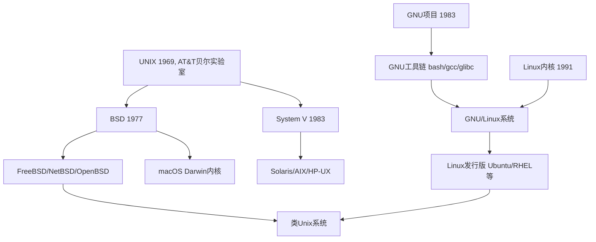

---
authors:
  - Salvely
title: 模板文章
subtitle: 模板文章的副标题
draft: true
description: 文章描述
tags:
  - 标签
categories:
  - 类别
series:
  - 系列
seriesNavigation: true
enableLastMod: true
enableWordCount: true
enableReadingTime: true
toc:
  enable: true
  auto: false
code:
  maxShownlines: 100
date: 2025-06-17T14:10:13+08:00
lastmod: 2025-06-17T14:11:01+08:00
---

<!--more-->

这里有个小问题：什么是GNU？它和Linux的差别是什么？GNU/Linux又是什么？

