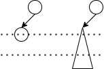
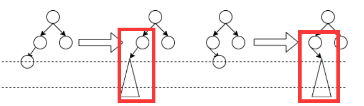
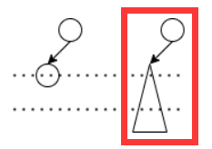
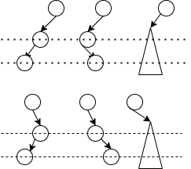
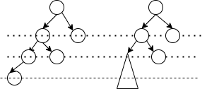
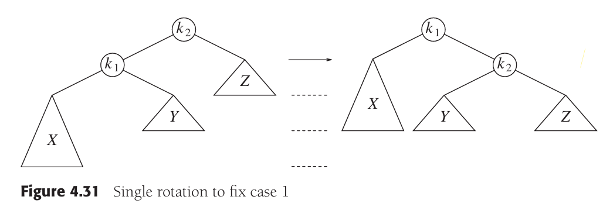
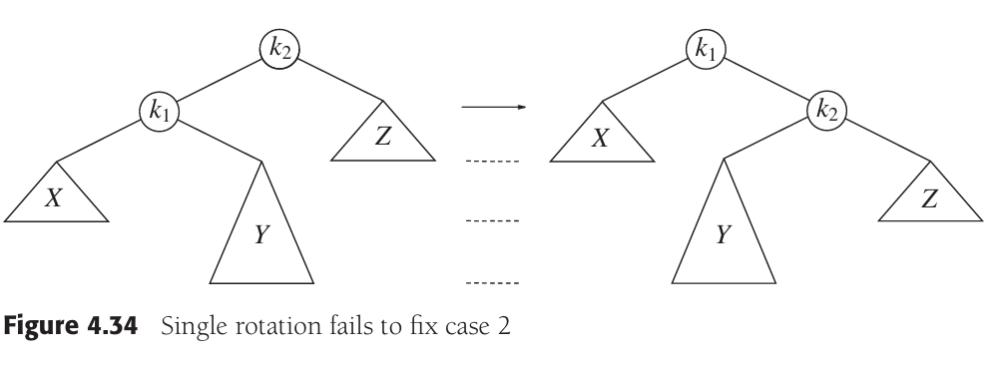
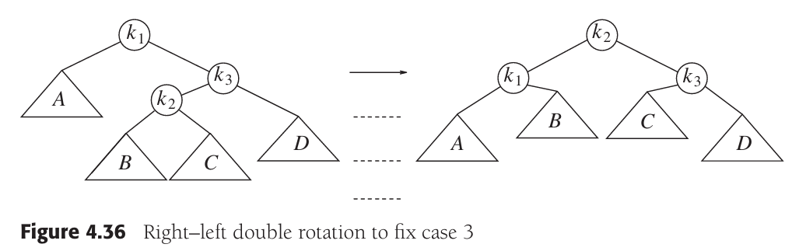

---
authors:
  - Salvely
title: AVL树原理详解及实现
tags:
  - AVL树
categories:
  - 数据结构
seriesNavigation: true
enableLastMod: true
enableWordCount: true
enableReadingTime: true
toc:
  enable: true
  auto: false
code:
  maxShownlines: 100
date: 2025-04-25T09:55:58+08:00
lastmod: 2025-05-18T19:00:04+08:00
---

<!--more-->

## 几个重要的概念

- 从结点$n_{1}$到$n_{k}$的路径（path）：从结点$n_{1}$到$n_{k}$，沿树经历的所有的结点构成的序列；
- 路径长度（length）：路径上的边的个数（注意不是结点个数），从$n_{1}$到$n_{k}$，路径长度也就是$k-1$；也就是说，每个结点到它自身的路径长度为0；
- 结点$n_{i}$深度：从根节点到$n_{i}$的路径长度。比如根结点的深度为0；
- 结点$n_{i}$高度：从$n_{i}$到所有叶子结点的路径中的最长路径长度。因此叶子结点的高度都为0。树的高度就是根节点的高度；
- 树的深度是其中最深的叶子结点的深度 = 树的高度；

## 普通二叉搜索树的缺陷

对于普通的二叉搜索树，当我们从小到大插入1到10时，因为每次都插在树的最右节点上，因此树的高度和插入的结点个数相同。那么对该树的操作，最大的时间复杂度为`O(n)`，最小为`O(1)`。因此，对于普通的搜索二叉树，一个特性是树的高度和插入的结点的大小顺序紧密相关，因此极易出现树的子树高度不均衡的情况。对树的操作又和结点的位置息息相关，因此可能出现部分操作时间复杂度较大（为`O(n)`）的情况。

我们希望充分利用树的二叉结构，让树的高度差不多为`logN`，这样操作的时间复杂度也为`O(logN)`。我们无法让每颗左右子树高度相同，这样对二叉搜索树的要求太苛刻。但是我们可以让左右子树的高度差别不大于1，这就提出了平衡二叉树（AVL树）的概念。我们首先探究一下平衡二叉树的结点个数及结构，和不平衡的情况，然后引入本文的重点：平衡二叉树的实现。

## 平衡树的结点个数及结构

AVL树的左右子树深度差别不大于1。设左右子树的高度差为左子树的高度减去右子树的高度，那么高度差的结果只能为1，-1和0（根据定义，空树的高度为-1，仅有1个根节点的树的高度为0）。

下面我们探究一下高度为$h$的平衡二叉树的最小结点个数。假设平衡树的高度为9，那么其左右子树的高度最多为8，又因为我们想要实现节点个数最少，而左右子树的高度可以相差1，因此设左子树的高度为7，右子树的高度为8。

由此我们可以得出一个公式，$S(h) = S(h-1) + S(h-2) + 1$，其中$S(-1) = 0, S(0) = 1$。这里的$S(h)$指的是高度为$h$的平衡二叉树的最少结点个数。根据前文，对于高度为$h$的平衡二叉树，其左右子树的高度最大为$h-1$，而因为左右子树高度可以相差1，要想让节点的个数最少，左子树的高度为$h-1$，右子树的高度为$h-2$，因此左右子树的最少节点个数分别为$S(h-1)$和$S(h-2)$，那么加上根节点，高度为$h$的平衡二叉树的总的最少节点个数为$S(h-1)+S(h-2)+1$。我们其实可以发现，这个结构有点类似于斐波那契数列$S(h) = S(h-1) + S(h-2)$ ，其中$S(-1) = S(0) = 1$。

而这里我们想要通用的分析一下一个高度为$h$的平衡二叉树的结构。如果是满二叉树，那么其节点的个数为$2^{h+1}-1$，而最小的结点个数为$S(h-1) + S(h-2) + 1$。我们列举一些基础的$h$的情况：

| 高度$h$ | 最小结点个数 | 最大结点个数 |
| ----- | ------ | ------ |
| -1    | 0      | 0      |
| 0     | 1      | 1      |
| 1     | 2      | 3      |
| 2     | 3      | 7      |
| 3     | 6      | 15     |

可以看到的是，随着$h$增大，平衡术的最小结点个数和最大结点个数的差异逐渐增大。此外，平衡树的结构是不一定的，它并不是从上一层到下一层，一层层的按顺序插入/删除结点，因此如果按照高度来对平衡树的结构和不平衡树的情况来进行讨论，是不合理的。因此，我们在后文主要通过对几种出现不平衡树的情况进行分类讨论，对每种讨论建立对应的处理方式，来保证树的平衡化。

## 不平衡的情况分析

要探究平衡二叉树操作后不平衡的情况，需要满足如下两点：

- 在操作（插入或删除）之前，二叉树是平衡的：也就是说，在操作之前，该平衡树中的所有子树都都满足左右子树高度差不大于1；
- 在操作之后，二叉树不平衡了：也就是说，在插入了一个结点之后，以某个结点为根的二叉树不是平衡树了。

需要注意的是，插入或删除以后不一定导致所有的祖先树都失去平衡。比如根节点的左子树比右子树的高度少1，但是左右子树都是平衡树。插入一个结点后，可能由于结构原因，导致这个左子树不再是平衡树，但是树的高度加了1，那么现在根节点的左子树和右子树的高度差别为0了。因此虽然某棵子树不是平衡树了，但是在根节点处依然是平衡的。删除操作同理。因此，**我们仅仅需要分析出现不平衡的情况的结点，以及及其为根的树，而不是处理整棵树。**

我们设左右子树的高度差为`D`，其中`D`为左子树高度减去右子树高度。其中`D`的取值仅有三种：1，0和-1。我们不必细致的考虑左右子树中到底有几个结点，左右子树分别长什么样子，是什么结构，这样的情况是很多的，是分析不完的。**我们只需要分析一个抽象的结构，知道是树中的哪个部分导致了不平衡的情况发生就行**。

### 插入情况分析

首先，我们要思考一下，这棵树中至少有几个结点，才会满足：插入结点前的树是平衡树，而插入节点后的树不再是平衡树了。

这棵树可能是空树吗？当然不行，空树插入节点后，那也只有1个结点，还是棵平衡树。

这棵树可能只有1个结点吗？也不行，1个结点的树插入节点后，也只有2个结点（可能在左，也可能在右），根节点左右子树的差为1，还是棵平衡树。

如果这棵树有2个结点，那么树的形态必然是：根节点+左子树或右子树有1个结点。假设这个结点是根节点的左结点，如果插入1个结点，就会出现2种情况：

- 插入在左子树下，左子树是平衡树，但是根节点不平衡了（左子树高度为2，右子树高度为0，`D = 2`）
- 插入在根节点的右节点处，整棵树依然是平衡的；

2个结点的插入前和插入后的情况如图：

如果这棵树有3个结点，如果除了根节点外另外两个结点都在左子树，那么左子树会不平衡。我们要求插入节点前该树是平衡的，因此该情况不成立。如果必须根节点左右各1个结点，那么插入1个结点后，整棵树依然是平衡树。因此3个结点的情况不成立。

如果这棵树有4个结点。那么根节点占1个，其他两棵子树占3个。如果说3个结点都在根节点的左子树，那么左子树的高度至少为2，右子树的高度为0。那么该树不平衡，不符合我们插入前树必须是平衡的要求。因此只能是一边2个结点，另一边1个结点。假设左子树2个结点，右子树1个结点。插入新节点的时候，必须是在下一层，否则插入结点后的树依然平衡。

4个结点的插入前和插入后的情况如图：

.png)

综上，要满足插入前树平衡，插入后不平衡的要求，该树要么有2个结点，插在有结点的那棵子树上。要么有4个结点，插入的结点必须使得树新加一层。

等等！上面这个图好像有一些奇怪的地方！我们可以发现，对于4个结点的情况，在进行了如上插入以后，新形成的树的根结点，已经不再是出现刚出现不平衡点的结点了。不平衡树出现的结点，是根结点的孩子！而我们把根节点的孩子提出来，是这样的结构：

这不正是我们前文提到过的2个结点的树插入后的结构吗？

因此，插入的不平衡情况可以被分为4种（最右侧的为左边2图的简化图）：

但是现在新的问题出现了，所有的情况都能被归类为这4种吗？会不会出现一种情况，平衡树的结点大于4个，在插入节点前，该树为平衡树。在插入节点后，该树为非平衡树。而且该树的根就是出现非平衡处的地方。我们发现对于5个结点插入的情况，仍然存在这样的树。即左子树有3个结点，分布在2层，右子树有1个结点。插入后排列如下（右图为左图简化版，囊括了插入在左右孩子的两种情况）：

综上，我们可以进行如下总结，不平衡处出现在：

- 左孩子
- 右孩子
- 左孩子的左子树
- 左孩子的右子树
- 右孩子的左子树
- 右孩子的右子树

### 删除情况分析

结点的删除遵循搜索二叉树的结点删除过程。复习一下：

- 如果删除的是叶子节点，直接删除即可；
- 如果删除的不是叶子节点，分情况讨论
	- 左子树不为空，就用左子树的最右结点替代它；
	- 左子树为空，但是右子树不为空，就用右子树的最左节点替代它；

删除的结果和插入一样，可能出现不平衡树。此外，删除的情况和插入一样复杂，我们无法对每个具体的情形进行处理。此外，我们只知道删除后的树不是平衡树，而对删除前的树的长相无法预测。这里我们想要分析的是删除后不平衡树的处理，而其实在分析插入的时候，我们就已经归纳过几种不平衡树的形态。因为因此对于插入和删除，我们可以进行统一的处理，而无需考虑删除前的树的形态。

### 统一处理：4种情况

## AVL树的旋转原理

要达成AVL树的效果，我们需要在对二叉树的结点进行插入和删除时增加一个操作，即"旋转"。

在旋转之前，我们需要找到不平衡树出现的那个根节点。其以上的树的不平衡都是由那个根节点下的左右子树导致的。下面的旋转操作均是围绕着这个出现不平衡情况的根节点实现，而不是围绕着整棵树的根节点。

如果一棵树插入节点后，成为了不平衡树，只可能是以下四种情况：

1. 插入在左子树的左孩子；
2. 插入在左子树的右孩子；
3. 插入在右子树的左孩子；
4. 插入在右子树的右孩子；

其中，情况1和4处理相似，2和3处理相似。对于情况1和4，只需要一次旋转。而对于情况2和3，需要2次旋转。

## 单旋转原理

根据前文，单旋转有2种情况：

- 新结点插入在左子树的左孩子；
- 新节点插入在右子树的右孩子；

这两种情况实际上是相同的，我们以第一种为例来进行分析。我们通过旋转，将左图的情况转变为右图。因为`k1`为不平衡树的根节点，因此我们抓住`k1`，摇一摇，那么`k2`就落了下来，`Z`依然是`k2`的右节点，`X`依然是`k1`的左节点。那么`Y`怎么办呢？`Y`的值大于`k1`而小于`k2`，因此它转变为`k2`的左节点。

## 双旋转

根据前文，双旋转有2种情况：

- 新节点插入在左孩子的右子树；
- 新节点插入在右孩子的左子树；

我们首先分析第一种方式。如果只是单旋转，旋转后如右图。我们可以看到，该树依然是不平衡的。`k1`是不平衡树的根。这样的单旋转只是把左图的样子做了个镜面效果罢了，归根结底是因为`Y`太深了。

对于`Y`，我们可以推测，其有一个根节点，和1-2个子节点。经过分析我们可以知道，`Y`的根节点的值是大于`k1`，小于`k2`的。那么我们可以把`Y`的根节点作为树的根节点，让`k1`和`k2`分别作为它的左右子树。又因为`Y`的左节点大于`k1`且小于`Y`的根节点，因此将其作为`k1`的右结点。同理，`Y`的右结点小于`k2`且大于`Y`的根节点，因此将其作为`k2`的左结点。

综合以上分析，我们对第一种情况进行如图的双旋转，成功解决问题（这里图中的根节点由`k2`替换成了`k3`，而`k2`表示`Y`的根节点，和上图的表示有一些区别，需要注意一下）：

下面我们分析第二种形式，也就是新节点插入在右孩子的左子树。其总体思路和第一种形式相同。如图，我们将`Y`抽象为一个由根节点`k2`和两个子节点`B`和`C`构成的二叉树（实际`C`不一定存在，可能为空）。那么`k2`大于`k1`且小于`k3`，因此让`k2`作为新的平衡二叉树的根节点。而`B`大于`k1`且小于`k2`，因此`B`为`k1`的右节点。`C`大于`k2`且小于`k3`，因此`C`为`k3`的左节点。旋转效果如右图所示。

## `AVLTree`实现

### `BinarySearchTree` 的扩展

### 新的`Node`类

## 高度更新

## 寻找那个不平衡根

## 右旋方法实现

## 左旋方法实现

## `left-right`旋转实现

## `right-left`旋转实现

## `insert`方法重载

## `remove`方法重载

## 完整实现

## 参考资料

- [一文理清AVL树（平衡二叉树）的插入与删除 - 知乎](https://zhuanlan.zhihu.com/p/635375714)
- 

