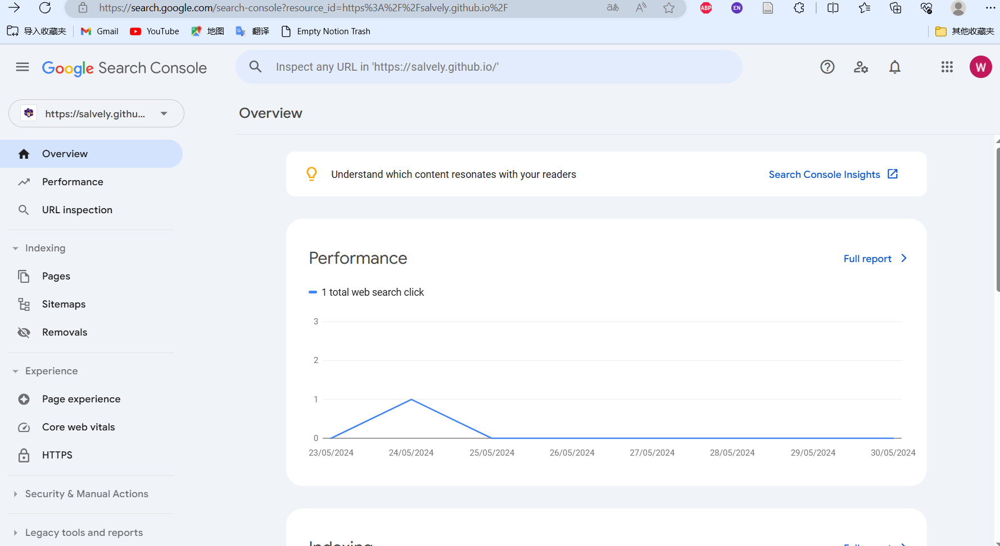

## 前言

最近在重新学习数学、物理、经济学和计算机科学。一般在学习一门课程之前，我会在知乎上查找“xxx 课程教材/书籍”，或者去豆瓣进行搜索。但是问题在于：

1. 知乎上的回答动辄几千条，其中有很多重复的回答，但是也有很多新鲜的内容。如果只看前面几个回答，就会感觉对教材收集的不全，没有办法体会不同教材对同一门知识的不同理解。但是对于知乎上的推荐，又很难做到对其进行整理和归类。
2. 豆瓣上的书籍，部分小众书籍质量很高，但是没有评分。在书籍列表中，有评分的书籍和没有评分书籍混杂在一起，无法区分优劣。

因此，我萌生了一个想法，就是构造一个教材/书籍推荐网，可以有各个方向/各个学科的经典教材/
书籍推荐，并不局限于课程。譬如前端学习、后端学习、分布式系统学习等不同方向的教材或书籍，也可以放在其中，以帮助更多像我这样有需要的同学。

在搭建网站时，我选择了 `mkdocs-material` 这个文档模板，搭建的思路依照 [CS 自学指南](csdiy.wiki)，以下是我的网站搭建过程。

> Mkdocs-material 的官方文档在此： [Material for MkDocs (squidfunk.github.io)](https://squidfunk.github.io/mkdocs-material/)，升级方式见此：[How to upgrade - Material for MkDocs (squidfunk.github.io)](https://squidfunk.github.io/mkdocs-material/upgrade/)

## mkdocs-material 安装：使用 `pip`

> 安装时也可以使用 `docker`，但是我没有试过；也可以使用 `git`，`git clone` 后进入项目，输入 `pip install .` 进行安装，我在安装的时候遇到了一些网络问题（这里的安装不要开代理，否则报错；但是没有使用代理的话，有些轮子又下不下来，我想可能需要配置国内的镜像源，有点懒得搞，因此采用了 `pip` 直接安装的方式）

我使用的 `python` 版本是 `Python 3.8.8`，`pip` 的版本是 `21.0.1`，如图


打开 `anaconda prompt`，输入 `pip install mkdocs-material` 直接安装即可。

## 创建新网站

`cd` 进入我们为项目创建的文件夹，我这里是 `E:\projects\book`，输入

```bash
$ mkdocs new .
```

即可创建一个新的 `mkdocs-material` 项目，可以看到输出

```bash
(base) E:\projects\book>mkdocs new .
INFO    -  Writing config file: .\mkdocs.yml
INFO    -  Writing initial docs: .\docs\index.md
```

当前文件夹下有两个文件：`docs` 目录和 `mkdocs.yml` 配置文件。其中 `docs` 内包含一个 `index.md`。我们在 `mkdocs.yml` 中填充配置，然后在 `docs` 中填写内容。

## 基础配置

我们初始配置的内容包括：

- `site_name`：网站名
- `site_url`：网站网址
- `theme：name:`：网站主题名

我的配置如下：

```yml
site_name: 书籍推荐网
site_url: https://Salvely.github.io/book-reco
theme:
  name: material
```

Mkdocs-material 提供了其特有的配置文件格式，使用效果见[这里](https://x.com/squidfunk/status/1487746003692400642)。要实现该配置：

1. 在 `vscode` 插件市场中查找 `vscode-yaml` 并安装
2. 在  `user/workspace settings.json` 的 `yaml.schemas` 下添加如下内容：

```json
{
   "yaml.schemas": {
     "https://squidfunk.github.io/mkdocs-material/schema.json": "mkdocs.yml"
   },
   "yaml.customTags": [ 
     "!ENV scalar",
     "!ENV sequence",
     "!relative scalar",
     "tag:yaml.org,2002:python/name:material.extensions.emoji.to_svg",
     "tag:yaml.org,2002:python/name:material.extensions.emoji.twemoji",
     "tag:yaml.org,2002:python/name:pymdownx.superfences.fence_code_format"
   ]
 } 
```

## 模板

> 我这里是构建一个基本的书籍推荐网，因此还无需增加其他的功能，这两个模板暂不使用。

- [博客模板](https://github.com/mkdocs-material/create-blog)
- [社交卡片模板](https://github.com/mkdocs-material/create-social-cards)

## 网站预览

> 提示：如果你是在 `anaconda prompt` 中执行命令，输入 `mkdocs serve` 即可预览。如果你实在 `git bash` 或者其他终端模拟器中，请输入 `python -m mkdocs serve` 预览。后续命令同理。

输入 `mkdocs serve` 对网站进行预览，在浏览器中输入 `localhost:8080` 即可看到网站效果。效果如下：


## 网站构建

> `mkdocs-material` 支持使用 `offline` 插件离线查看内容，我们没有这样的需求，所以不配置该插件。

要构建静态网站，输入 `mkdocs build`，可以看到生成了如下内容：


## Git 仓库建立并设置 github actions

> 还可以选择其他的网站部署方式，详情见这里：[Publishing your site - Material for MkDocs (squidfunk.github.io)](https://squidfunk.github.io/mkdocs-material/publishing-your-site/)

对于本网站，我们使用 `github pages` 进行部署，其中一个很重要的步骤是配置 `github actions` 工作流。

### 仓库的创建及拉取

打开 `github`，创建一个新的仓库 `book-reco`，仓库在[此]([Salvely/book-reco: book recommendation website (github.com)](https://github.com/Salvely/book-reco))。
我们用 `vscode` 打开项目，输入

```bash
$ git init #初始化一个git仓库
$ git remote add origin https://github.com/Salvely/book-reco #添加仓库remote
```

输入如下命令可以查看当前 `remote` 列表：

```bash
$ git remote -v
origin  https://github.com/Salvely/book-reco (fetch)
origin  https://github.com/Salvely/book-reco (push) 
```

因为我们在 `github` 上建立仓库时，顺带初始化了 `README.md` 和 `LICENSE`，因此在将内容提交到 `github` 上之前，我们需要先 `git pull` 最新的内容下来，对 `conflict` 进行修改，然后再 `git push` 上去。命令如下：

```bash
$ git pull origin main
From https://github.com/Salvely/book-reco
 * branch            main       -> FETCH_HEAD
```

### Github actions 工作流配置

在 `push` 到 `github` 之前，我们需要创建一个 `./github/workflows`，在 `  .github/workflows/ci.yml ` 文件下，设置一下工作流（`YAML` 格式）：

```YAML
name: ci 
on:
  push:
    branches:
      - master 
      - main
permissions:
  contents: write
jobs:
  deploy:
    runs-on: ubuntu-latest
    steps:
      - uses: actions/checkout@v4
      - name: Configure Git Credentials
        run: |
          git config user.name github-actions[bot]
          git config user.email 41898282+github-actions[bot]@users.noreply.github.com
      - uses: actions/setup-python@v5
        with:
          python-version: 3.x
      - run: echo "cache_id=$(date --utc '+%V')" >> $GITHUB_ENV 
      - uses: actions/cache@v4
        with:
          key: mkdocs-material-${{ env.cache_id }}
          path: .cache
          restore-keys: |
            mkdocs-material-
      - run: pip install mkdocs-material 
      - run: mkdocs gh-deploy --force
```

### 推送到 github

输入如下命令，推送到 `github`

```bash
git add .
git commit -m "add github actions workflow"
git push --set-upstream origin master
```

问题来了，现在有好几个 `branch`，我们列举一下：

```bash
$ git branch -a
* master
  remotes/origin/gh-pages
  remotes/origin/main
  remotes/origin/master
```

我们的目标是，推送到 `main` 分支，也就是把 `master` 改名为 `main`。操作的指南可以参考这篇博文：[如何在 Git 中重命名本地或远程分支 (freecodecamp.org)](https://www.freecodecamp.org/chinese/news/how-to-rename-a-local-or-remote-branch-in-git/) 或者直接创建一个 `main` 分支，然后切换到该分支，并且设置该分支为提交分支，然后删除 `master` 分支。使用命令如下：

```bash
git checkout -b main # 创建一个main分支，并且切换到main
git branch --set-upstream-to=origin/main main # 设置提交分支为main，提交到origin下的main分支
git push # 提交到github
git branch -d master #删除之前的master分支
```

## 网站发布

### Github pages 部署

在 `github` 上打开项目，进入 `settings->pages`，在 `Deploy from a branch` 下选择 `gh-pages`，并且 `save`。这时候 `github actions` 会自动运行。若部署成功，则会显示如下界面：


这时候点击 `Visit site`，我们便可以跳转到我们的书籍推荐网：


我们可以通过设置项目信息来将项目与这个网站绑定在一起，点击项目主页旁边这个小齿轮设置：


### 域名修改

令人不满的是，现在这个网站的网址是 `https://www.salvely.github.io/book-reco`，如果我们希望改成一个特定的网址，如 `www.books.io`，要怎么办呢？具体流程可以参考这个视频： [Set up a Custom Domain on GitHub (youtube.com)](https://www.youtube.com/watch?v=QxTOGJORhMo) 以及 github 的这个教程：[Verifying your custom domain for GitHub Pages - GitHub Docs](https://docs.github.com/en/pages/configuring-a-custom-domain-for-your-github-pages-site/verifying-your-custom-domain-for-github-pages)。视频和教程对整个过程讲解的非常清楚，你可以自行配置。但是由于需要购买域名，我又是个穷鬼，所以这一步我就不配置了，有兴趣的同学可以先购买一个域名，然后根据视频和教程自行配置。（免费的域名还是有一定的风险，慎用）

## Bing & Google 网站收录

有了网站，我们需要让搜索引擎检索到它。当今主流的搜索引擎包括：

- Google
- Bing

Duckduckgo 也是基于 Bing 搜索引擎，因此我们无需额外配置。

### Google 搜索引擎收录网页

Google 的搜索收录是在 [Google Search Console](https://search.google.com/search-console/about) 下进行，进入网页后点击 `Start Now`，进入你的 `Dashboard`（如果没有账户的话，可以用谷歌账户登录，否则需要注册）大致界面如下：



如果没有注册过网页，进去以后直接就会弹出来这样一个框框。这是一个域名验证的步骤。我们选择 `URL Prefix` 步骤， 输入域名 `https://salvely.github.io/book-reco`


接下来会验证 `ownership`，有两种方式：

- 将弹窗提供的 `googlexxxx.html` 附加到你的主页中
- 将弹窗提供的 `html` 标签附加到你的主页中


我们先选择第一种，下载它提供的 `.html` 文件，添加到项目中。


然后将项目推送到 `github` 上，等待构建完成。成功后会有如下显示：


进入 `dashboard` 以后，会弹出来几条完善信息，其他的暂时不需要管，但是我们需要添加 `sitemap`（站点地图），便于搜索引擎检索，一半来说 `sitemap` 位于 `主页域名/sitemap.xml`。我们的主页为 `https://salvely.github.io/book-reco`，因此站点地图为： `https://salvely.github.io/book-reco/sitemap.xml`。提交成功后显示如下：


别的都不需要配置了，`google search console` 会在一天之内获取到我们网站的数据。

### Bing 搜索引擎收录网页

`Bing` 搜索引擎通过 [Home - Bing Webmaster Tools](https://www.bing.com/webmasters/) 收录我们的网站。之所以把 `google search console` 放在 `bing webmaster` 之前，是因为 `bing webmaster` 可以通过导入 `google search console` 中的网站进行直接配置，而不需要我们进行任何手动添加（包括站点地图）


到这一步，两大主流搜索引擎的网站收录都已经配置成功了。

## 高级配置

> 高级配置的文档见[此](https://squidfunk.github.io/mkdocs-material/setup/)。本博文不涉及到的内容包括：
>
> 1. CSS & Javascript 重写：[Customization - Material for MkDocs (squidfunk.github.io)](https://squidfunk.github.io/mkdocs-material/customization/)
> 2. 部分小符号：[Conventions - Material for MkDocs (squidfunk.github.io)](https://squidfunk.github.io/mkdocs-material/conventions/)
> 3. 浏览器支持 & 企业支持 & 使用原则
> 4. 其他的文档框架：包括 [docusaurus](https://docusaurus.io/)，Jekyll，Sphinx，Gitbook
> 5. LICENSE：MIT License
> 6. Blog & Social Card 模板教程
> 7. [Python Markdown - Material for MkDocs (squidfunk.github.io)](https://squidfunk.github.io/mkdocs-material/setup/extensions/python-markdown/) 和 [Python Markdown Extensions - Material for MkDocs (squidfunk.github.io)](https://squidfunk.github.io/mkdocs-material/setup/extensions/python-markdown-extensions/)

### 网站结构

#### 语言 Language

> 我们希望书籍推荐网支持：中文，繁体中文，英文（后续添加其他语言）；并且支持语言的翻译

在 `mkdocs.yml` 中设置语言（默认为中文）：

```yaml
theme:
	language:zh
```

为了实现多语言支持，可以在 `mkdocs.yml` 中进行如下设置。本项目仅使用中文简体，因此不配置该项。

```yaml
extra:
	alternate:
	  - name: English
	    link: /en/ 
	    lang: en
	  - name: Deutsch
	    link: /de/
	    lang: de
      - name: 繁体中文
        link: /hant/
        lang: zh-Hant
```

`stay on page` 和 `Directionality` 暂时不配置。

#### 导航 Navigation

导航栏配置如下：

```yaml
theme:
features:
  - navigation.instant # 启用 instant loading(必须设置site_url)
  - navigation.instant.prefetch # 用户悬停在链接上就开始加载页面
  - navigation.instant.progress # 显示页面加载进度
  - toc.follow # 边栏自动滚动
  - toc.integrate # 目录导航集成
  - navigation.top # 回到顶部按钮
  - navigation.tabs # 顶部导航选项卡
  - navigation.sticky # 粘性导航选项卡（只有在顶部导航选项卡启用时，才能启用这项）
  - navigation.path # 在页面中显示导航路径
```

本项目中未配置的项目包括：

- 即时预览+自动预览
- 锚点跟踪
- 导航部分+导航扩展+导航修剪+章节索引页
- 隐藏侧边栏+隐藏导航路径
- 键盘快捷键+内容区宽度定制

#### 标头 Header

本项目中无需配置此项：包括隐藏标头、公告栏、标记为已读。

#### 页脚 Footer

页脚配置如下：

```yaml
theme:
features:
  - navigation.footer # 在页脚添加上一页和下一页的链接
extra: # 社交链接作为项目文档页脚的一部分呈现在版权声明旁边
  social:
    - icon: simple/github
      link: https://salvely.github.io/book-reco
      name: book-reco
  generator: true # 展示网站的生成方式
copyright: Copyright &copy; 2024 - 2025 Wen Gao # 版权声明
```

如果你想要某篇文档中隐藏上一个/下一个链接，可以在 `frontmatter` 中进行如下配置：

```YAML
---
hide:
  - footer
---

# Page title
...
```

该项目不配置自定义版权部分。

#### 搜索 Search

`mkdocs-material` 中搜索插件默认开启，对于搜索部分我们进行如下配置：

```YAML
theme:
features:
  - search.suggest # 开启搜索提示
  - search.highlight # 搜索突出显示
```

本项目不配置的部分包括：搜索共享，搜索提升，将部分内容和块从搜索中排除

#### 标签 Tags

这个功能暂时不需要。

### 内容

本项目不配置博客和版本功能。如果你有需求，可以参考：[Setting up tags - Material for MkDocs (squidfunk.github.io)](https://squidfunk.github.io/mkdocs-material/setup/setting-up-tags/)

#### 评论系统

##### `giscus` 配置

> 另一个基于 `github` 的评论系统为 [utterance/utterances: :crystal_ball: A lightweight comments widget built on GitHub issues](https://github.com/utterance/utterances)，`Giscus` 正是受到了它的启发。包括 [Twikoo | 一个简洁、安全、免费的静态网站评论系统](https://twikoo.js.org/) 和[Valine 一款快速、简洁且高效的无后端评论系统](https://valine.js.org/) 也很不错。

在本项目中，我们使用 [giscus](https://giscus.app/) 作为评论系统，该评论系统基于 `github discussions`。要配置该评论系统，我们需要进行以下工作：

1. 在 `Github` 中安装 [GitHub Apps - giscus](https://github.com/apps/giscus)，并且对相应的仓库进行授权（可以与文档仓库不同，该仓库需要利用其 `discussions` 板块作为评论系统）
2. 确保仓库公开，`giscus app` 已经安装，并且开启仓库的 `discussions` 功能 （指南见此：[Enabling or disabling GitHub Discussions for a repository - GitHub Docs](https://docs.github.com/en/repositories/managing-your-repositorys-settings-and-features/enabling-features-for-your-repository/enabling-or-disabling-github-discussions-for-a-repository)，其主要步骤是：打开仓库->Settings->下拉到 Features->点击开启 Discussions）
3. 访问 [giscus](https://giscus.app/zh-CN)，根据流程完成配置
		1. 语言选择 `简体中文`
		2. 仓库中输入 `username/repo`（注意仓库必须满足刚刚的 3 个要求）
		3. `页面 ↔️ discussion 映射关系` 选择第一项
		4. `discussion 分类` 选择 `announcements`
		5. `特性` 选择第一个
		6. `主题` 默认选择 `用户偏好的色彩方案`
4. 然后复制 `giscus` 提供的代码段，类似下面 (根据你的 `repo` 信息修改部分的属性)

```HTML
<script
  src="https://giscus.app/client.js"
  data-repo="<username>/<repository>"
  data-repo-id="..."
  data-category="..."
  data-category-id="..."
  data-mapping="pathname"
  data-reactions-enabled="1"
  data-emit-metadata="1"
  data-theme="light"
  data-lang="en"
  crossorigin="anonymous"
  async
>
</script>
```

##### `mkdocs-material` 评论系统配置

下面我们需要进行一些个性化的配置，具体可以参考 [Customization - Material for MkDocs (squidfunk.github.io)](https://squidfunk.github.io/mkdocs-material/customization/#extending-the-theme)。

> 需要注意的是，以下步骤对 `git clone` 下载的 `mkdocs-material` 项目无效，只对 `pip` 安装的 `mkdocs-material` 项目有效，且项目名需要配置好

1. 设置文件夹结构：在 `mkdocs.yml` 目录下添加一个 `overrides` 文件夹，然后在 `overrides` 下新建一个 `partials` 文件夹， 里面放置的是需要重写的 `html` 格式文件。
2. 在 `mkdocs.yml` 中配置 `overrides` 文件夹下的内容为重写的 `html` 格式

```yaml
theme:
name: material
custom_dir: overrides
```

3. 在 `partials` 文件夹中添加 `comments.html`，表示评论系统的 `html` 格式，其内容如下：

```HTML

  <h2 id="__comments">{{ lang.t("meta.comments") }}</h2>
  <!-- Insert generated snippet here -->

  <!-- Synchronize Giscus theme with palette -->
  <script>
    var giscus = document.querySelector("script[src*=giscus]")

    // Set palette on initial load
    var palette = __md_get("__palette")
    if (palette && typeof palette.color === "object") {
      var theme = palette.color.scheme === "slate"
        ? "transparent_dark"
        : "light"

      // Instruct Giscus to set theme
      giscus.setAttribute("data-theme", theme) 
    }

    // Register event handlers after documented loaded
    document.addEventListener("DOMContentLoaded", function() {
      var ref = document.querySelector("[data-md-component=palette]")
      ref.addEventListener("change", function() {
        var palette = __md_get("__palette")
        if (palette && typeof palette.color === "object") {
          var theme = palette.color.scheme === "slate"
            ? "transparent_dark"
            : "light"

          // Instruct Giscus to change theme
          var frame = document.querySelector(".giscus-frame")
          frame.contentWindow.postMessage(
            { giscus: { setConfig: { theme } } },
            "https://giscus.app"
          )
        }
      })
    })
  </script>

```

4. 在 `Insert generated snippet here` 处插入我们之前复制的 `giscus` 提供的代码，就实现了博客的评论系统的配置啦
5. 如果想让该博文含有评论系统，需要在 `frontmatter` 中设置 `comments=true`，如下

```YAML
---
comments: true
---

# Page title
...
```

##### 全局开启评论系统

> `meta` 插件只对 `mkdocs-material` 的 `sponsors` 开放，不对 `public` 版本代码开放，因此如果想要在每个博问下包含评论系统，你还是得老老实实地在每个博文下添加 `comments: true`，这个版块的内容就不用阅读了。
> 

如果要对整个文件夹启用评论系统，可以采用 `meta` 插件，使用说明见这里：[内置元插件 - MkDocs 材料 (squidfunk.github.io)](https://squidfunk.github.io/mkdocs-material/plugins/meta/)。要配置 `meta` 插件，需要在某个文件夹下添加 `.meta.yml`，并在其中添加我们想要的递归合并的内容，如 `tags: Example`。添加以后该文件夹下的所有文件都会具有这个 `tag`。

我们想要让所有博文都包含评论功能，那么就需要进行如下工作：

1. 在 `docs` 文件夹下创建 `.meta.yml`
2. 在 `.meta.yml` 中添加 `comments: true`
3. 在 `mkdocs.yml` 中添加 `meta plugin`

```YAML
plugins:
- meta
```

此外，如果想禁用 `meta` 插件，可以在 `mkdocs.yml` 中插入如下语句：

```YAML
plugins:
- meta:
    enabled: false
```

如果设置的 `meta` 文件不是 `.meta.yml`，而是其他名称的话，可以在 `mkdocs.yml` 中添加如下语句：

```YAML
plugins:
- meta:
    meta_file: file_name.yml
```

#### 关联仓库

> 图标合集见此：[Adding a git repository - Material for MkDocs (squidfunk.github.io)](https://squidfunk.github.io/mkdocs-material/setup/adding-a-git-repository/)

`mkdocs.yml` 中的存储库相关配置如下：

```YAML
repo_url: # 设置github仓库（或其他仓库）链接
repo_name: # 自定义的仓库名称
theme:
icon:
  repo: fontawesome/brands/git-alt
```

本项目中不配置的选项包括：

- 代码操作（如 `edit`）
- 文档日期，作者，贡献者（懒得弄这些了）

### 外观

包括颜色、字体、Logo 和 Social Cards，本项目中不配置这些内容，你可以自行配置。

### 其他优化

本项目不配置网站分析，离线使用和数据隐私功能。

#### 网站优化

> 如果你不是 `mkdocs-material` 的 `sponsor`（也就是氪金用户），那么您无法使用 `projects` 和 `optimize` 插件，下面的配置你就不用写了。
> 

本项目不制定 `scope`，`mkdocs.yml` 中的网站优化配置如下（如果你是 `sponsor`）：

```YAML
plugins:
- projects # 多项目插件，适用于多语言网站、网站旁边构建博客、拆分大型项目代码库等（只有sponsors可用）
- optimize # 内置的优化插件使用压缩和转换技术自动识别和优化所有媒体文件，作为构建的一部分
```

## 相关插件

`mkdocs-material` 相关插件见[此](https://squidfunk.github.io/mkdocs-material/plugins/)因为本项目是个纯文档项目，因此不进行额外的插件配置。有兴趣的读者可以自行配置。

## `mkdocs.yml` 文档配置

```YAML
site_name: 书籍推荐网
site_url: https://Salvely.github.io/book-reco
theme:
  name: material
  language: zh
  icon:
    repo: fontawesome/brands/git-alt
  features:
    - navigation.instant # 启用 instant loading(必须设置site_url)
    - navigation.instant.prefetch # 用户悬停在链接上就开始加载页面
    - navigation.instant.progress # 显示页面加载进度
    - toc.follow # 边栏自动滚动
    - toc.integrate # 目录导航集成
    - navigation.top # 回到顶部按钮
    - navigation.footer # 在页脚添加上一页和下一页的链接
    - search.suggest # 开启搜索提示
    - search.highlight # 搜索突出显示
  custom_dir: overrides
extra:
  social:
    - icon: simple/github
      link: https://salvely.github.io/book-reco
      name: book-reco
  generator: true # 展示网站的生成方式
plugins:
  - search
copyright: Copyright &copy; 2024 - 2025 Wen Gao # 版权声明
repo_url: https://github.com/Salvely/book-reco # 设置github仓库（或其他仓库）链接
repo_name: salvely/book-reco # 自定义的仓库名称
```

## 参考资料

网站搭建过程中参考的资料如下：

- [为Mkdocs网站添加评论系统（以giscus为例）_giscus mkdocs-CSDN博客](https://blog.csdn.net/m0_63203517/article/details/133819706)
- [基于giscus打造博客评论系统-liangyuanpeng 的博客 | liangyuanpeng's Blog](https://liangyuanpeng.com/post/add-comments-with-giscus/#%E7%AC%AC%E4%B8%80%E6%AD%A5-%E9%83%A8%E7%BD%B2%E4%BD%A0%E8%87%AA%E5%B7%B1%E7%9A%84-giscus-%E6%9C%8D%E5%8A%A1)
- [Hugo 博客引入 Giscus 评论系统 - (lixueduan.com)](https://www.lixueduan.com/posts/blog/02-add-giscus-comment/)
