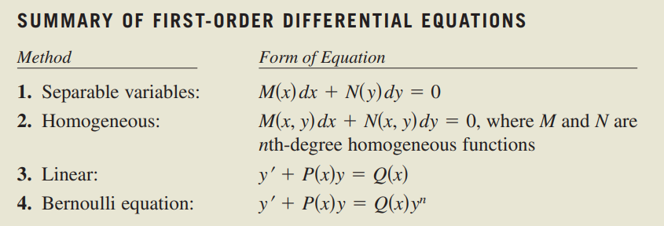
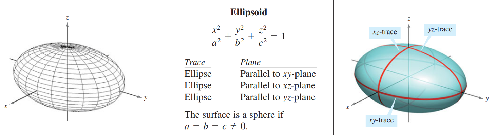

> 学习本教材的目的是：
>
> 1. 掌握微积分基础知识
> 2. 巩固计算能力
>
> 前 5 章内容分别为：微积分前置知识，极限，微分，微分的应用，一些常见的指对数和超越函数介绍。内容较为简单，因此这里不再详细展示。本笔记从第六章：微分方程的解法开始。

## Chapter 6：微分方程

> 本章最开始介绍了`Slope Field`，即一个函数的导数与其变量 x 和 y 相关，这种形式的方程称为微分方程，我们可以通过取点在图上画出它的函数图像，而后可以通过欧拉法近似的对它进行求解。而后又介绍了增长和衰减微分方程，这是微分方程的应用体现。接下来的就是几种常见微分方程形式的解法，我们直接进入正题。此外，P443-444 有大量基础习题可供练习。本章应用题未做。

- **可分离变量微分方程**
  - 对形如$M(x)+N(y)\frac{dy}{dx}=0$的式子：进行分离变量，然后两边同时积分，得到一个不定积分
- **齐次微分方程**
  - 对具备$f(tx,ty)=t^{n}f(x,y)$特性的函数，我们称之为齐次函数。
  - 一个包含齐次函数的微分方程$y'=f(x,y)$或$M(x,y)dx+N(x,y)dy=0$，可以通过换元，令$u=\frac{y}{x}$。
  - 此时$y=ux$，那么$y'=u'x+u$。用$u$替换$f(x,y)$中的$\frac{y}{x}$；用$u'x+u$替换$y'$，可以得到一个关于$u$和$x$的可分离变量的微分方程，然后遵循前一条的方法进行积分。得出结果后用$\frac{y}{x}$替换掉$u$
- **一阶线性微分方程**
  - 形如$\frac{dy}{dx}+P(x)y=Q(x)$，$P(x)$和$Q(x)$都是关于 x 的连续函数，这种形式被称为标准形。对于一个线性微分方程，我们需要先将其转化为标准型，得到$P(x)$和$Q(x)$。然后：
  - 首先我们对$P(x)$进行积分，得到$u(x)=e^{\int{P(x)dx}}$，$u(x)$被称之为`integrating factor`
  - 方程的通解是$y=\frac{1}{u(x)}\int{Q(x)u(x)dx}$
  - 这个结果的原因是：对$\frac{dy}{dx}+P(x)y=Q(x)$左右同乘以$u(x)$后，式子的左边刚好是两个函数的导数的形式$(y*u(x))'=Q(x)*u(x)$，其中一个函数就是$u(x)$，而右边也对$Q(x)$同乘了$u(x)$，因此对两边积分，就可以得到方程的通解（这是一个巧妙的小发现！但是我还不知道为什么，以后总会知道的！）
  - 注意：
    - 求解的时候，要注意常数项在积分后的括号里，不要漏掉它了
    - 在求解应用的时候，可以注意一下限制条件，有条件的去除绝对值符号
    - 此外，求$u(x)$那个不定积分时，不需要带常数
  - 应用包括（课本 P441，445-446 面有较多的应用习题）
    - 混合物问题
    - 空气阻力问题
    - RL 电路电流求解问题
- **伯努利方程（n 阶非线性微分方程）**
  - 可以降阶到 1 阶线性
  - 形如$y'+P(x)y=Q(x)y^{n}$
  - n=0 时，为一阶线性微分方程
  - n=1 时，为可以分离变量的微分方程
  - 其他阶次时，推导如下：
    1. 首先对两边同时乘以$y^{-n}$，可以得到：$y^{-n}y'+y^{1-n}P(x)=Q(x)$
    2. 然后对两边同时乘以$1-n$，可以得到$(1-n)y^{-n}y'+(1-n)y^{1-n}P(x)=(1-n)Q(x)$
    3. 然后我们可以发现，最左边的那一项，其实就是$(y^{1-n})'$，因此我们可以将其化成$(y^{1-n})'+(1-n)P(x)y^{1-n}=(1-n)Q(x)$
    4. 观察上面那个式子，其实他是$(y^{1-n})'$的一阶线性微分方程，对这个方程，其
       $P_{1}(x)=(1-n)P(x)$
       $Q_{1}(x)=(1-n)Q(x)$
       然后可以用之前的方式计算它的通解，只不过这里需要把$y$替换为$y^{1-n}$
- 总结
  
- 习题类型
  - 可分离变量的微分方程的通解求解
  - slope field 的绘制（先确定几个坐标点处的斜率，然后再绘制图像）
  - 一阶线性微分方程的通解求解
  - 齐次微分方程的通解求解
  - 伯努利微分方程的通解求解
  - 证明某个函数是某个微分方程的通解，并且求它的特解
  - 几个应用模型

## Chapter 7：积分的应用

> 本章的重点在于计算

- 求两曲线之间所夹的面积
  - 注意哪条曲线在上，哪条在下
  - 可以选择不同的切割方法
- 求体积
  - 圆盘法：部分立体图形需要借助一些几何关系，而不只是题目所给的函数
    - 基础旋转
    - 绕非 x 轴旋转
    - 两曲线之间相夹部分旋转
    - 绕 y 轴旋转
    - 横切和纵切，寻找立体图形的几何关系
      
    - 易错点
      - 图形搞错
      - 上下界搞错
      - 计算不仔细
      - 部分体积做题时容易忽略
    - 应当刷题巩固
  - 壳层法
- 求弧长
  - $ds=\sqrt{dx^2+dy^2} = \sqrt{(dx^2)(1+(\frac{dy}{dx})^2)} = \sqrt{1+(\frac{dy}{dx})^2}dx=\sqrt{1+y'}dx$
  - $ds=\sqrt{dx^2+dy^2} = \sqrt{(dy^2)(1+(\frac{dx}{dy})^2)} = \sqrt{1+(\frac{dx}{dy})^2}dy=\sqrt{1+x'}dy$
- 求旋转体的表面积
  - $dS=2\pi rds$
  - 如果$r$是关于 x 的函数$f(x)$，那么$dS=2\pi f(x)\sqrt{1+y'}dx$
  - 否则，$dS=2\pi f(y)\sqrt{1+x'}dy$
- 求功
  - 力为常量：$W=Fx$
  - 力为变量：$W=\int_{a}^{b}{F(x)dx}$
  - 三种常见的力学定律
    - 弹力定律：$F=kd$
    - 引力定律：$F=k\frac{m_{1}m_{2}}{d}$
    - 库仑定律：$F=k\frac{q_{1}q_{2}}{d}$
- 求矩，重心和质心
  - 矩：$Moment=mx$
  - 对于一维平面：
    - 关于源点的矩：$M_{0} = m_{1}x_{1}+m_{2}x_{2}+...+m_{n}x_{n}$
    - 质心：$\bar{x}=\frac{M_{0}}{m}$
  - 对于二维平面，且平面质量密度为 1：
    - 关于 x 轴的矩：$M_{x}=m_{1}x_{1}+m_{2}x_{2}+...+m_{n}x_{n}$
    - 关于 y 轴的矩：$M_{y}=m_{1}y_{1}+m_{2}y_{2}+...+m_{n}y_{n}$
    - 质心 x 坐标：$\bar{x}=\frac{M_{x}}{m}$
    - 质心 y 坐标：$\bar{y}=\frac{M_{u}}{m}$
  - 需要解释的是，在矩的计算过程中的$x_{n}$和$y_{n}$并不是普通的而坐标，而是$x$轴上该坐标和源点轴的距离。譬如关于$x=3$的矩中，$x_{1}=x-3$
  - 对于一块夹在$f(x)$和$g(x)$中的平面，且平面质量密度为$\rho$
    - 首先，要求矩和质心，我们需要知道 3 个值
      - 总质量
      - x 轴上，单个单位的质量与相对距离的积的和
      - y 轴上，单个单位的质量与相对距离的积的和
    - 因此我们需要将问题拆解为几个步骤：
      - 面积求解
      - 总质量求解
      - 单个单位的质量求解
      - 单个单位与对称轴的相对距离求解
      - 单个单位面积的矩求解
    - 该平面的总质量=密度 \* 面积，也就是$m=\rho A=\rho \int_{a}^{b}f(x)-g(x)dx$
    - 对 x 轴：
      - x 轴上$x_{i}$处的质量 $m_{i}=\rho dA = \rho (f(x_{i})-g(x_{i}))dx$
      - x 轴上$x_{i}$处的矩 = $m_{i}x_{i}=\rho (f(x_{i})-g(x_{i}))x_{i}dx$
      - x 轴上的矩的大小为$M_{x}=\int_{a}^{b}\rho (f(x)-g(x))xdx$
      - 关于 x 轴的质心为：$\bar{x}=\frac{M_{x}}{m}$
    - 对 y 轴：
      - $x_{i}$处的质量与 x 轴的情况下相同，$m_{i}=\rho dA = \rho (f(x_{i})-g(x_{i}))dx$
      - y 轴上$y_{i}$处的矩 = $m_{i}y_{i}=\rho (f(x_{i})-g(x_{i}))\frac{f(x_{i})+g(x_{i})}{2}dx$
      - y 轴上矩的大小为$M_{y}=\int_{a}^{b}\rho (f(x)-g(x))\frac{f(x)+g(x)}{2}dx$
      - 关于 y 轴的质心为：$\bar{y}=\frac{M_{y}}{m}$
- 求流体压强和流体作用力
  - 液体压强$P=wh$，其中$w$是单位体积的液体密度，$h$是深度
  - 流体作用力的大小$F=PA=whA$，其中 P 是压强，A 是面积
  - 当物体横跨不同深度时，情况如下：
    - 这其中的变量有多个：
      - 深度
      - 面积
    - 我们需要对不同深度下的压强微元进行积分，我们将
      - 当前微元所在的深度表示为$h(y_{i})$
        > 为什么直接用$y_{i}$作为深度，是因为如果 y 轴向上建系，那么水下的$y_{i}$是个负数，深度$h$是个正数，所以通常$h(y_{i})=-y_{i}$
      - 当前微元的长度为$L_{y_{i}}$
      - 当前微元的宽度为$dy$
    - 那么两个变量的值分别为：
      - 深度$h(y_{i})$
      - 面积$L(y_{i})dy$
    - 那么当前微元的压强为$dP=wh(y_{i})L(y_{i})dy$
    - 那么总的压强为$P=\int_{c}^{d}wh(y)L(y)dy$

## Chapter 8：积分技巧，洛必达法则及反常积分

> 本章的重点在于计算

- 基础换元方法
  - 比较下列三种的解法差别：
    - $\int \frac{4}{x^2+9}dx$：该式子基于$arctan \frac{x}{3}$ 的导数，稍作变换即可
    - $\int \frac{4x}{x^2+9}dx$：使用换元法，令$u=x^2+9$，则$du=2xdx$，即可求解
    - $\int \frac{4x^2}{x^2+9}dx$：将$4x^2$拆分为$4(x^2+9)-36$，然后将式子改为$\int 4dx + \int \frac{-36}{x^2+9}dx$，然后用第一个式子的积分方法
  - 利用反三角函数的导数换元：形如$a^2-u^2$，利用 $(arcsinx)'=\frac{1}{1-x^2}$
  - 分式转化，如将$\frac{1}{1+e^x}$转化为$1-\frac{e^x}{1+e^x}$
  - 利用基本的换元法
  - 使用三角函数的基本性质换元
    - $\sec^2x=\tan^2x+1$
    - $\sin^2x+\cos^2x=1$
    - $\cos2x=2cos^2x-1=cos^2x-sin^2x=1-2sin^2x$
  - 一些重要的积分公式（可以参见课本 P523）
    
- 分部积分法
  - 基于$(uv)'=u'v+v'u$
  - 因此 $uv = \int u'v + \int v'u$，因此可以得到$\int udv = uv - \int vdu$
  - 两项重要考点
    - 找准$u$和$v$
    - 使用多次分部积分来求解$f^n(x)$的积分问题，尤其是高次幂三角函数中的积分问题
    - 重要的积分表
      
    - 使用 Tabular Method 解决问题（参见课本 P532）
      
      > For more information on the tabular method, see the article “Tabular Integration by Parts” by David Horowitz in The College Mathematics Journal, and the article “More on Tabular Integration by Parts” by Leonard Gillman in The College Mathematics Journal. To view these articles, go to the website [www.matharticles.com](http://www.matharticles.com).
- 多次幂三角积分法
  - $\sin x$和$\cos x$一族
    - $\int \sin^m(x)\cos^n(x)$
    - 重要公式
      - $sin^2(x)+cos^2(x)=1$
    - 4 种情况
      - m 为奇数，n 为偶数
        - 拆一个$sin(x)$出来，其他的用$(sin^2(x))^k$替代
        - 将$sin^2(x)$用$1-cos^2(x)$替代
      - m 为偶数，n 为奇数
        - 拆一个$cos(x)$出来，其他的用$(cos^2(x))^k$替代
        - 将$cos^2(x)$用$1-sin^2(x)$替代
      - m，n 均为偶数
        - $sin^2(x)=\frac{1-cos(2x)}{2}$
        - $cos^2(x)=\frac{1+cos(2x)}{2}$
      - 只有$cos(x)$或$sin(x)$且次数为偶数
        - 不断地利用倍角公式降次：
          - $cos^2(x)=\frac{1+cos(2x)}{2}$
          - $sin^2(x)=\frac{1-cos(2x)}{2}$
      - 只有$cos(x)$或$sin(x)$且次数为奇数怎么办？不知道。。。
    - m=n=1 时的几种情况：
      
  - $\tan x$和$\sec x$一族
    - $\int sec^m(x)tan^n(x)$
    - 5 种情况
      - m 为偶数且为正
        - 拆出一个$sec^2(x)$作为$\tan x$的导数，其他的$sec^2(x)$转化为$1+\tan^2(x)$
      - n 为奇数且为正
        - 拆出一个$\sec x\tan x$，其他的$\tan^2(x)$转化为$\sec^2(x)-1$
      - 无$\tan x$且 m 为奇数且为正
        - 使用分部积分法（上一节）
      - 无$\sec{x}$且 n 为奇数且为正
        - 拆出一个$\tan^2(x)$，将其转化为$\sec^2(x)-1$，对剩余的部分继续这样转化
      - 上述没有一个符合->转化为$\sin$和$\cos$，然后根据其规律求解
  - $\cot x$和$\csc x$一族（本书未详细讲述这一点，该知识点可以参考《Calculus with Analytic Geometry》和《Thomas Calculus》
- 三角换元法
  - 三种常见分母（最后利用三角形进行还原工作）
    - $\sqrt{a^2-u^2}$：利用恒等式$\cos^2\theta=1-\sin^2\theta$，令$u=a\sin\theta$
    - $\sqrt{a^2+u^2}$：利用恒等式$\sec^2\theta=1+\tan^2\theta$，令$u=a\tan\theta$
    - $\sqrt{u^2-a^2}$：利用恒等式$\tan^2\theta=\sec^2\theta-1$，令$u=a\sec\theta$
  - 另外三种常见分子：（教材 P549）
    
  - 应用
    - 求解弧长
    - 比较流体作用力
- 有理分式积分法
- 查表法（这个不多说，就是查表）
- 不定式和洛必达法则
  - 不定式
    - 0/0 型和$\frac{\infty}{\infty}$
    - 其他形式：转化为上述两种
  - 对分子分母求其导数的极限，如果其导数还是不定式，就继续求导，直到其为非不定式为止
  - 注意：慎用！很多不定式可能越求导越复杂！
- 反常积分
  - 函数可能不是连续的，中间有无穷间断点，那么我们就不能直接对整个定义域求积分，求出来的值是不正确的。需要将其划分为多个段，分别求积分
  - 对于包含无穷间断点的定义域，求积分的方法是：将无穷间断点替换为常数，求解其积分，然后取$\lim\limits_{c\rightarrow\infty}$
  - 一个重要的反常积分，涉及到$\frac{1}{x^p}$函数的敛散性
    

> 学完这章后完成 Chapter 7-8 的习题，并完善笔记

## Chapter 9：无穷级数\*

> 边学习边完成习题

- 序列
- 级数及其敛散性
- 积分判定法 & p-series
- 级数比较
- 交错级数
- 比例判定法 & 求根判定法
- 泰勒多项式和近似
- 幂级数
- 用幂级数表示函数
- 泰勒和麦克劳林级数

## Chapter 10：圆锥曲线，参数方程和极坐标\*

> 边学边完成习题

- 圆锥曲线和微积分
- 平面曲线和参数方程
- 参数方程和微积分
- 极坐标和极坐标下的几个经典图形
- 极坐标下的面积和弧长
- 极坐标下的圆锥曲线和开普勒定律

## Chapter 11：向量和空间几何

> 想要知道点乘和叉乘公式是怎么来的？点击[linear algebra - Origin of the dot and cross product? - Mathematics Stack Exchange](https://math.stackexchange.com/questions/62318/origin-of-the-dot-and-cross-product)

- 平面中的向量

  - 向量和标量的差别：向量不止有大小，还有方向
  - 向量的大小：$|\vec{v}| = \sqrt{v_{0}^2+v_{1}^2+...+v_{n}^2}$, 来源于距离公式
  - 向量相等：大小相同，方向相同
  - 单位向量：大小为 1 的向量
  - 零向量：大小为 0 的向量
  - 运算性质
    - 向量和=两向量各个分量相加
    - 向量差=两向量各个分量相减
    - 向量和标量的乘积=标量与向量中每个分量相乘
    - 向量取反=（-1）乘以向量中每个分量
  - 几何特性：依据平行四边形定则
  - 向量空间公理
    
  - 求解一个向量方向上的单位向量：$\vec{u}=\frac{\vec{v}}{|v|}$
  - 标准单位向量：$\vec{i}=(1,0)$，$\vec{j}=(0,1)$
  - 用标准单位向量表示其他向量：$\vec{v}=v_{1}\vec{i}+v_{2}\vec{j}$，这种写法称$\vec{v}$为$\vec{i}$和$\vec{j}$的线性组合，$\vec{i}$和$\vec{j}$为$\vec{v}$在水平和垂直方向上的分量
  - 应用：
    - 力的合力与力的分解
    - 求合速度及合速度的分解

- 空间坐标系和空间中的向量

  - 三维坐标系
  - 三维坐标系两点之间的距离公式
  - 三维坐标系中的向量：大部分公理和二维平面中的向量相同，此处不再重复
  - 向量平行：两向量方向相同，大小相差一个标量的倍数，其中$\vec{u}=c\vec{v}$
  - 应用：依然是力和速度

- 向量点乘（dot product/scalar product/inner product）

  - $\vec{u}\cdot\vec{v}=u_{1}v_{1}+u_{2}v_{2}+...+u_{n}v_{n}$
  - 点乘的性质：
    
  - 三角形夹角求解
    - 夹角公式推导
      - 余弦公式如下：$c^2=a^2+b^2-2ab\cos C$
      - 那么$\cos C=\frac{a^2+b^2-c^2}{2ab}$
      - 将该公式用向量表示，$a^2=|\vec{v_{1}}|^2$，$b^2=|\vec{v_{2}}|^2$，$c^2=|\vec{v_{1}}-\vec{v{2}}|^2$
      - 则该公式可表示如下：$|\vec{v_{1}}-\vec{v{2}}|^2 = |\vec{v_{1}}|^2 + |\vec{v_{2}}|^2-2|\vec{v_{1}}||\vec{v_{2}}|cosC$
      - 又因为$|\vec{v_{1}}-\vec{v{2}}|^2 = |\vec{v_{1}}|^2 + |\vec{v_{2}}|^2-2\vec{v_{1}}\cdot\vec{v_{2}}$
      - 那么可以推导出：$|\vec{v_{1}}||\vec{v_{2}}|cosC=\vec{v_{1}}\cdot\vec{v_{2}}$
      - 因此$\cos C=\frac{\vec{v_{1}}\cdot\vec{v_{2}}}{|\vec{v_{1}}||\vec{v_{2}}|}$
    - 由夹角公式可以看到，由于$|\vec{v_{1}}||\vec{v_{2}}|$恒为正，因此$\cos C$的正负和$\vec{v_{1}}\cdot\vec{v_{2}}$的正负恒相同
    - 此外，对于两个非零向量，当$\vec{v_{1}}\cdot\vec{v_{2}}=0$时，$\cos C=0$，两向量夹角为 90°
    - 正交向量：夹角为 90° 的两个向量称为正交向量
      - 向量之间：用`orthogonal`
      - 平面之间：用`perpendicular`
      - 向量和平面之间：用`normal`
  - 方向角求解
    - 假设$\vec{v}=<v_{1},v_{2},v_{3}>$，这三个分量分别是$\vec{v}$在 x、y、z 轴上的投影
    - $\vec{v}$与$\vec{i}$之间：
      - $\vec{v}$在 x 轴上的投影是：$v_{1}$
      - 夹角的余弦值为：$\cos \alpha=\frac{\vec{v_{1}}}{|\vec{v}|}$
    - $\vec{v}$与$\vec{j}$之间：
      - $\vec{v}$在 y 轴上的投影是：$\vec{v_{2}}$
      - 夹角的余弦值是：$\cos \beta=\frac{\vec{v_{2}}}{|\vec{v}|}$
    - $\vec{v}$与$\vec{k}$之间：
      - $\vec{v}$在 z 轴上的投影是：$\vec{v_{3}}$
      - 夹角的余弦值是：$\cos \gamma=\frac{\vec{v_{3}}}{|\vec{v}|}$
    - $\vec{v}$方向上的单位向量$\vec{u}=\frac{\vec{v}}{|\vec{v}|}=\frac{\vec{v_{1}}}{|\vec{v}|}\vec{i}+\frac{\vec{v_{2}}}{|\vec{v}|}\vec{j}+\frac{\vec{v_{3}}}{|\vec{v}|}\vec{k}$
    - 该单位向量也可以写作：$\vec{u}=\cos \alpha\vec{i}+\cos \beta\vec{j}+\cos\gamma\vec{k}$
    - 此外，因为$v_{1},v_{2},v_{3}$是向量$\vec{v}$在 x、y、z 轴上的投影，因此可以得到关系式$\cos^2\alpha +\cos^2\beta+\cos^2\gamma=1$
  - 投影和向量正交分解
    - 投影：要求解一个向量$\vec{u}$在另一个向量$\vec{v}$上的投影，我们需要以下几步：
      - 求解$\vec{u}$和$\vec{v}$之间的夹角的余弦$\cos \theta$
      - 投影的长度 = 投影向量的长度$|\vec{u}|$ \* 夹角的余弦值$\cos\theta$
      - 投影的方向 = 向量$\vec{v}$方向上的单位向量，为$\frac{\vec{v}}{|\vec{v}|}$
      - 因此向量$\vec{u}$在$\vec{v}$上的的投影为：投影的长度 \* 投影的方向 = $(|\vec{u}|\cos\theta)\frac{\vec{v}}{|\vec{v}|}$
      - 因为$\cos\theta=\frac{\vec{u}\cdot\vec{v}}{|\vec{u}||\vec{v}|}$
      - 因此，投影的公式为$(|\vec{u}|\frac{\vec{u}\cdot\vec{v}}{|\vec{u}||\vec{v}|})\frac{\vec{v}}{|\vec{v}|}=\frac{\vec{u}\cdot\vec{v}}{|\vec{v}|^2}\vec{v}$
    - 正交向量
      - 和投影垂直的是该投影的正交向量，其可以用$\vec{u}-proj_{v}{u}$
  - 力的分解：求解一个力的投影及正交
  - 功的求解：功 = 力在某个位移方向上的投影**的长度** \* 位移量
    - 使用投影 \* 位移
    - 可以直接使用点乘
      - 可以直接使用点乘的原因是：功是一个标量，**其求解的是 投影的长度 _ 位移量，而不是投影 _ 位移量。**
      - 在前面的推导中我们知道投影的长度为为$|\vec{u}|\cos\theta$，是在其后乘了一个单位向量才让它称为一个向量。
      - 位移是一个矢量，而位移量也是一个标量$|\vec{v}|$
      - 相乘的最后结果为$|\vec{u}||\vec{v}|\cos\theta$，也就是$\vec{u}\cdot\vec{v}$

- 向量叉乘

  - 作用：求解一个垂直于多个向量的向量（至少 3 维空间），使用代数余子式计算
  - 叉乘结果的方向：以$\vec{u}\times\vec{v}$为例，在右手系中，手掌从$\vec{u}$向$\vec{v}$弯曲，大拇指的方向就是叉乘结果的方向
  - 叉乘的几个代数性质：
    - 第一条：依照叉乘向量的方向计算方法，等号左右两边的叉乘结果方向相反；也可以直接用代数式计算，得到与几何分析吻合的结果。
    - 第二条：
      - 从代数（行列式）的角度分析：
        - 设$\vec{v}=<v_{1},v_{2},v_{3}>$，$\vec{w}=<w_{1},w_{2},w_{3}>$，那么
          $$
          \vec{u}\times(\vec{v}+\vec{w})=\begin{bmatrix}\vec{i} & \vec{j} & \vec{k} \\ u_{1} & u_{2} & u_{3} \\ v_{1}+w_{1} & v_{2}+w_{2} & v_{3}+w_{3}\end{bmatrix}
          $$
        - 根据行列式的性质（具体参考[第 18 课 行列式及其性质\_哔哩哔哩\_bilibili](https://www.bilibili.com/video/BV1zx411g7gq/?p=18&vd_source=85acf0a59ded02e4c75ae1158baca207)），可得如下推导：
          $$
          \begin{bmatrix}\vec{i} & \vec{j} & \vec{k} \\ u_{1} & u_{2} & u_{3} \\ v_{1}+w_{1} & v_{2}+w_{2} & v_{3}+w_{3}\end{bmatrix}=\begin{bmatrix}\vec{i} & \vec{j} & \vec{k} \\ u_{1} & u_{2} & u_{3} \\ v_{1} & v_{2} & v_{3}\end{bmatrix}+\begin{bmatrix}\vec{i} & \vec{j} & \vec{k} \\ u_{1} & u_{2} & u_{3} \\ w_{1} & w_{2} & w_{3}\end{bmatrix}
          $$
        - 因此，结论 2 成立
    - 第五条：两个相同/平行的向量无法形成一个平面，因此无法得到关于它的垂直向量，因为只有一个向量；代数证明方法可以构造一个矩阵$\begin{bmatrix} \vec{i} & \vec{j} & \vec{k}\\ u_{1} & u_{2} & u_{3}\\ u_{1} & u_{2} & u_{3}\end{bmatrix}$，其后面两行完全相同，在计算行列式的值时，每个代数余子式的值都等于 0，因此最后的结果等于 0。
    - 第六条：
      - **从代数（行列式）的角度分析：这个结果是怎么得到的 TODO**
      - **从几何的角度分析：这个结果是怎么得到的 TODO**
  - 叉乘的几个几何性质
    - 第一条：根据方向计算方法可解
    - 第二条：课本中提供了从右向左的证明方法，如下：
      
    - 第三条：根据第二条，当两向量平行时，$\sin\theta=0$，结果为 0
    - 第四条：根据第二条，$|\vec{v}|\sin\theta$的值等于$\vec{v}$在$\vec{u}$上投影的正交向量的长度，也就是以$\vec{u}$和$\vec{v}$围起来的平行四边形的高，因为平行四边形的面积=底 \* 高，因此叉乘向量的大小=平行四边形的面积；如果在这个基础上乘以$\frac{1}{2}$的话，得到的结果就是三角形的面积
  - 叉乘的几个应用
    - 求平行四边形面积
    - 求力矩：$M=\vec{F}\times\vec{PQ}$
  - triple scalar product（三维标量积？我也不知道该怎么翻译）
    - $\vec{u}\cdot(\vec{v}\times\vec{w})$
    - 计算方法如下：
      - 
    - 计算方法解释：
      - $\vec{v}\times\vec{w}$的结果是$\det(A)\vec{i}+\det(B)\vec{j}+\det(C)\vec{k}$，此处$\det$指的是三个代数余子式。让$\vec{u}$和这个式子点乘，结果也就是让$det(A)\cdot{u_{1}}+\det(B)\cdot{u_{2}}+\det(C)\cdot{u_{3}}$，那么其效果相当于把$u_{1},u_{2},u_{3}$放在叉乘矩阵的第一行
    - $\vec{u}\cdot(\vec{v}\times\vec{w})=\vec{v}\cdot(\vec{w}\times\vec{u})=\vec{w}\cdot(\vec{u}\times\vec{v})$
      - 原理
        - 对于$\vec{u}\cdot(\vec{v}\times\vec{w})$，$\vec{u}$ 的值在第一行，$\vec{v}$ 的值在第二行，$\vec{w}$ 的值在第三行
        - 核心为交换一行令行列式的值乘-1，交换两行令行列式的值不变
    - 应用：求以$\vec{u}$和$\vec{v}$为底，$\vec{w}$为斜边的平行六面体体积
      - 原理：平行四面体的体积 = 底面积 \* 高
      - 底面积 = 底边两个向量的叉乘的大小，也就是$|\vec{u}\times\vec{v}|$
      - 高 = 斜边，在底面两个向量叉乘方向上的投影，也就是$|proj_{|\vec{u}\times\vec{v}|}{\vec{w}}|$，也就是$|\frac{\vec{w}\cdot(\vec{u}\times\vec{v})}{|\vec{u}\times\vec{v}|^2}(\vec{u}\times\vec{v})|$
      - 那么相乘以后就是$|\vec{u}\times\vec{v}||\frac{\vec{w}\cdot(\vec{u}\times\vec{v})}{|\vec{u}\times\vec{v}|^2}(\vec{u}\times\vec{v})|$，得到公式$\vec{w}(\vec{u}\times\vec{v})$
    - 引申结论：当且仅当三个向量共平面时，triple scalar product = 0

- 空间中的直线和平面

  - 直线
    - 直线表示的两个要素：
      - 起始点：用一个坐标表示
      - 方向：用向量表示
    - 一条经过点$P(x_{0},y_{0},z_{0})$，方向为$<a,b,c>$的直线，可以用参数方程表示（t 是参数）：
      - $x = x_{0}+at$
      - $y=y_{0}+bt$
      - $z=z_{0}+ct$
    - 也可以该方程表示：$\frac{x-x_{1}}{a}=\frac{y-y_{1}}{b}=\frac{z-z_{1}}{c}$
  - 平面
    - 平面表示的两个要素：
      - 平面中的一个点$P(x_{1},y_{1})$
      - 垂直于该平面的法向量$\vec{n}=<a,b,c>$
    - 平面表示的原理：
      - 平面中所有经过点 P 的直线都与法向量垂直，即$\vec{PQ}\cdot\vec{n}=0$
      - $\begin{bmatrix}a,b,c\end{bmatrix}\begin{bmatrix}x-x_{1}\\y-y_{1}\\z-z_{1}\end{bmatrix} = 0$
      - 由此得到平面公式为：$a(x-x_{1})+b(y-y_{1})+c(z-z_{1})=0$
    - 平面公式（也叫标准形式）为：$a(x-x_{1})+b(y-y_{1})+c(z-z_{1})=0$
    - 移向后得到通用形式为$ax+by+cz+d=0$
    - 平面之间夹角余弦$\cos\theta=\frac{|\vec{n_{1}}\cdot\vec{n_{2}}|}{|\vec{n_{1}}|\cdot|\vec{n_{2}}|}$
      > 为什么这里取绝对值？是因为平面之间夹出来的是两个角，其中一个是直角/锐角，另一个是它的补角。我们取夹角为锐角，因此$\cos\theta >= 0$
      - 当$\cos\theta=0$时，两平面垂直
    - 求解两平面相交线
      - 第一种方法：通过消元求解各个变量之间关系，最后改装为参数方程
      - 第二种方法（更好）：相交线实际与是两平面的法向量的叉乘同方向
  - 在空间中绘制平面
    - 令 x/y/z=0，获取其与各个平面的相交线
  - 点、线、面之间的距离
    - 点 和 点：距离公式
    - 点 和 线：
      - 假设求点$P(x_{0},y_{0},z_{0})$到直线的距离，直线过一点$Q(x_{1},y_{1},z_{1})$，方向向量$\vec{v}$为$<a,b,c>$
      - 公式推导 1
        - 向量$\vec{PQ}=<x_{1}-x{0},y_{1}-y{0},z_{1}-z{0}>$
        - ~~$\vec{PQ}$在方向向量上的投影为$proj_{\vec{v}}{\vec{PQ}}=\frac{\vec{PQ}\cdot\vec{v}}{|\vec{v}|^2}\vec{v}$~~
        - ~~与投影垂直的正交向量为$\vec{PQ}-\frac{\vec{PQ}\cdot\vec{v}}{|\vec{v}|^2}\vec{v}$~~（这条路行不通，因为正交向量的长度我们不知道）
        - ~~直线方向向量$\vec{v}$与向量$\vec{PQ}$之间的夹角余弦的绝对值为：$\cos\theta=\frac{|\vec{PQ}\cdot\vec{v}|}{|\vec{PQ}|\cdot|\vec{v}|}$~~
        - ~~夹角的正弦值为$\sin\theta=\sqrt{1-\cos^2\theta}$~~
        - ~~点 P 到直线的距离 = $|\vec{PQ}|\sin\theta = |\vec{PQ}|\sqrt{1-\cos^2\theta} = |\vec{PQ}|$~~（这种通过余弦求正弦的方法太复杂，能否直接求正弦呢？噢！叉乘！）
        - 距离$d=|\vec{PQ}|\sin\theta$
        - 因为$|\vec{v}\times\vec{PQ}|=|\vec{v}||\vec{PQ}|\sin\theta$
        - 因此$\sin\theta=\frac{|\vec{v}\times\vec{PQ}|}{|\vec{v}||\vec{PQ}|}$
        - 因此距离$d = |\vec{PQ}|\sin\theta = |\vec{PQ}|\frac{|\vec{v}\times\vec{PQ}|}{|\vec{v}||\vec{PQ}|}=\frac{|\vec{v}\times\vec{PQ}|}{|\vec{v}|}$
      - ~~公式推导 2~~
        - 求解直线向量的法向量：这条路行不通，因为空间中一个向量的法向量有无数条
        - 求解过点 P，且方向向量为该法向量的直线
        - 求解该直线与原直线的交点 Q
        - 求解 PQ 的距离
      - **点到直线距离公式**：$d = |\vec{PQ}|\sin\theta = |\vec{PQ}|\frac{|\vec{v}\times\vec{PQ}|}{|\vec{v}||\vec{PQ}|}=\frac{|\vec{v}\times\vec{PQ}|}{|\vec{v}|}$
    - 点 和 平面：
      - 点到平面的距离求解 -> 一条射线在法向量上的投影长度
      - 假设求点$P(x_{0},y_{0},z_{0})$到平面的距离，平面过一点$Q(x_{1},y_{1},z_{1})$，法向量$\vec{n}$为$<a,b,c>$
      - 推导过程
        - 向量$\vec{PQ}=<x_{1}-x_{0},y_{1}-y_{0},z_{1}-z_{0}>$
        - 投影的长度为$|proj_{\vec{n}}\vec{PQ}|=\frac{|\vec{PQ}\cdot\vec{n}|}{|\vec{n}|^2}$
      - 公式：$d=|proj_{\vec{n}}\vec{PQ}|=\frac{|\vec{PQ}\cdot\vec{n}|}{|\vec{n}|^2}$
    - 线 和 线：
      - 平行：两线的方向向量平行
      - 相交：两线存在一公共点（可求解），无距离公式
      - 异面（如何判断？）即不平行也不相交
      - 两平行直线的距离
        - 推导：在第一条直线上找一点，求其到第二条直线的距离
          - 假设第一条直线过$P(x_{0},y_{0},z_{0})$，方向为$\vec{v} = <a,b,c>$；第二条直线过$Q(x_{1},y_{1},z_{1})$，方向与第一条直线相同
          - 那么$\vec{PQ}=<x_{1}-x_{0},y_{1}-y_{0},z_{1}-z_{0}>$
          - 根据点到直线的距离公式，我们可以知道$d=\frac{|\vec{v}\times\vec{PQ}|}{|\vec{v}|}$
            > 其实我感觉在向量里面推导到这一步就可以了，其他推导方法可以看这里：[点到直线距离公式的几种推导 - 知乎 (zhihu.com)](https://zhuanlan.zhihu.com/p/26307123)
        - 公式：
          - 使用向量形式表达：$d=\frac{|\vec{v}\times\vec{PQ}|}{|\vec{v}|}$
          - 使用直线标准形式表达：$d = \frac{|c1-c2|}{\sqrt{a^2+b^2}}$
      - 两异面直线的距离公式（推导）：
        > 这个视频讲的非常清楚：[Shortest distance between two skew lines in 3D space. (youtube.com)](https://www.youtube.com/watch?v=HC5YikQxwZA)
        - 假设第一条直线过点$P(x_{0},y_{0},z_{0})$，其方向$\vec{u}=(u_{0},u_{1},u_{2})$
        - 第二条直线过点$Q(x_{1},y_{1},z_{1})$，其方向$\vec{v}=(v_{0},v_{1},v_{2})$
        - 那么第一条直线的参数方程形式为（t 为参数）：
          $$
          \begin{align} \\
          x=x_{0}+u_{0}t \\
          y=y_{0}+u_{1}t \\
          z=z_{0}+u_{2}t
          \end{align}
          $$
        - 第二条直线的参数方程形式为（s 为参数）：
          $$
          \begin{align}
          x=x_{1}+v_{0}s \\
          y=y_{1}+v_{1}s \\
          z=z_{1}+v_{2}s
          \end{align}
          $$
        - 异面直线的关键在于：设$S_{1}S_{2}$为两直线最短距离处，那么$S_{1}S_{2}$垂直于第一条直线，也垂直于第二条直线。设$S_{1}(x_{0}+u_{0}t,y_{0}+u_{1}t,z_{0}+u_{2}t)$，$S_{2}(x_{1}+v_{0}s,y_{1}+v_{1}s,z_{1}+v_{2}s)$，那么方程
          $$
          \begin{align}
          \vec{S_{0}S_{1}}\cdot\vec{u}=0 \\
          \vec{S_{0}S_{1}}\cdot\vec{v}=0
          \end{align}
          $$
          有解，可以求出$t$和$s$的值，然后得到向量$\vec{S_{0}S_{1}}$
        - $d=|\vec{S_{0}S_{1}}|$
    - 线 和 平面：求解线方向向量和平面法向量夹角
      - 平行：线和平面法向量垂直$\cos\theta=0$
      - 相交：线和平面法向量夹角不为 0 或+-1
      - 垂直：线和平面法向量同向$\cos\theta=1/-1$
      - 如果相交的话，线和平面的交线为：将直线参数方程带入平面方程求解得到坐标
    - 平面 和 平面
      - 平行：两平面的法向量平行
      - 相交：两平面的法向量不平行
      - 如果平行的话，两平面间的距离公式为：
        - 使用平面标准式，则距离为
          $$
          d=\frac{|d_{1}-d_{2}|}{\sqrt{a^2+b^2+c^2}}
          $$
        - 推导
          - 假设两平面的法向量为$\vec{n_{1}}=(a,b,c)$
          - 平面一的方程为：$ax+by+cz+d1=0$
          - 平面二的方程为：$ax+by+cz+d2=0$
          - 假设现在有一条从平面一的$P(x_{0},y_{0},z_{0})$发出的射线（P 点满足$ax_{0}+by_{0}+cz_{0}+d1=0$），其方向与法向量平行，该直线的方程为（t 为参数）：
            $$
            \begin{align}
            x=x_{0}+at \\
            y=y_{0}+bt \\
            z=z_{0}+ct \\
            \end{align}
            $$
          - 假设点$Q(x_{1},y_{1},z_{1})$为该直线和平面的交点，将其带入平面二的方程，可得如下结果：$$a(x_{0}+at)+b(y_{0}+bt)+c(z_{0}+ct)+d2=0$$
          - 通过移项可得：
            $$
            (ax_{0}+by_{0}+cz_{0}+d2)+(a^2t+b^2t+c^2t)=0
            $$
          - 那么 t 的值为：$$t=\frac{-(ax_{0}+by_{0}+cz_{0}+d2)}{a^2+b^2+c^2}$$
          - 又因为$ax_{0}+by_{0}+cz_{0}+d1=0$，因此$ax_{0}+by_{0}+cz_{0}=-d1$，那么$t$的式子可以改写为$$t=\frac{d1-d2}{a^2+b^2+c^2}$$
          - 因此向量$$\begin{align}\vec{PQ}=(x_{1}-x_{0},y_{1}-y_{0},z_{1}-z_{0})\\ = (at,bt,ct) \\ =(\frac{a(d1-d2)}{a^2+b^2+c^2},\frac{b(d1-d2)}{a^2+b^2+c^2},\frac{c(d1-d2)}{a^2+b^2+c^2})\end{align}$$
          - 那么向量的长度（两平面间的距离）为$$d=\begin{align}\sqrt{\frac{(a^2+b^2+c^2)(d1-d2)^2}{(a^2+b^2+c^2)^2}} \\ =\sqrt{\frac{(d1-d2)^2}{(a^2+b^2+c^2)}} \end{align}$$
          - 该等式可以化简为$$d=\frac{|d1-d2|}{\sqrt{a^2+b^2+c^2}}$$
      - 如果相交的话，两平面的交线为：交线的方向向量为两平面的法向量的叉乘（因为交线即垂直于第一个平面的法向量，又垂直于第二个平面的法向量，因此它的方向就是这两个法向量的叉乘）

- 空间中的曲面
  - 球面：$(x-x_{0})^2+(y-y_{0})^2+(z-z_{0})^2=r^2$
  - 平面：$ax+by+cz+d=0$
  - 圆柱：通常方程中只规定两个轴，汇成的曲线沿着没有规定的那个轴平移
  - 二次曲面：$Ax^2+By^2+Cz^2+Dxy+Exz+Fyz+Gx+Hy+Iz+J=0$
    - 椭圆体（ellipsoid）
    - 单叶双曲面（hyperboloid of one sheet） 
    - 双叶双曲面（hyperboloid of two sheets）
    - 椭圆锥面（elliptic cone） 
    - 椭圆双曲面（elliptic paraboloid）
    - 双曲抛物面（hyperbolic paraboloid）
  - 旋转面
- 其他三维空间建系方法及相关计算
  - 圆柱坐标系（Cylindrical Coordinates）：x 和 y 轴用极坐标表示，z 轴用普通的直角坐标系表示
    - 直角坐标系 -> 圆柱坐标系
      - $x=r\cos\theta$
      - $y=r\sin\theta$
      - $r=\sqrt{x^2+y^2}$
      - z 保持不变
    - 圆柱坐标系 -> 直角坐标系
      - $\rho=\sqrt{x^2+y^2}$
      - $\tan\theta=\frac{y}{x}$
      - z 保持不变
  - 球系（Spherical Coordinates）
    - 坐标系定义
      - 设有一点$P(x,y,z)$，原点为$O(0,0,0)$，向量$\vec{OP}=(x,y,z)$
      - $\theta$ 是$\vec{OP}$在 xOy 平面上的投影与 x 轴之间的夹角
      - $\phi$是$\vec{OP}$与 z 轴之间的夹角
    - 直角坐标系 -> 球系
      - $\rho=\sqrt{x^2+y^2+z^2}$
      - $\cos\theta=\frac{x}{\sqrt{x^2+y^2}}$ 或 $\tan\theta=\frac{y}{x}$
      - $\cos\phi=\frac{z}{\rho}$
    - 球系 -> 直角坐标系
      - 向量 $\vec{OP}$ 在 xOy 平面上的投影长度为$r=\rho\sin\phi$
      - $z=\rho\cos\phi$
      - $x=\rho\sin\phi\cos\theta$
      - $y=\rho\sin\phi\sin\theta$
  - 圆柱坐标系 & 球系互转
    - 简单复习
      - 假设按照直角坐标系，存在一点$P(x,y,z)$，原点为$O(0,0,0)$，向量$\vec{OP}=(x,y,z)$
      - 圆柱坐标系
        - $r$ 为向量 $\vec{OP}$ 在 xOy 上的投影长度
        - $\theta$是投影与 x 轴的夹角
      - 球系
        - $\rho = |\vec{OP}|$
        - $\theta$ 是$\rho$ 在 xOy 平面上的投影与 x 轴的夹角
        - $\phi$ 是$\rho$ 与 z 轴之间的夹角
    - 圆柱坐标系 -> 球系
      - $\rho = \sqrt{r^2+z^2}$
      - $\theta$ 保持不变
      - $\cos\phi=\frac{z}{\rho}$
    - 球系 -> 圆柱坐标系
      - $r =\rho\sin\phi$
      - $\theta$ 保持不变
      - $z=\rho\cos\phi$

## Chapter 12：向量函数

- 向量值函数
  - 空间曲线和向量值函数
    > 需要注意的是，这里的曲线**是一个轨迹**，其**横纵坐标都是关于时间 t 的函数**。可能存在曲线的方程相同，但是他们并不是同一个曲线。比如顺时钟一个周期的时间形成的圆，和逆时针一个时钟周期形成的圆。
    - 平面曲线定义：
      - 由一串点$(f(t),g(t))$定义而成，其中 t 为参数。
      - 横纵坐标 x 和 y 的参数方程如下：
      - $x=f(t)$
      - $y=g(t)$
      - 其中 t 为参数，$f$和$g$是**两个关于 t**的连续函数。三维空间中的曲线定义类似。
    - 由平面曲线定义可以引申到向量值函数
    - 向量值函数定义：
      - $\vec{r(t)}=f(t)\vec{i}+g(t)\vec{j}$
      - 其中 t 为参数，$f$和$g$是**两个关于 t**的连续函数。三维空间中的曲线定义类似。
    - 平面曲线 -> 向量值函数：设置$f(t)$和$g(t)$，确定 t 的区间，用向量值函数定义$\vec{r(t)}=f(t)\vec{i}+g(t)\vec{j}$
    - 向量值函数 -> 平面曲线：消去 t
  - 向量值函数的运算性质
    - 加/减：各个方向的函数分量分别加
    - 乘/除：各个方向的分量都乘/除
  - 极限和连续
    - 极限的定义
    - 极限的求解：对$\vec{r(t))}$极限的求解等同于对其各个分量函数极限的求解
    - 连续性的定义：$t\rightarrow a$时的极限的值=$\vec{r(a)}$
    - 连续的向量函数的定义：该函数在定义域上各处都连续
- 向量值函数的微分和积分

  - 微分

    > 注意：向量值函数本质上还是向量，只不过其中的每个分量都是一个关于 t 的函数。其符合向量的通用运算性质，只不过求解得到的结果是函数。只有把特定的 t 值带进去，才会得到一个实数解。

    - 定义
      其中，$\vec{r'(t)}$ 在$\vec{r(t)}$的切线方向，指向 $t$ 增加的方向。
    - 计算：对各个分量的函数求导（为什么？）
    - 高阶微分计算：直接计算即可
    - 连续性：导数在定义域上各点连续，而且在定义域上不存在导数为 0 的情况
    - 微分性质及其应用

      - 第一条：用一个常数乘以向量，常数会和向量所有函数分量相乘，那么对结果求导，就是对函数分量求导。
      - 第二条：两个向量相加，会将各自的函数分量相加。对相加后的结果求导，效果就等同与先对各个分量求导，然后再相加。
      - 第三条（重点）：
        - 一个普通函数乘以一个向量，这个函数会和这个向量中的各个函数相乘。
        - 根据链式法则，对两个函数的乘积相乘，结果是：
          $$
          (w(t)f(t))'=w'(t)f(t)+w(t)f'(t)
          $$
        - 那么原式如下：
          $$
          \begin{aligned}
          	&\frac{d}{dt} (w(t)\vec{r(t)}) = \frac{d}{dt}w(t)(f(t)\vec{i}+g(t)\vec{j}) \\
          	&= \frac{d}{dt}(w(t)f(t)\vec{i}+w(t)g(t)\vec{j})\\
          	&= \frac{d}{dt}(w(t)f(t))\vec{i}+\frac{d}{dt}(w(t)g(t))\vec{j}\\
          	&= (w'(t)f(t)+w(t)f'(t))\vec{i} + (w(t)g'(t)+w'(t)g(t))\vec{j} \\
          	&= (w'(t)f(t)\vec{i}+w'(t)g(t)\vec{j})+(w(t)f'(t)\vec{i}+w(t)g'(t)\vec{j}) \\
          	&= w'(t)\vec{r(t)}+w(t)\vec{r'(t)}
          	\end{aligned}
          $$
      - 第四条（重点）:
        - 两个向量值函数点乘，相当于各个分量分别相乘，最后相加
        - 对点乘的结果进行求导，就相当于对各个分量积求导
        - 推导如下：
          $$
          \begin{aligned}
          		& \frac{d}{dt}(\vec{r(t)}\cdot\vec{u(t)}) \\
          		&= \frac{d}{dt}(f_{1}(t)\vec{i}+g_{1}(t)\vec{j})\cdot(f_{2}(t)\vec{i}+g_{2}(t)\vec{j}) \\
          		&= \frac{d}{dt}(f_{1}(t)f_{2}(t)\vec{i}+g_{1}(t)g_{2}(t)\vec{j}) \\
          		&= \frac{d}{dt}(f_{1}(t)f_{2}(t)\vec{i}) + \frac{d}{dt}(g_{1}(t)g_{2}(t)\vec{j}) \\
          		&= (f'_{1}(t)f_{2}(t)+f_{1}(t)f'_{2}(t))\vec{i}+(g'_{1}(t)g_{2}(t)+g_{1}(t)g'_{2}(t))\vec{j} \\
          		&= (f'_{1}(t)f_{2}(t)\vec{i}+g'_{1}(t)g_{2}(t)\vec{j}) + (f_{1}(t)f'_{2}(t)\vec{i}+g_{1}(t)g'_{2}(t)\vec{j}) \\
          		&= <f'_{1}(t),g'_{1}(t)>\cdot<f_{2}(t),g_{2}(t)>+<f_{1}(t),g_{1}(t)>\cdot<f'_{2}(t),g'_{2}(t)>\\
          		&= \vec{r'(t)}\vec{u(t)}+\vec{r(t)}\vec{u'(t)}
          \end{aligned}
          $$
      - 第五条（重点）

    > 注意：平面中的向量没有叉乘，只有空间中的向量才有叉乘。因为叉乘结果德方向垂直于两个向量构成的平面。

    - 推导如下：

      $$
      	\begin{aligned}
      	&\frac{d}{dt}(\vec{r}(t)\times\vec{u}(t)) \\
      	&= \frac{d}{dt}(<f*{1}(t),g*{1}(t),h*{1}(t)>\times<f*{2}(t),g*{2}(t),h*{2}(t)>) \\
      	&= \frac{d}{dt}\begin{bmatrix} \vec{i} & \vec{j} & \vec{k} \\
      	f*{1}(t) & g*{1}(t) & h*{1}(t) \\
      	f*{2}(t) & g*{2}(t) & h*{2}(t) \\
      	\end{bmatrix} \\
      	& = \frac{d}{dt}((g*{1}(t)h*{2}(t)-h*{1}(t)g*{2}(t))\vec{i}-(f*{1}(t)h*{2}(t)-h*{1}(t)f*{2}(t))\vec{j}+(f*{1}(t)g*{2}(t)-g*{1}(t)f*{2}(t))\vec{k}) \\
      	\end{aligned}
      $$

      下面我们开始求导，由于式子太长，因此在后续的推导中我们将省略$t$，推导如下

      $$
      	\begin{aligned}
      	&= (g_{1}h_{2}-h_{1}g_{2})'\vec{i}-(f_{1}h_{2}-h_{1}f_{2})'\vec{j}+(f_{1}g_{2}-g_{1}f_{2})'\vec{k} \\
      	&= (g_{1}'h_{2}+g_{1}h_{2}'-h_{1}'g_{2}-h_{1}g_{2}')\vec{i}-(f_{1}'h_{2}+f_{1}h_{2}'-h_{1}'f_{2}-h_{1}f_{2}')\vec{j}+(f_{1}'g_{2}+f_{1}g_{2}'-g_{1}'f_{2}-g_{1}f_{2}')\vec{k} \\
      	&= ((g_{1}'h_{2}-h_{1}'g_{2})\vec{i}-(f_{1}'h_{2}-h_{1}'f_{2})\vec{j}+(f_{1}'g_{2}-g_{1}'f_{2})\vec{k}) + ((g_{1}h_{2}'-h_{1}g_{2}')\vec{i}-(f_{1}h_{2}'-h_{1}f_{2}')\vec{j}+(f_{1}g_{2}'-g_{1}f_{2}')\vec{k}) \\
      	&= \begin{vmatrix} \vec{i} & \vec{j} & \vec{k}\\ f_{1}' & g_{1}' & h_{1}'\\f_{2} & g_{2} & h_{2}\\ \end{vmatrix} + \begin{vmatrix} \vec{i} & \vec{j} & \vec{k} \\ f_{1} & g_{1} & h_{1} \\ f_{2}' & g_{2}' & h_{2}'\\ \end{vmatrix} \\
      	&= \vec{r}'(t)\times\vec{u}(t) + \vec{r}(t)\times\vec{u}'(t)
      	\end{aligned}
      $$

      - 第六条（重点）：当向量值函数的参数不再是 简单的$t$，而是 $w(t)$ 时，对$f(w(t))$和$g(w(t))$的求导会遵循链式法则，分别得到$f'(w(t))w'(t)$和$g'(w(t))w'(t)$，得到的结果是 $f'(w(t))w'(t)\vec{i}+g'(w(t))w'(t)\vec{j}$，推导如下:
        $$
        \begin{aligned}
        & \frac{d}{dt}\vec{r}(w(t)) \\
        &= \frac{d}{dt}(f(w(t))\vec{i}+g(w(t))\vec{j}) \\
        &= \frac{d}{dt}(f(w(t)))\vec{i}+\frac{d}{dt}(g(w(t)))\vec{j} \\
        &= f'(w(t))w'(t)\vec{i} + g'(w(t))w'(t)\vec{j} \\
        &= w'(t)(f'(w(t))\vec{i}+g'(w(t))\vec{j}) \\
        &= w'(t)\vec{r}'(w(t))
        \end{aligned}
        $$
      - 第七条（重点）：依据第四条点乘公式，求导之后得到$$2\vec{r}\cdot(t)\vec{r}'(t) = 0$$那么很自然可得$\vec{r}(t)\cdot\vec{r}'(t)=0$

  - 积分：对向量值函数德各个分量分别求定积分和不定积分。
    - 定积分：直接对各个函数分量求定积分即可
    - 不定积分 > 注意不定积分带带常数。 - 推导：假设$f(t)$，$g(t)$和$h(t)$的原函数分别是$F(t)$、$G(t)$ 和 $H(t)$，设向量$\vec{R}(t) = F(t)\vec{i}-G(t)\vec{j}+H(t)\vec{k}$，推导如下：
      $$
      \begin{aligned}
      & \int{\vec{r}(t)}=\int{f(t)}\vec{i} - \int{g(t)}\vec{j}+\int{h(t)}\vec{k} \\
      &= (F(t)+C*{1})\vec{i}-(G(t)+C*{2})\vec{j}+(H*{t}+C*{3})\vec{k} \\
      &= (F(t)\vec{i}-G(t)\vec{j}+H(t)\vec{k}) + (C*{1}\vec{i}-C*{2}\vec{j}+C\_{3}\vec{k}) \\
      &= \vec{R}(t) + \vec{C}
      \end{aligned}
      $$
      因此也可得$\vec{R}'(t)=\vec{r}(t)$

- 速度和加速度 & 斜抛运动

  - 设现在存在一个物体
  - t 时刻位置：$\vec{r}(t)=x(t)\vec{i}+y(t)\vec{j}$
  - 速度
    - 推导
      - 在初始阶段，该物体的位置为$\vec{r}(t)=x(t)\vec{i}+y(t)\vec{j}$
      - 在$\Delta(t)$ 时间后，该物体的位置为$\vec{r}(t+\Delta{t})=x(t+\Delta{t})\vec{i}+y(t+\Delta{t})\vec{j}$
      - 因此这段时间的位移量的变化用向量表示为$\vec{r}(t+\Delta{t})-\vec{r}(t)$
      - 因为一段时间内的平均速度 = 位移量 / 时间长度，设平均速度为$\vec{v}$，那么
        $$
        \begin{aligned}\vec{v}=\frac{\vec{r}(t+\Delta{t})-\vec{r}(t)}{\Delta{t}}\end{aligned}
        $$
      - 那么要求解瞬时速度，我们需要让$\Delta{t}\rightarrow 0$，由此解得
        $$
        \begin{aligned}\lim*{\Delta{t}\rightarrow 0}\vec{v}=\lim*{\Delta{t}\rightarrow 0}\frac{\vec{r}(t+\Delta{t})-\vec{r}(t)}{\Delta{t}}\end{aligned}
        $$
      - 该速度表达式也是我们前面提到的向量值函数的导数表达式$\vec{r}'(t)$，我们用向量替换掉$\vec{r}(t+\Delta{t})$和$\vec{r}(t)$，再对其格式进行一下整理，可得

        $
    	\begin{aligned}
		&\vec{v}=\vec{r}'(t)=\lim_{\Delta{t}\rightarrow 0}\frac{(x(t+\Delta{t})\vec{i}+y(t+\Delta{t})\vec{j})-(x(t)\vec{i}+y(t)\vec{j})}{\Delta{t}} \\
    	&= \lim_{\Delta{t}\rightarrow 0}\frac{x(t+\Delta{t})-x(t)}{\Delta{t}}\vec{i}+\lim_{\Delta{t}\rightarrow 0}\frac{y(t+\Delta{t})-y(t)}{\Delta{t}}\vec{j} \\
    	&= x'(t)\vec{i}+y'(t)\vec{j} \\
    	\end{aligned}
		$
		
      - 那么该速度的大小为$|\vec{v}(t)|=\sqrt{(x'(t))^2+(y'(t))^2}$
  - 加速度
    - 我们可以看到物体瞬时速度的大小就是位移向量值函数的导数，那么加速度作为速度的变化量，可以推导出其值为速度向量值函数的导数
    - 公式：$\vec{a}=\vec{r}''(t)=\vec{v}'(t)=x''(t)\vec{i}+y''(t)\vec{j}$
  - 位移、速度、加速度图像
    - 求公式 -> 带入值 -> 求特特定 t 下的向量 -> 绘制向量
  - 初值问题
    - 通过多次不定积分求解原函数，通过带入值求解常数项
  - 斜抛运动

    - 物理分析：垂直方向上的力为重力，水平方向上无作用力（不考虑空气阻力）
    - 情景假设：该物体以速度$v_{0}$抛出，抛出时速度与水平面夹角为$\theta$，高度为 h，物体质量为 m，重力加速度为 g。下面分析该物体在 t 时刻的位移和速度。
    - 坐标系建立：x 轴向右，y 轴向上，那么起始的位移就是$\vec{r}(0)=h\vec{j}$，起始的速度为$\vec{v}(0)=v_{0}\cos\theta\vec{i}+v_{0}\sin\theta\vec{j}$，唯一的作用力是重力，其可以表示为$\vec{F}=-mg\vec{j}$
    - 目的：求解时刻$t$的速度 $\vec{v}(t)$ 和位移 $\vec{r}(t)$
    - 数学建模：

      - 因为加速度$a=-g\vec{j}$，因此速度$\vec{v}(t)=-gt\vec{j}+(C_{1}\vec{i}+C_{2}\vec{j})$
      - 因为 t=0 时，$\vec{v}(0)=v_{0}\cos\theta\vec{i}+v_{0}\sin\theta\vec{j}$
      - 因此，$C_{1}=v_{0}\cos\theta$，$C_{2}=v_{0}\sin\theta$，速度的公式为
        $$
        \begin{aligned}
        &\vec{v}(t)=-gt\vec{j}+(v_{0}\cos\theta\vec{i}+v_{0}\sin\theta\vec{j}) \\
        &= v_{0}\cos\theta\vec{i} + (v_{0}\sin\theta-gt)\vec{j}
        \end{aligned}
        $$
      - 对速度向量值函数进行积分，解得位移公式为
        $$
        \vec{x}(t)=v_{0}(\cos\theta)t\vec{i}+(v_{0}(\sin\theta)t-\frac{1}{2}gt^2)\vec{j}+(C_{1}\vec{i}+C_{2}\vec{j})
        $$
      - 因为当 t=0 时，位移为：$\vec{r}(0)=h\vec{j}$，因此$C_{1}=0$，$C_{2}=h$
      - 因此位移公式为：

        $$
        \begin{aligned}
        &\vec{x}(t)=v_{0}(\cos\theta)t\vec{i}+(v_{0}(\sin\theta)t-\frac{1}{2}gt^2)\vec{j}+h\vec{j} \\
        &= v_{0}(\cos\theta)t\vec{i}+(v_{0}(\sin\theta)t-\frac{1}{2}gt^2+h)\vec{j} \\
        \end{aligned}
        $$

    - 斜抛运动总结总结
      - 速度向量值函数
        $$
        \begin{aligned}
        &\vec{v}(t)= v_{0}\cos\theta\vec{i} + (v_{0}\sin\theta-gt)\vec{j}
        \end{aligned}
        $$
      - 位移向量值函数
        $$\vec{x}(t) = v_{0}(\cos\theta)t\vec{i}+(v_{0}(\sin\theta)t-\frac{1}{2}gt^2+h)\vec{j}$$

- 切向量 & 法向量
  - 单位切向量：方向与$\vec{r}'(t)$相同，表示如下（$\vec{r}'(t)\ne0$）：
    $$
    \vec{T}(t)=\frac{\vec{r}'(t)}{|\vec{r}'(t)|}
    $$
  - 切线求解
  - 单位法向量
  - 加速度在水平 & 垂直方向上的分量
- 弧长和曲率
- 总结

## Chapter 13：多变量函数

- 多变量函数简介
- 极限和连续
- 偏导
- 微分
- 多变量的链式法则
- 方向导数和梯度
- 切平面和法线
- 两变量函数的极值
- 两变量函数极值的应用
- 拉格朗日乘子法
- 总结

## Chapter 14：重积分

- 重积分与平面面积
- 二重积分与体积
- 基底变换：极坐标下的二重积分
- 质心与转动惯量
- 表面积
- 三重积分及其应用
- 圆柱坐标系和球坐标系下的三重积分
- 基地变换的新方法：Jacobians 矩阵
- 总结

## Chapter 15：向量分析（向量场，线积分和平面积分）\*

- 向量场
- 线积分
- 保守向量场（conversative vector fields）和独立路径（independent path）
- 曲面的参数表示
- 曲面积分
- 高斯散度定理
- 斯托克斯定理
- 总结

## 本书难点

## Todo

- [ ] Vector Calculus
- [ ] 不等式
- [ ] 代数
- [ ] 数学分析
- [ ] 解析几何
- [ ] 常微分方程
- [ ] 线性代数
- [ ] 矩阵论
- [ ] 代数
- [ ] 立体几何
- [ ] 解析几何
- [ ] 概率论与数理统计
- [ ] 统计学
- [ ] 解析几何
- [ ] 偏微分方程
- [ ] 基础物理
- [ ] 严谨的数学分析
- [ ] 级数的研究
- [ ] 不等式性质的学习
- [ ] 数学分析
- [ ] 圆锥曲线的学习
- [ ] 平面几何
- [ ] 微分几何
- [ ] 分析几何
- [ ] 坐标系 & 仿射几何相关内容学习
- [ ] 平面几何学东西
- [ ] 向量研究
- [ ] 立体几何学习
- [ ] 图形学学习
- [ ] Vector Calculus
- [ ] 电磁学
- [ ] 俄罗斯初等代数学习
- [ ] 抽象代数
